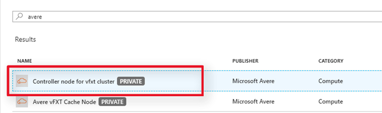

# Deploy a vFXT Cluster
The easiest way to create a vFXT cluster, is to use a controller node which has scripts and templates for creating the vFXT cluster. In this tutorial, you will create a controller node from the Azure portal and use it to create a vFXT cluster.

# Create Controller

## Find the Avere controller node image
From the [Azure marketplace](https://ms.portal.azure.com/#blade/Microsoft_Azure_Marketplace/GalleryFeaturedMenuItemBlade/selectedMenuItemId/home), search for Avere and click the Controller node.



## Enable Programmatic Access
The controller node needs programmatic access. You’ll need to enable programmatic access to your subscription BELOW the Create button. You’ll only need to do this once and can skip this step in the future. 


After enabling programmatic access for the controller node, select the vFXT node and enable programmatic access for that image.

## Walk through the wizard
Click Create to walk through the wizard.
Name the instance.
Choose HDD.
Provide a username and password for command-line access. 
Choose your subscription.
Create a new resource group.
Choose a location close to you.
Before clicking OK, note the username, password, resource group name, and location.


For the size, choose A0.

Create a new virtual network and subnet. Capture this information for later.
To access the controller remotely, we’ll need a public IP address and SSH.


We don’t need boot diagnostics but we do need to register with Azure AD.


Review and Create. After 5 or 6 minutes, your controller node will be up and running.

# Create cluster
Now that your controller node is up and running, you’ll need to access the node, edit templates, and run the script. In this video, we’ll create your vFXT cluster using the controller.
This video assumes that you are a subscription owner and that you have enough quota to run vFXT instances.
Copy your controller’s public IP address from the portal. SSH to the device with the username and password that you provided.
The steps covered in this video can be found in the ```/VFXT_README``` file.

Run ```az login``` to authenticate.
Copy the subscription ID that you want to use and run ```az account set --subscription``` and paste your subscription ID.
Edit the cluster role template and paste your subscription ID here, too. This role gives the controller permissions to create the vFXT and the Azure components it needs.
Create the role by running the az role definition create command 
```az role definition create --role-definition /avere-cluster.json```

Copy and then edit the “create-minimal-cluster” template. 
Provide the name of your resource group, location, virtual network, subnet, and cluster role. Give your cluster a name and an admin password.

Save the file, exit, and run the script. When the script completes, copy the management IP address.