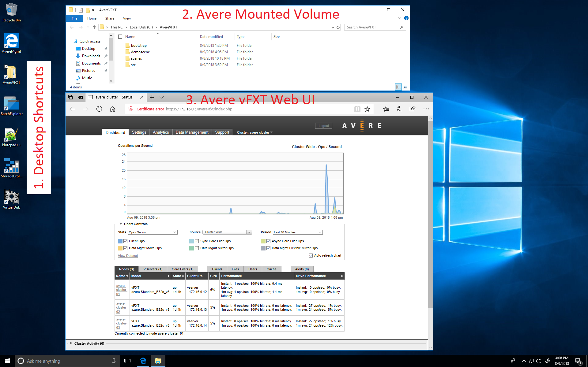

# Windows 10 Avere vFXT Mounted Workstation

This 20 minute deployment will setup a Windows 10 Avere Workstation with various tools and features including:

1. **AvereVFXT Mounted Volume** - automatically mount the Avere VFXT volume to c:\AvereVFXT, and adds a shortcut to the Desktop

2. **Avere Admin Page on Desktop and Edge Home Button** - the desktop and Edge browser home button points to the Avere Management Endpoint

3. **Media Software** - The Window Media Service Pack, and VirtualDub enable post production of content including turning rendered frames into movies.

4. **Azure Batch Explorer** - Azure Batch Explorer enables easy management and viewing of batch jobs.

5. **Azure Storage Explorer** - Azure Storage Explorer allows management of all Azure Storage accounts.

This solution can be deployed through the portal or cloud shell.

## Portal Deployment

To install from the portal, launch the deployment by clicking the "Deploy to Azure" button:

<a href="https://portal.azure.com/#create/Microsoft.Template/uri/https%3A%2F%2Favereimageswestus.blob.core.windows.net%2Fgithubcontent%2Fsrc%2Fwin10vfxtmounted%2Fwin10-azuredeploy.json" target="_blank">

</a>

Save the output values of the deployment for access to the Windows 10 Avere Workstation.

## Cloud Shell Deployment

1. To deploy, first open a cloud shell from the [portal](http://portal.azure.com) or [cloud shell](https://shell.azure.com/).

2. Run the following commands in cloud shell to deploy, updating the commented variables:

```bash
# set the subscription, resource group, and location
export DstSub=#"SUBSCRIPTION_ID"
export DstResourceGroupName=#"example_vdbench_resourcegroup"
export DstLocation=#"eastus2"

mkdir win10
cd win10

# get the Avere vFXT controller template and edit parameters
curl -o azuredeploy.json https://avereimageswestus.blob.core.windows.net/githubcontent/src/win10vfxtmounted/win10-azuredeploy.json
curl -o azuredeploy.parameters.json https://avereimageswestus.blob.core.windows.net/githubcontent/src/win10vfxtmounted/win10-azuredeploy.parameters.json

# deploy the template
az account set --subscription $DstSub
az group create --name $DstResourceGroupName --location $DstLocation
az group deployment create --resource-group $DstResourceGroupName --template-file azuredeploy.json --parameters @azuredeploy.parameters.json
```

4. Scroll-up in the deployment output to a section labelled `"outputs"`.

## Using the Windows 10 Avere Workstation

1. RDP to the clientAddress from the output parameters in the last command.

2. Once logged in, notice the following:
   1. Desktop Shortcuts for the Avere Management WebUI, Avere Mounted Volume, Batch Explorer, StorageExplorer, , and Virtual Dub
   2. Avere Mounted Volume is mounted to c:\AvereVFXT
   3. Avere vFXT Web UI - either opened by Desktop shortcut or "Home" button.



The source code to produce the template is located [here](../src/win10vfxtmounted).