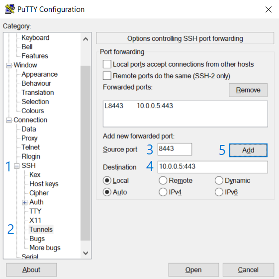

# Access the vFXT cluster
Now that your vFXT cluster is created, you need to configure its storage. In this tutorial, you will access the vFXT cluster by creating an SSH tunnel and accessing the interface with your browser.

## Access with a Linux host
If using a Linux-based client, use an SSH tunneling command like `ssh -L [localPort]:[vFXTmgmtIP]:443 [username]@[controllerPublicIP]`. For example, `ssh -L 8443:10.0.0.5:443 ronh@40.117.119.51`.
Enter your SSH password

## Access with a Windows host
If using PuTTY, add your username@ the public IP address of the controller in the hostname field. Expand SSH on the left and click Tunnels. Enter a source port like 8443. For the destination, enter the vFXT’s management IP address :443. Click Add and click Open.

Enter your SSH password.

## Access 
Open your browser. Navigate to https://127.0.0.1:8443. Depending on your browser, you will need to go to Advanced and Proceed to the page.

Enter the username `admin` and the vFXT password you provided.

Click “Login” or press Enter.
