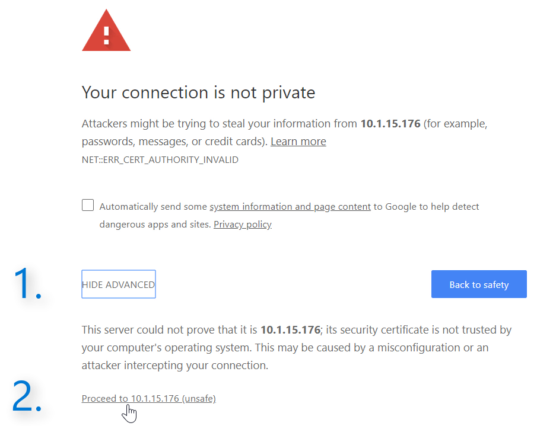
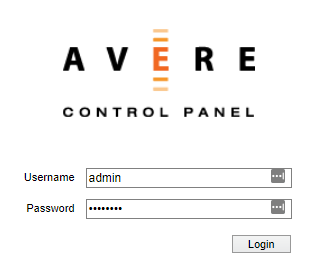

# Access the vFXT cluster
In this tutorial, you will access the vFXT cluster by creating an SSH tunnel and loading the Avere Control Panel cluster management interface with your browser. 

This is necessary because the vFXT cluster sits within a private VNet. To securely reach the vFXT cluster's management IP address, you can tunnel to the public IP address on the cluster controller and use it to forward traffic to the cluster. 

## Access with a Linux host

If using a Linux-based client, use an SSH tunneling command like `ssh -L [localPort]:[vFXTmgmtIP]:443 [username]@[controllerPublicIP]` to connect to the cluster's management IP address through the cluster controller public IP.

Example:
```sh
ssh -L 8443:10.0.0.5:443 ronh@203.0.113.51
```
Enter your SSH password.

## Access with a Windows host

If using PuTTY, fill in the **hostname** field with *your_username*@*controller_public_IP*.

Example: ``ronh@203.0.113.51``

In the **Configuration** panel: 

1. Expand **Connection** and **SSH** on the left. 
1. Click **Tunnels**. 
1. Enter a source port, like 8443. 
1. For the destination, enter the vFXT cluster's management IP address and port 443. Example: ``203.0.113.51:443``
1. Click **Add**.
1. Click **Open**.


Enter your SSH password.

## Connecting from the browser

Open your browser. Navigate to https://127.0.0.1:8443. Depending on your browser, you might need to click **Advanced** and proceed to the page.



Enter the username `admin` and the password you provided when creating the cluster.



Click **Login** or press enter on your keyboard.

## Next step: Configure storage
Now that you can access the cluster, enable [support](enable_support.md).
