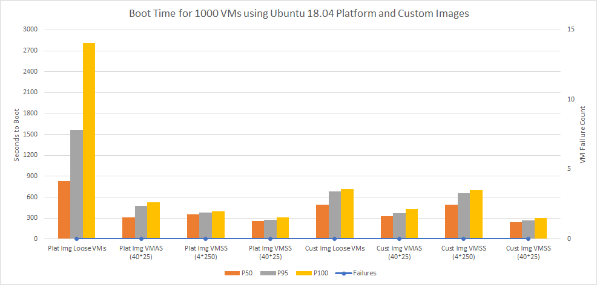
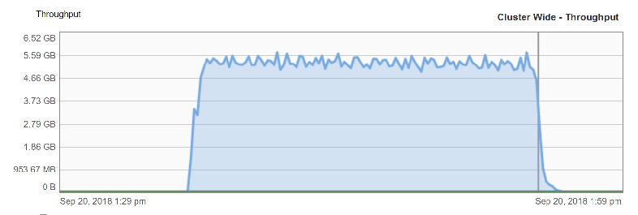
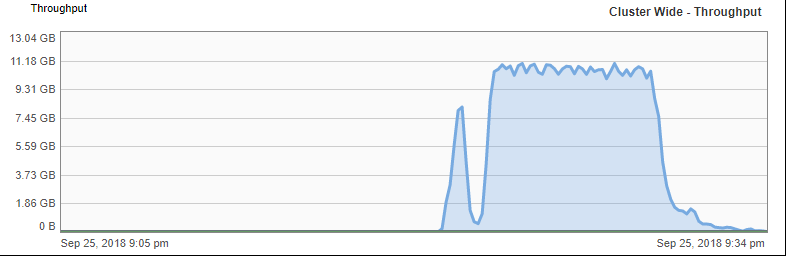
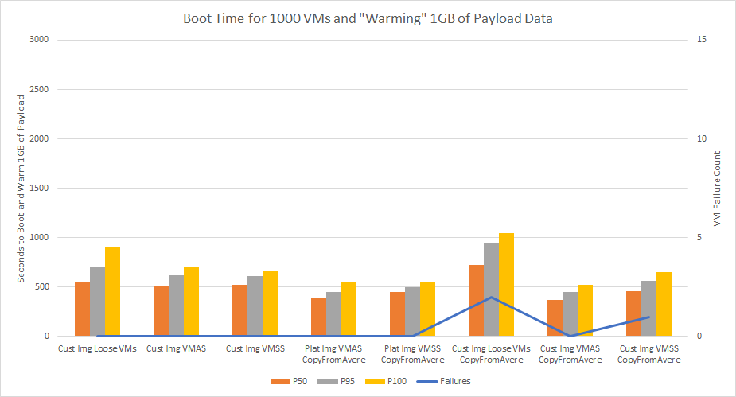
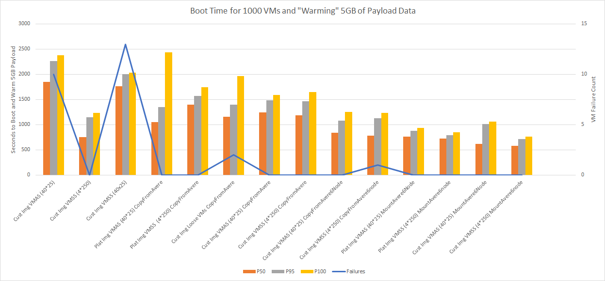
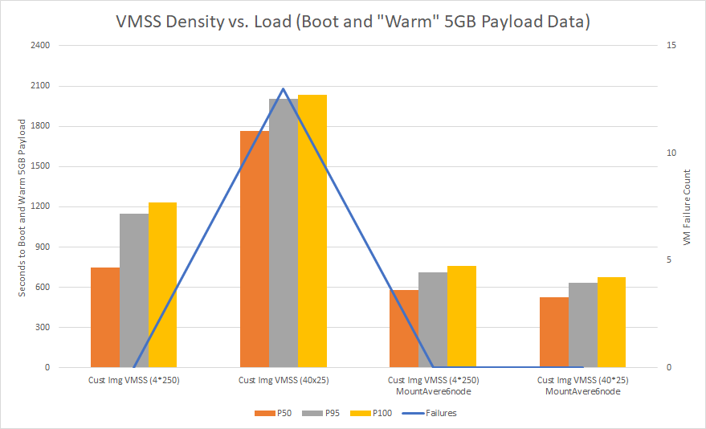

# Best Practices for Improving Azure Virtual Machine Boot Time

October 2018

## Abstract

Using the Azure compute scalable infrastructure and the Avere vFXT we were able to decrease the 95th percentile of the combined time of boot and payload read of 1000 virtual machines by 72% from 37.7 minutes down to 10.5 minutes.  This report discusses the various performance pitfalls to avoid and the optimizations available to ensure the virtual machines boot and are running the target applications in the fastest possible time.

## Introduction

A common question we hear from our HPC customers is how to boot thousands of virtual machines (VMs) quickly on Azure.  Our first answer to customers is to use either of the Azure managed solutions such as [Azure CycleCloud](https://azure.microsoft.com/en-us/features/azure-cyclecloud/) or [Azure Batch](https://azure.microsoft.com/en-us/services/batch/). These two solutions remove the complexity of provisioning and booting HPC sized compute workloads.

However, some customers still want to deploy their own workloads from scratch or want the ability to fine tune and add features from the [Azure Quickstart Templates](https://github.com/Azure/azure-quickstart-templates). For these customers we did not have a best practices guide. This document explores booting 1000 VMs and provides best practices for deploying VMs quickly on Azure.

The main questions of this document are:

  1. What is the fastest way to boot 1000 VMs?

  2. Can the Avere vFXT be used to serve large binary / toolchain payloads to result in improved deployment times?  The Avere virtual FXT (vFXT) Edge Filers act as network-attached storage (NAS) in the cloud and support burstable high-performance computing (HPC) workloads. 

This document first starts with hypotheses for these questions, and then runs various experiments to prove or disprove the hypotheses and finally concludes with best practices. Some of the best practices learned in this study can further help improve speed of boot times with [Azure CycleCloud](https://azure.microsoft.com/en-us/features/azure-cyclecloud/), and [Azure Batch](https://azure.microsoft.com/en-us/services/batch/).

## Hypothesis

We had the following hypotheses for the fastest way to boot 1000 VMs:

1. Platform images will deploy significantly faster than custom images.

2. Downloading large binary / toolchain payloads from the Avere vFXT will improve VM deployment time over having the binaries and tools preloaded on the OS disk.

3. If #2 holds true, further scaling the Avere vFXT horizontally will provide linear improvement in boot time.

4. [Virtual Machine Scale Sets (VMSS)](https://azure.microsoft.com/en-us/services/virtual-machine-scale-sets/) will be faster than availability sets VMs or loose VMs.

## Experiment Setup

Here is the setup for the experiment:

1. Pick a region, and ensure enough quota exists for 1000 DS2v2 VMs. We chose DS2v2 because it has enough [Blob cache](https://docs.microsoft.com/en-us/azure/virtual-machines/windows/sizes-general#dsv2-series) to hold large binary / toolchain payloads.

2. Deploy a virtual network and storage account, and create an Avere vFXT cluster using these [deployment instructions](https://github.com/Azure/Avere/blob/master/docs/jumpstart_deploy.md). 

    Cluster details: 

    - Three nodes of Standard_E32s_v3 instances
    - Per-node cache size: 8192GB
    - Blob storage backend

3. Add a subnet named "batch" to the three-node cluster's VNet, with address space to support 1000 nodes. For this experiment we used `10.0.16.0/20` for our address space.

4. Deploy another VNet and storage account, and create a six-node Avere vFXT cluster using the same options as the three-node cluster in step 2. 

5. Add a subnet named "batch" to the six-node cluster's VNet, with address space to support 1000 nodes. For this experiment we used `10.0.16.0/20` for our address space.

6. Download and build the [deployer utility](https://github.com/anhowe/azure-util/tree/master/deployer) and associated templates. This will be used for deploying the VMs.

7. For resource group deletion, download and build the [deleterg utility](https://github.com/anhowe/azure-util/tree/master/deleterg).

8. Create an event hub using the following [instructions](https://docs.microsoft.com/en-us/azure/event-hubs/event-hubs-go-get-started-send) and capture the following:
    1. Event hub namespace name
    2. Event hub name
    3. Event hub key name
    4. Event hub key

9. If you don't already have a service principal for your subscription, create a service principal using [these instructions](https://docs.microsoft.com/en-us/cli/azure/create-an-azure-service-principal-azure-cli?toc=%2Fen-us%2Fazure%2Fazure-resource-manager%2Ftoc.json&bc=%2Fen-us%2Fazure%2Fbread%2Ftoc.json&view=azure-cli-latest) and capture the following:
    1. Tenant ID
    2. Client ID
    3. Client Secret
 
10. Create an Ubuntu 18.04 custom image, and capture it using these [instructions](https://docs.microsoft.com/en-us/azure/virtual-machines/linux/capture-image). Before running capture, prepare the VM image by running the following commands:
    1. `sudo -s`
    2. `apt-get update`
    3. `apt-get install -y parallel nfs-common`
    4. `mkdir -p /opt`
    5. `curl --retry 5 --retry-delay 5 -o /usr/bin/parallelcp https://raw.githubusercontent.com/anhowe/azure-util/master/deployer/templates/parallelcp`
    6. `curl --retry 5 --retry-delay 5 -o /opt/create1GBfiles.sh https://raw.githubusercontent.com/anhowe/azure-util/master/deployer/templates/create1GBfiles.sh`
    7. `curl --retry 5 --retry-delay 5 -o /opt/create5GBfiles.sh https://raw.githubusercontent.com/anhowe/azure-util/master/deployer/templates/create5GBfiles.sh`
    8. `chmod +x /usr/bin/parallelcp`
    9. `chmod +x /opt/create1GBfiles.sh`
    10. `chmod +x /opt/create5GBfiles.sh`
    11. `mkdir -p /opt/tools1GB && /opt/create1GBfiles.sh /opt/tools1GB`
    12. `mkdir -p /opt/tools5GB && /opt/create5GBfiles.sh /opt/tools5GB`

11. Set up each Avere vFXT cluster with the following:
    1. From the client VM - 
        1. `apt-get update`
        2. `apt-get install -y parallel nfs-common`
        3. `mkdir -p /opt`
        4. `curl --retry 5 --retry-delay 5 -o /usr/bin/parallelcp https://raw.githubusercontent.com/anhowe/azure-util/master/deployer/templates/parallelcp`
        5. `curl --retry 5 --retry-delay 5 -o /opt/create1GBfiles.sh https://raw.githubusercontent.com/anhowe/azure-util/master/deployer/templates/create1GBfiles.sh`
        6. `curl --retry 5 --retry-delay 5 -o /opt/create5GBfiles.sh https://raw.githubusercontent.com/anhowe/azure-util/master/deployer/templates/create5GBfiles.sh`
        7. `mkdir -p /mnt/tools1GB && /opt/create1GBfiles.sh /mnt/tools1GB`
        8. `mkdir -p /mnt/tools5GB && /opt/create5GBfiles.sh /mnt/tools5GB`
        9. `mkdir -p /nfs/avere`
        10. mount the avere cluster with a command similar to the following `mount 10.0.0.5:/msazure /nfs/avere`.
        11. `parallelcp /mnt/tools1GB /nfs/node1/tools1GB`
        12. `parallelcp /mnt/tools5GB /nfs/node1/tools5GB`
        13. `mkdir /nfs/node1/bootstrap`
    2. Download and build the [eventhubsender utility](https://github.com/anhowe/azure-util/tree/master/eventhubsender) and save to `/nfs/avere/bootstrap`
    3. `curl --retry 5 --retry-delay 5 -o /nfs/avere/bootstrap/bootstrap.sh https://raw.githubusercontent.com/anhowe/azure-util/master/deployer/templates/bootstrap.sh`

Then with each template from the [deployer utility](https://github.com/anhowe/azure-util/tree/master/deployer) directory, perform an experiment of booting 1000 VMs.

## Results

We divided our experiment into two phases:

  1. Phase 1: Determine the fastest way to boot 1000 VMs.

  2. Phase 2: How can the Avere vFXT improve the delivery and usage of a large binary / toolchain payload?
 
### Phase 1: Determine the fastest way to boot 1000 VMs

Our first few experiments immediately ran into issues where our P95 deployment time was 26 minutes, and our P100 was around 47 minutes. We found solutions for each of the problems and they are listed in the following sub sections.

#### Heavy ARM Throttling on Create

During create we would see a long tail of deployment times, and also the following error message from ARM (as seen from https://resources.azure.com):

```json
"details": [
    {
    "code": "TooManyRequests",
    "target": "GetOperation30Min",
    "message": "{\"operationGroup\":\"GetOperation30Min\",\"startTime\":\"2018-09-18T11:44:38.1546086+00:00\",\"endTime\":\"2018-09-18T11:59:38.1546086+00:00\",\"allowedRequestCount\":30000,\"measuredRequestCount\":37352}"
    }
]
```

When creating 1000 VMs, it creates 1000 NICs, 1000 VMs, 1000 disks, and 1000 custom script extensions. These resources were submitted as templates through ARM. As ARM polled status on all these resources, it exhausting the request budget for the subscription.

To solve this, we implemented the following workarounds:
    1. Eliminate the custom script extension, eliminating 1000 resources that needed status checks.
    2. Run all custom script extension commands through "cloud-init".
    3. Reduce polling from our script.
    4. Add event hub hooks in the [deployer utility](https://github.com/anhowe/azure-util/tree/master/deployer), and have every VM use the [eventhubsender utility](https://github.com/anhowe/azure-util/tree/master/eventhubsender) to signal completion.
    5. Submitted case 84593165 to resolve the issue long term.

If you wanted multiple thousands of VMs, it might be best to create a subscription for each block of 1000 VMs to work around these throttling limitations.

#### Heavy ARM Throttling on Delete

Deletion of resource groups containing the 1000 VMs would take 90 minutes to delete, and result in the following error message:

```json
{
  "error": {
	"details": [
	  {
		"code": "TooManyRequests",
		"target": "DeleteVM30Min",
		"message": "{\"operationGroup\":\"DeleteVM30Min\",\"startTime\":\"2018-09-18T15:13:12.093203+00:00\",\"endTime\":\"2018-09-18T15:28:12.093203+00:00\",\"allowedRequestCount\":3014,\"measuredRequestCount\":5446}"
	  }
	],
	"code": "OperationNotAllowed",
	"message": "The server rejected the request because too many requests have been received for this subscription."
  }
}
```

The main solution here was to stagger the deletes of the resource groups as captured in the [deleterg utility](https://github.com/anhowe/azure-util/tree/master/deleterg). To resolve long term we have submitted case 84854892.

#### Throttling from Ubuntu Package Updates

For the platform images, we encountered throttling from the Ubuntu servers that had the following error message: `Unable to connect to azure.archive.ubuntu.com:http:`.

The solution here was to wrap the apt commands in retry. Another possibility here is to try to [pre-download packages](https://www.ostechnix.com/download-packages-dependencies-locally-ubuntu/) and store them on Azure storage. We would then have to contend with storage throttling. 

#### VMSS singlePlacementGroup

To go past the 100 node limit on a VMSS, singlePlacementGroup must be set to "false". 

#### 40-Minute Nodes

Occasionally one or two nodes would take 40 minutes to boot, whereas all others were less than five minutes. The solution here was to over-provision by one or two and prune the tardy VMs. We were careful to rule out ARM throttling in this case, because over-provisioning with ARM throttling would make the deployment time tail longer.

#### Boot Results

Once we resolved the above performance issues, we were able to get the timings for booting 1000 VMs from Ubuntu 18.04 platform and custom images. The results of the percentiles of the seconds to boot are shown following chart. We did not notice a performance difference between platform images and custom images, invalidating our first hypothesis.

   

In the above chart, and subsequent charts, 4 * 250 for VMSS means four VMSS resources each with 250 VMs per VMSS, and 40 * 25 means 40 groups of 25 VMs each.

Once we understood how to boot VMs quickly, we next looked at how to prepare the large binary / toolchain payload. In our experience, we have seen that customers require binaries or toolchains in the size range of 1GB to 5GB. These toolchains depend on the vertical and could be used for rendering, genomics processing, and financial modeling. Based on this understanding, we recorded the timings for 1GB and 5GB binaries.

In the next round of experiments we "warmed" our toolchains by reading all bits of the toolchain, and thereby populating the Blob cache.  The purpose of "warming" is to ensure the VM is ready to perform work. A VM that has booted quickly is of no use if the first read on the toolchain takes 30 minutes. To "warm" the toolchain we copied all the bits from the toolchain on the OS disk to the ephemeral drive (from /opt/tools to /mnt/tools).

Since we are using a DS2_v2 VM size, we have [8GB of local cache](https://docs.microsoft.com/en-us/azure/virtual-machines/windows/sizes-general#dsv2-series). This means we will have enough room in the Blob cache to hold either the 1GB or 5GB binary. In summary, each premium VM has a Blob cache that stores recently used data in RAM and SSDs locally as shown in the following image. This is described in more detail in the [Premium Storage GA announcement](https://azure.microsoft.com/en-us/blog/azure-premium-storage-now-generally-available-2/).

<p align="center">
   
</p>

Here are the percentiles of seconds to boot and "warm" a 1GB toolchain from bits stored on the custom image:

   | Percentile | Loose VMs | VM Availability Sets | VM Scale Sets |
   | --- | --- | --- | --- |
   | VMs Per Availability Set or VMSS | 1 | 25 | 250 |
   | Failure Count | 0 | 0 | 0 |
   | P50 | 557 | 512 | 526 |
   | P95 | 698 | 618 | 615 |
   | P100 | 901 | 707 | 661 |

Here are the percentiles of seconds to boot and "warm" a 5GB tool chain from bits stored on the custom image:

   | Percentile | Loose VMs | VM Availability Sets | VM Scale Sets | VM Scale Sets |
   | --- | --- | --- | --- | --- |
   | VMs Per Availability Set or VMSS | 1 | 25 | 250 | 25 |
   | Failure Count | 8 | 10 | 0 | 13 |
   | P50 | 1617 | 1853 | 749 | 1766 |
   | P95 | 1920 | 2260 | 1147 | 2004 |
   | P100 | 2038 | 2379 | 1235 | 2036 |

On the 5GB "warming" we hit some form of threshold in the stack where the VM boot tail grew as signified by the P100 time. We also started seeing multiple VM failures. Most of the failures we saw were because the VM rebooted and interrupted the deployment process.  The VMSS VMs outperformed the loose VMs and the availability set VMs. After running this experiment we ran an additional experiment, where we reduced the VMSS to 25 VMs per VMSS, and we ended up with much worse performance and an increase in failures. This led to a conclusion that a large VMSS group scales much better than many smaller ones.

### Phase 2: How can the Avere vFXT improve the delivery and usage of a large binary / toolchain payload?

The next phase of the experiment is to determine how to use the Avere vFXT to improve boot time by using it to serve the 1GB and 5GB binary / toolchain payloads. Our first few runs against the Avere vFXT were slow. Upon further investigation we realized we had to disable "always forward" for this read workload. The "always forward" on the Avere vFXT treats all the RAM and disk memory across the Avere nodes as one shared pool. In this way, the more nodes you add, the larger your shared cache. The downside is that the probability of introducing a network hop is the inverse of your node count-1. Disabling "always forward" reduces the cache size to the amount of RAM/disk space on a single machine, but completely eliminates the network hop.

Disabling "always forward" is an advanced command-line setting on the Avere vFXT cluster. From the cluster controller VM, SSH as root to the management IP address for the cluster. This will connect you to a vFXT node in the cluster. Log in using the administrative password you set for the cluster and run the following commands:

```bash
averecmd support.setCustomSetting mass1.always_forward OZ 0 "comment"
averecmd support.setCustomSetting vcm.always_forward ZZ 0 "comment"
```

After we disabled always forward we saw a steady 5.5 GB/s from our three-node Avere vFXT cluster, and a steady 11 GB/s from our six-node Avere vFXT cluster, as shown in the following images. These numbers demonstrated that Avere vFXT clusters have great horizontal scaling.

   

   

We then collected the timings for the 1GB and 5GB payloads in the following configurations:
 * Mount the three-node Avere vFXT and copy payload from Avere vFXT to the OS disk of the platform image
 * Mount the three-node Avere vFXT and copy payload from the Avere vFXT to the OS disk of the custom image
 * (5GB only) Mount the six-node Avere vFXT and copy payload from the Avere vFXT to the OS disk of the custom image
 * (5GB only) Mount the six-node Avere vFXT and copy 5GB payload from the Avere vFXT to the ephemeral drive ("warming the cache for the NFS mount")
 * (5GB only) Mount the six-node Avere vFXT and copy 5GB payload from the Avere vFXT to the ephemeral drive ("warming the cache for the NFS mount")

The results for the 1GB warming runs are summarized in the following chart. The results show that copying 1GB payloads from Avere results in slight performance increases in all cases but the loose VMs.  It is interesting to note that with the increased load the more densely-packed VMSS (250 VMs per VMSS) performed slightly better than the lightly packed VMSS (40 VMs per VMSS).

   

The results for the 5GB warming runs are summarized in the following chart. The first three column of results show retrieval of the 5GB payload from the OS disk of the custom image as found in Phase 1 of the experiment. The following observations can be seen:
 * As previously discussed, large VMSS groupings (250 VMs per VMSS) significantly outperform the small VMSS groupings (25 VMs per VM) for the large load.
 * For the loose VMs and the availability set VMs, copying from the Avere vFXT improves the timings, and also reduces the occurrences of VM failures
 * Using the payload directly from the Avere vFXT NFS share shows performance improvements across all VM configurations

   

The fastest configuration for booting 1000 VMs with a 5GB toolchain payload was the following:
 * 40 VMSS resources each with 25 custom image VMs
 * Mount a six-node Avere vFXT for the toolchain payload

It is worth shrinking the above chart to highlight a subtle performance characteristic with VMSS density.  When reading a large payload from the OS disk, either from the boot (Windows) or from the boot + payload read, it is important to use the most densely-packed VMSS to get the fastest possible boot time, with the least amount of VM failures.  If you have a small payload and a small footprint, then it is better to go with a less dense VMSS for the best performance as shown in the following chart:

   

Also, if you are using the Avere vFXT only to reduce the boot time of the clients, and not for servicing HPC workload data, you can stop-deallocate the Avere vFXT after the clients have started.  At a minimum, to achieve this, you will need to implement the following designs:
 * On boot, copy the data from the Avere share to the OS Disk or data disk of the clients.
 * Ensure low priority clients have `stop-deallocate` set for the eviction policy.  This ensures the payload data sticks around.
 * Ensure the Avere vFXT nodes are started and running when scaling up.
 * Adjust the NFS settings on the clients to use soft mounts and have error handling in place for when the NFS share is missing.

## Conclusion

The above experiments reveal multiple conclusions about how to make VMs boot faster on Azure. All but one of our hypotheses are correct. As seen in our results, the hypothesis stating that platform images are faster than custom images is incorrect.

Here are the best practices to achieve the fastest virtual machine provisioning times on Azure and avoid long boot time tails.

  1. **Use a managed service for VM creation** - Consider using an Azure managed service like [Azure CycleCloud](https://azure.microsoft.com/en-us/features/azure-cyclecloud/) or [Azure Batch](https://azure.microsoft.com/en-us/services/batch/). An Azure managed service hides the complexity around virtual machine creation.

  2. **Use Azure virtual machine scale sets (VMSS)** - Experiments show that virtual machine scale sets (VMSS) consistently outperform availability sets and loose VMs.

  3. **NFS Mount all virtual machine clients to an Avere vFXT Edge Filer for large binary / toolchain payloads** - The fastest boot times result when VMs NFS mount the Avere vFXT Edge Filer and consume the binary / toolchain payloads.  NFS mounting all VM clients to an Avere vFXT yields the following additional benefits:
     1. The Avere vFXT becomes a single source of truth, so if the toolchain needs updating, it is changed in a single place versus the creation of a new custom image, and recreating the client VMs.
     2. Fewer virtual machine reboots and failures.
     3. If only used for reducing boot time of clients, save money by using the above techniques to stop-deallocate the Avere vFXT nodes when not in use.
     4. This best practice works when using [Azure CycleCloud](https://azure.microsoft.com/en-us/features/azure-cyclecloud/) and [Azure Batch](https://azure.microsoft.com/en-us/services/batch/).

  4. **The Avere vFXT scales linearly as you add more nodes** - Experiments show that the Avere vFXT linearly scales in throughput as more nodes are added. 

  5. **Adjust VMSS density depending on bytes used per VM** - Experiments show that a more densely-packed VMSS resource scales better for a VM that consumes a large amount of bytes to boot and start the target application.  A density of 300 VMs per VMSS will work best for a Linux virtual machine with a large payload or a custom Windows image.  A density of 25 VMs per VMSS will work best for booting Linux virtual machines with a very small application or toolchain payload or can directly NFS mount a share containing the application or toolchain.

  6. **Manage your ARM calls** - ARM throttling leads to long virtual machine boot times.  Techniques to reduce ARM throttling include using cloud-init instead of custom script extension, staggering ARM calls, and reducing polling. Using multiple subscriptions will also help work around these issues.

  7. **Loose VMs are slow** - Loose VMs are the slowest to boot and have the longest deployment time tails.  If you want to use loose VMs, consider grouping them by availability sets to achieve better performance.
