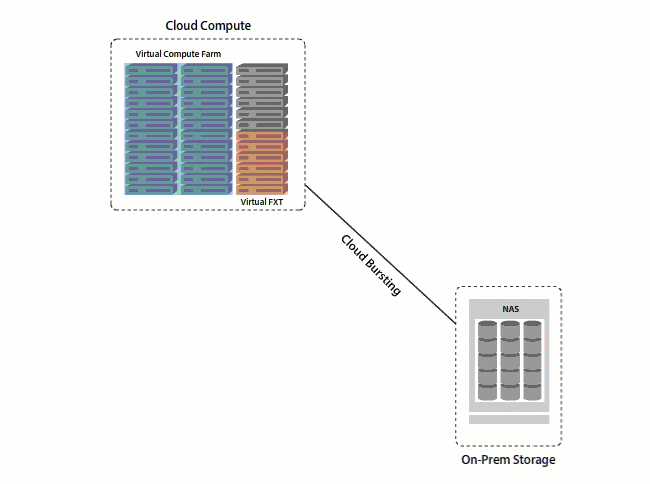

# Cloud Bursting

Avere Virtual FXT (vFXT) Edge filers allow you to run compute workflows in Azure Compute without having to worry about moving your NAS.  The vFXT accomplishes this by performing read-ahead caching, which aids in hiding latency when trying to use cloud computing against on-premises storage. The benefits of using this technology include:

  * Leverage your current on-premsises NAS environment alongside Azure Compute
  * Allows you to offset peaks in compute demand with Azure's pay-as-you-go services without moving large data sets from existing storage
  * Hides latency to cloud compute resources with cloud caching
  * Provides easy scaling from 3 to 24 nodes to meet growing demands in shorter periods of time
  * Reduces cloud compute costs by as much as 90% by minimizing the use of Azure Storage during processing
  * Eliminates the need to expand owned compute capacity, reducing data center footprint and supporting data center consolidation
  * Allows for use of Microsoft Azure Low-priority Virtual Machines for additional savings
  * Enterprises and companies working within HPC environments see immediate benefits of flexibility and agility to match compute resources with business demands quickly and easily.

[Learn more about Cloud Bursting](http://www.averesystems.com/cloud-bursting)

