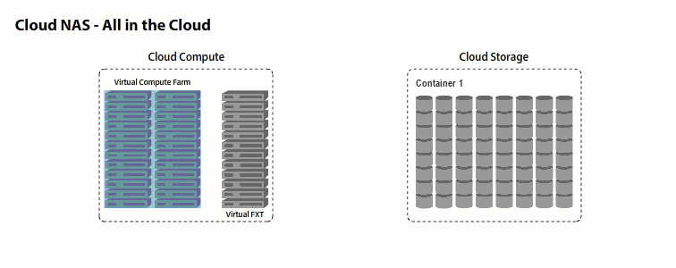

# Clustered file system for Azure – Cloud NAS

When using both Azure Storage and Azure Compute resources, you can use the Avere vFXT to create a scale-out NAS in the public cloud, eliminating the silos between these resources. Leverage low-cost Azure Storage for HPC workloads running on Azure Compute.

Avere Cloud NAS with the vFXT for Azure gives you:
  * Scalability – clustering up to 24 nodes
  * Low Data Latency – powerful cloud cache tiers data for optimal performance
  * Secure AES 256-encryption
  * Protection with Cloud Snapshots
  * Insights with powerful analytics

[Learn more about Cloud NAS](http://www.averesystems.com/cloud-nas)

