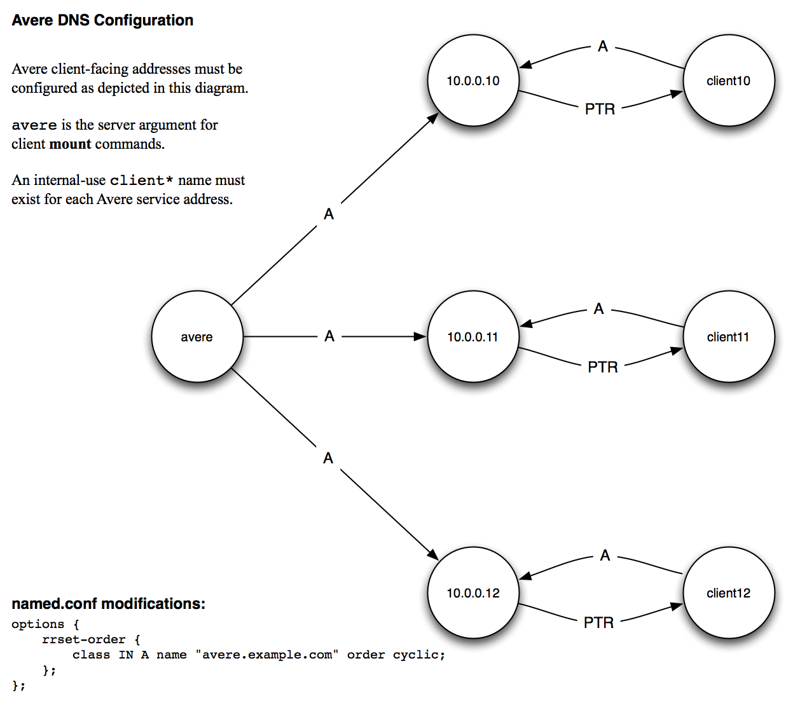

# Configuring DNS for the Avere cluster

This section explains the basics of setting up a DNS system for your Avere cluster.

* If your system is accessed by NFS clients only, using DNS is recommended but not required - it is possible to specify all network addresses by using numeric IP addresses. 

* If your system supports SMB (CIFS) access, DNS is required, because you must specify a DNS domain for the Active Directory server.

* DNS is required if you want to use Kerberos authentication.

## Load Balancing

To distribute the overall load, configure your DNS domain to use round-robin load distribution for client-facing IP addresses.

## Configuration Details

For optimal performance, configure client-facing cluster addresses as shown in the following diagram. 

[Text description](averedns_text_alt.txt)

The following ``nsupdate`` commands provide an example of configuring DNS correctly:

        update add avere.example.com. 86400 A 10.0.0.10
        update add avere.example.com. 86400 A 10.0.0.11
        update add avere.example.com. 86400 A 10.0.0.12
        update add client10.example.com. 86400 A 10.0.0.10
        update add client11.example.com. 86400 A 10.0.0.11
        update add client12.example.com. 86400 A 10.0.0.12
        update add 10.0.0.10.in-addr.arpa. 86400 PTR client10.example.com
        update add 11.0.0.10.in-addr.arpa. 86400 PTR client11.example.com
        update add 12.0.0.10.in-addr.arpa. 86400 PTR client12.example.com

## DNS Settings

DNS parameters are set in [Cluster > Administrative Network](<http://library.averesystems.com/ops_guide/4_7/gui_admin_network.html#gui-admin-network>) settings page in the Avere Control Panel. Settings on that page include: 

* DNS server address
* DNS domain name
* DNS search domains

Read [DNS Settings](<http://library.averesystems.com/ops_guide/4_7/gui_admin_network.html#gui-dns>) for more details about using this page.
