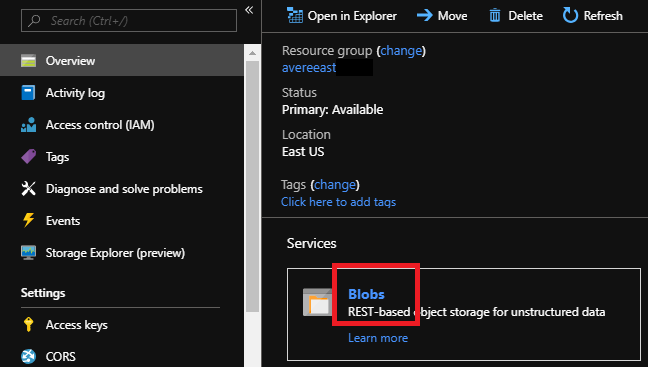
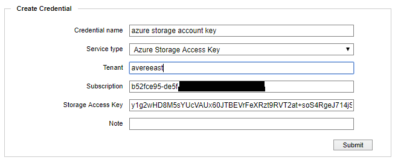

# Configure Storage

There are two steps to set up a back-end storage system for your vFXT cluster. 
1. [Create a core filer](#create-a-core-filer), which connects your vFXT cluster to an existing storage system or an Azure Storage Account.
1. [Create a namespace junction](#create-a-junction), which provides a path for clients to mount.

## Create a core filer
"Core filer" is a vFXT term for a storage system. It is most often a NAS like NetApp or Isilon. More information about core filers can be found [here](http://library.averesystems.com/ops_guide/4_7/settings_overview.html#managing-core-filers).

To add a core filer, choose either of the the two main types of core filers:
  1. [NAS core filer](#nas-core-filer) - describes how to add a NAS core filer 
  2. [Azure Storage Account cloud core filer](#azure-storage-account-cloud-core-filer) - describes how to add an Azure Storage account as a cloud core filer

### NAS core filer

A NAS core filer, may be an on-prem NetApp or Isilon, or a NAS endpoint in the cloud.  The following steps add a NAS core filer:

1. From the Avere Control Panel, click the Settings tab at the top.

2. Click “Manage Core Filers” on the left. 

3. Click “Create.”

   

   * Name your core filer.
   * Provide a fully qualified domain name (FQDN) if available. Otherwise, provide an IP address or hostname that resolves to your core filer.
   * Choose your filer class from the list. If unsure, choose “Other.”
   * Click **Next** and choose a cache policy. 
   * Click **Add Filer**.
   * For more detailed information refer to [Adding a new NAS core filer](http://library.averesystems.com/ops_guide/4_7/new_core_filer_nas.html).

Next proceed to [Create a Junction](#create-a-junction).  

### Azure Storage Account cloud core filer

To use Azure Blob storage as your vFXT cluster's back-end storage, you need an empty container to add as a cluster core filer.

**TIP:** To avoid the following steps, use the ``create-cloudbacked-cluster`` sample script if you want to create a storage container at the same time as creating the vFXT cluster. The ``create-minimal-cluster`` sample script does not create an Azure storage container.

The following steps create an Azure Storage Account with an empty container and add it as a cloud filer:

1. Create a general-purpose V2 storage account by clicking on the "Deploy to Azure".  You can add it to the same resource group as the vFXT.

   

2. Once created click on the Alert icon in the top right, and click **Go to resource group**.

   

3. Click on the Azure Storage Account from the resource list.

   

4. Create a blob container by clicking on **Blobs** on the overview page and then click **+Container**, and add a container using any name, ensuring "Private" access.

   

5. Get the Azure Storage account key by, clicking **Access keys** under **Settings**:

   

6. Now browse to the Avere Management UI, and click **Settings**, followed by "**Cloud Credentials**, followed by **Add Credential**

   

7. Fill in a description for the name, and then fill in the Storage Account Name, SubscriptionId, and Key into the fields "Tenant", "Subscription", and "Storage Access Key" respectively, and click "submit":

   

8. To create the core filer, click “Manage Core Filers” on the left. 

9. Click “Create.”

10. Fill out the Wizard:
   * Choose "Cloud" filer type
   * Name your core filer and click **Next**.
   * Accept the default cache policy and continue to the third page. 
   * In **Service type**, choose **Azure storage**. 
   * Choose the credential created earlier from the list.
   * Set Bucket contents to **empty**
   * Change Certificate verification to **Disabled**
   * Change Compression mode to **None**    
   * On the fourth page, enter the name of the container as **storage-account/container** in **Bucket name**.
   * Set Encryption Type to **None**.  An Azure Storage Account has encryption on by default.
   * Click **Add Filer**.
   * Refer to [Adding a new cloud core filer](<http://library.averesystems.com/ops_guide/4_7/new_core_filer_cloud.html>) for more detailed information. 
   * Click Next.

The page will refresh, or you can refresh the page to display your new core filer.

Next proceed to [Create a Junction](#create-a-junction).

## Create a junction
A junction is a path that you create for clients. Clients mount the path in order to arrive at the destination you choose. For example, you could create `/avere/files` to map to your NetApp core filer, `/vol0/data` export, and the `/project/resources` subdirectory.
More information about junctions can be found [here](http://library.averesystems.com/ops_guide/4_7/gui_namespace.html).
- Click “Namespace” in the upper left.
- Provide a namespace path beginning with / (forward slash) like /avere/data.
- Choose your core filer.
- Choose the export.
- Click “Next.”

   

The junction will appear after a few seconds. Create additional junctions as needed.

## Proceed to Parallel Data Ingest
Now that a junction is exported, proceed to [Parallel Data Ingest](getting_data_onto_vfxt.md).
