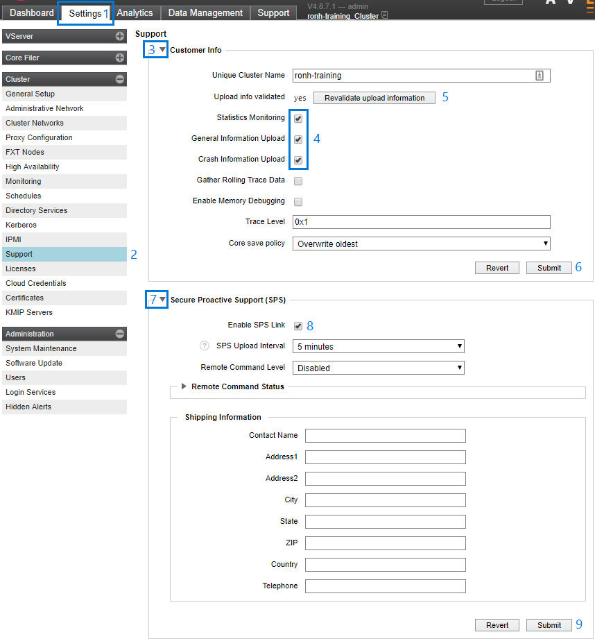

# Enable support uploads

Enabling support uploads allows support personnel to have insight into your vFXT cluster state so that they can provide the best customer service.

Follow these steps from the Avere Control Panel to activate support. 

1. Navigate to the **Settings** tab at the top.
1. Click the **Support** link on the left and accept the privacy policy.
   
1. Click the triangle to the left of **Customer Info** to expand the section.
1. Check the boxes for **Statistics Monitoring**, **General Information Upload**, and **Crash Information Upload**.
1. Click the **Validate upload information** button.
1. Click **Submit**.
1. Click the triangle to the left of **Secure Proactive Support (SPS)** to expand the section.
1. Check the box for **Enable SPS Link**.
1. Click **Submit**.

   
   
   
## Next step: Configure storage
Next, proceed to [configure storage](configure_storage.md).
