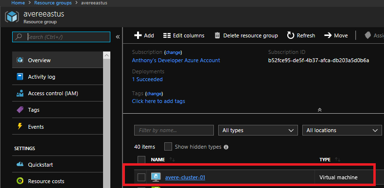
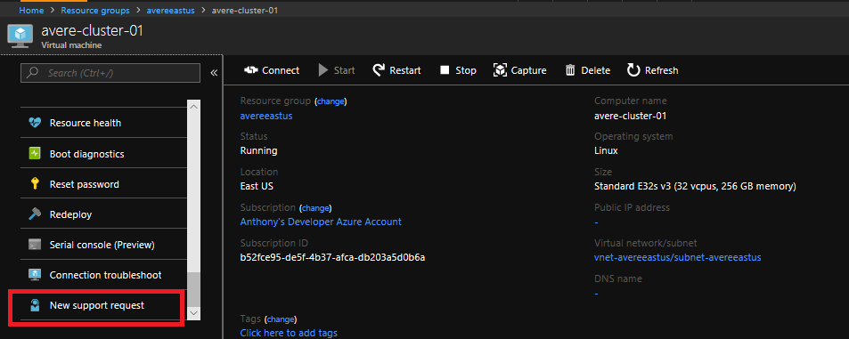
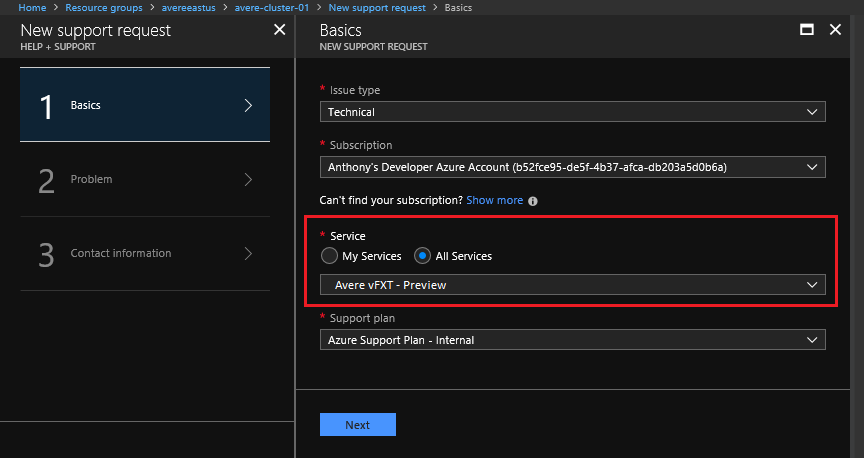

# Troubleshooting and Engaging Support

If you encounter issues, here are the various ways to engage help and support:
  * **Documentation and Examples** - If you encounter issues with the examples in this Avere documentation please confirm the issue does not already exist, and then file a [github issue](https://github.com/Azure/Avere/issues).
  * **Quota** - if you encounter quota related issue, [request quota increase](https://docs.microsoft.com/en-us/azure/azure-supportability/resource-manager-core-quotas-request).
  * **Avere vFXT issue** - raise a support ticket in the Azure Portal for your Avere vFXT as described in the [section below](#raise-a-support-ticket-for-your-avere-vfxt)

# Raise a support ticket for your Avere vFXT

If you encounter issues with the Avere vFXT, you will need to request help through the Azure Portal.  The following steps ensure your support ticket is tagged with a resource from your cluster to ensure fastest possible ticket routing:

1. From https://portal.azure.com select "Resource Groups".

    

2. Browse to the resource group containing your vFXT virtual machines where you are experiencing the issue, and click on one of the virtual machines

    

3. scroll down on the VM options, and click "New support request" at the bottom

    

4. On page 1, click "All Services" and choose "Avere vFXT" under "Storage"

    

5. On page 2, choose the Problem Type and category that most closely matches your issue.  From there add a short title and description with time of issue

    

6. On page 3, fill in your contact information, and click "Create".  You will be provided a ticket number via email, and someone will be in contact with you
