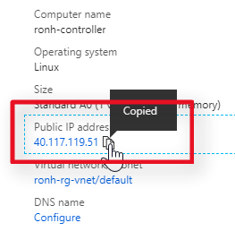
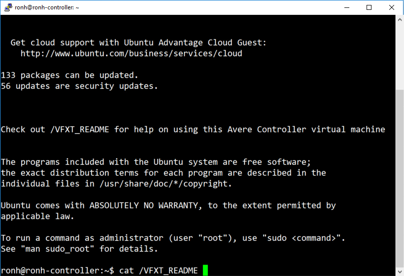
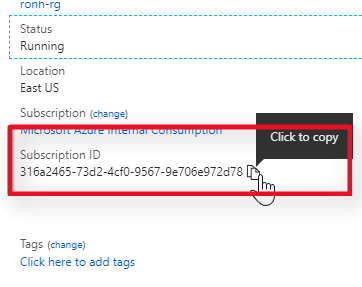
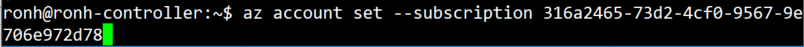
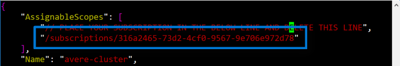
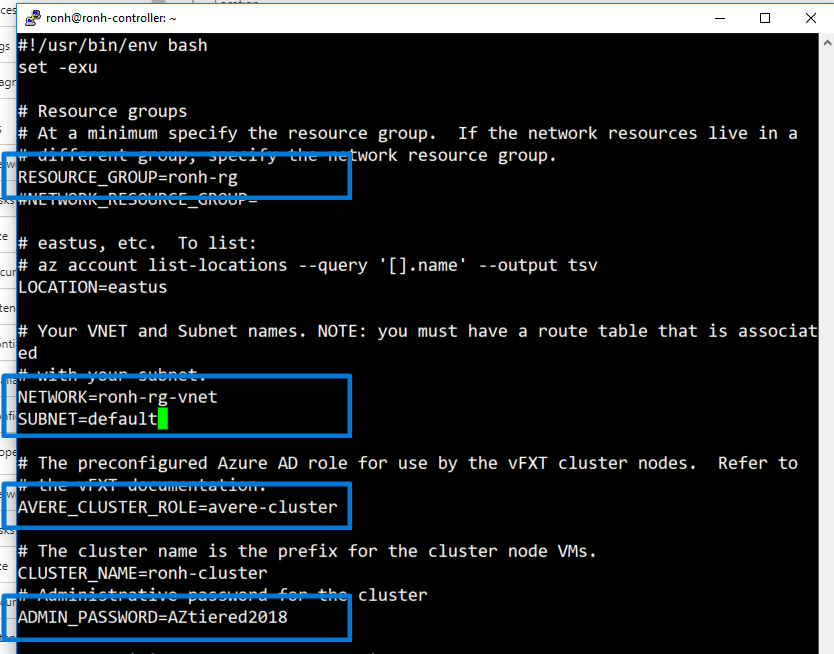

# Jumpstart Deploy a vFXT Cluster
The easiest way to create a vFXT cluster, is to use a controller node which has scripts and templates for creating the vFXT cluster. In this tutorial, you will create a controller node and use it to create a vFXT cluster.  By the end of this tutorial, you will have a VNET, a controller, and a vFXT cluster as shown in the following diagram:


This tutorial assumes that you have done the following prerequisites:

1. [Create a new subscription](prereqs.md#create-a-new-subscription)
1. [Subscription owner permissions](prereqs.md#subscription-owner-permissions).
1. [Quota for the vFXT cluster](prereqs.md#quota-for-the-vfxt-cluster).
1. [Accepting the Legal Terms for the marketplace images](prereqs.md#accepting-the-legal-terms-for-the-two-marketplace-images).

## Create Controller

To install from the portal, launch the deployment by clicking the "Deploy to Azure" button:

<a href="https://portal.azure.com/#create/Microsoft.Template/uri/https%3A%2F%2Favereimageswestus.blob.core.windows.net%2Fgithubcontent%2Fsrc%2Fvfxt%2Fazuredeploy.json" target="_blank">

</a>

Update the controller name and password, and click "Purchase".  After 5 or 6 minutes, your controller node will be up and running.

## Create cluster
Now that your controller node is running, you need to access the controller node, edit the templates, and run the create cluster script. 

### Access the Controller
Copy your controller’s public IP address from the portal.



SSH to the device with the username and password that you provided.
The following steps are mentioned in the `/VFXT_README` file.



Authenticate by running `az login`.


Copy your subscription ID.



Run ```az account set --subscription``` and paste your subscription ID.



### Edit the templates
Edit the cluster role template (`vi /avere-cluster.json`) and paste your subscription ID here, too. This role gives the controller permissions to create the vFXT and the Azure components it needs.



Create the role by running the az role definition create command.
```sh
az role definition create --role-definition /avere-cluster.json
```

Copy and then edit the `create-minimal-cluster` template. For example:
```sh
cp /create-minimal-cluster ./cmc
vi cmc
```

Provide the name of your resource group, location, virtual network, subnet, and cluster role. Give your cluster a name and an admin password.



Save the file and exit.

### Run the script
Run the script (`./cmc`). When the script completes, copy the management IP address.


### Proceed to Accessing the Cluster
Now that the cluster is running [Click Here] https://github.com/Azure/Avere/blob/master/docs/access_cluster.md
