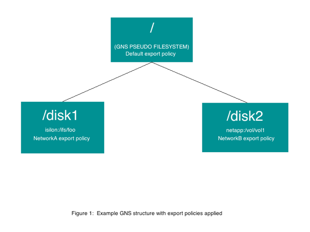

# Applying export rules

Export Rules and Export Policies enforce security on the cluster by limiting access to an export on a back-end filer.  

* *Export rules* are individual definitions that allow or restrict access by host, network, NIS group, or by the default group.  
* *Export policies* are a collection of Export Rules that are applied to a filer's exports, allowing the rules within the policy to be enforced.  

In this document we will walk through an example scenario in which we apply export policies that we have created to various filer exports that have junctions in our Global Namespace (GNS). We will then explain how these export policies will be enforced by the cluster to help secure the GNS.
 
For more information on creating export rules and policies, please review [Controlling Access to Core Filer Exports](https://azure.github.io/Avere/legacy/ops_guide/4_7/html/export_rules_overview.html) in the Cluster Configuration Guide.

## Example 

For our example, we will examine a GNS vserver that has two junctions pointing to two filer exports.  This gives us three potential places for us to apply export policies to the cluster. 

* The first and highest point in the namespace is for the pseudofilesystem's ``/`` directory. 
* The second point is for a junction called ``/disk1``, which points to an export ``/ifs/foo`` on the back-end filer named ``isilon``.
* The third point is for a junction called ``/disk2``, which points to an export ``/vol/vol1`` on the back-end filer ``netapp``. 
 
For our export policies, we will create three:
 
* **Default** - This rule allows read/write access to everyone.
* **NetworkA** - This rule allows the network 10.0.0.0/24 read/write access and restricts everyone else.
* **NetworkB** - This rule allows the network 10.1.0.0/24 read/write access and restricts everyone else.
 
## Implementing example export policies 
 
When applying export policies, it's important to remember to use the least restrictive policies at the highest point in the namespace tree, and then gradually get more restrictive as they move down the tree. This is because export policies start at the point where they are implemented and trickle down to all the files and directories underneath them. So if you put a restrictive policy in for ``/`` (let's say the **NetworkA** export policy, for example) that policy is applied to ``/``, ``/disk1``, and ``/disk2``. In this example, it means that *only* the network 10.0.0.0/24 will be able to access anything within the namespace tree structure - everyone else will be locked out.
 
With these ideas in mind, we can set up our security structure.  

Let's say that we want ``/disk1`` to be accessed by NetworkA and ``/disk2`` to be accessed by NetworkB. We would set the following export policies:

* ``/`` would stay at **Default**
* ``/disk1`` would be assigned the **NetworkA** export policy 
* ``/disk2`` would be assigned NetworkB export policy.  

Figure 1 shows the global namespace structure with the policies applied.


 
If we mount ``/`` from the client 10.0.0.1 and do an ``ls``, we would see:

```
disk1
disk2
```
 
If we tried to ``cd`` into ``disk1``, we would be successful and would be able to view and work with its contents. If we tried to go into ``disk2``, however, the export policy **NetworkB** would block the request and we would receive an access denied message.  
 
Now, lets say that we change the export policy for ``/`` to **NetworkB**. 

Although the client 10.0.0.1 has an export policy that allows it access to ``/disk1``, it would *not* be able to access that directory because the export policy for its parent ``/`` is now set so that only clients from the 10.1.0.0/24 network can access the tree. Since ``/disk1`` is part of that tree, the policy set for ``/`` supercedes the policy set for ``/disk1``.  

To allow the client 10.0.0.1 to access ``/disk1``, ``/`` would need to have either the export policy of **Default** (which allows everyone), or **NetworkA** (which allows 10.0.0.0/24 access).
 
## Conclusion 
 
As you can see, when export policies are applied, especially in complex configurations, it can be a challenge to implement them in ways that ensure you are giving everyone the proper access. 

Key things to remember are:

* Export policies trickle down from each junction point
* The pseudofilesystem paths are points where export policies can be imposed. 

If there is a problem with access, you will always want to check both ``/`` and the export policy of the junction to ensure both allow access to the client in question. If you do that, you should be able to troubleshoot access problems fairly easily.
 
## Supplemental reading 
 
More information regarding export policies and rules can be found at the following links:

* <https://azure.github.io/Avere/legacy/ops_guide/4_7/html/gui_export_policies.html>
* <https://azure.github.io/Avere/legacy/ops_guide/4_7/html/gui_export_rules.html>
 


<div style="text-align: right">Version 1.2, May 23 2019 </div>
