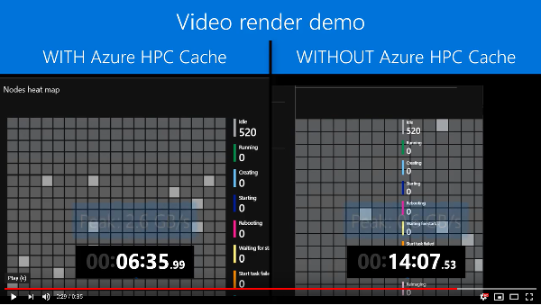

# Video rendering with Maya, Azure Batch, and Avere vFXT for Azure

## Introduction

Azure Batch enables you to seamlessly parallelize rendering workloads onto Azure virtual machines.  Azure Batch allows you to use your own virtual machine images, and provides pre-built render images with software like Maya and Arnold.  More information on Azure Batch and rendering including [reference rendering architectures](https://docs.microsoft.com/en-us/azure/batch/batch-rendering-architectures) can be found in the article ["Rendering using Azure"](https://docs.microsoft.com/en-us/azure/batch/batch-rendering-service).

The [Avere vFXT](https://aka.ms/averedocs) is a natural fit with Azure Batch Rendering because it hides [storage latency](why_avere_for_rendering.md), by bringing the storage close to Azure Batch.

This 60-minute demo takes you through rendering an animated movie using Azure Batch, Maya, and the Avere vFXT cluster.  The Avere vFXT is added to hide latency as shown in the following video:

[](https://youtu.be/V9bdSXgOfWQ)

> The source code to produce the template is located [here](../src/tutorials/mayabatch).

## Prerequisites

1. Install a vFXT cluster using the [Avere vFXT Marketplace Wizard](https://azuremarketplace.microsoft.com/en-us/marketplace/apps/microsoft-avere.vfxt-template?tab=Overview).

2. Create a Windows 10 workstation for Avere vFXT with [Windows 10 workstation for Avere vFXT](windows_10_avere_vfxt_mounted_workstation.md).

3. On the cluster controller, mount the vFXT shares. 

    1. Run the following commands:

       ```bash
       sudo -s
       apt-get update
       apt-get install nfs-common
       mkdir -p /nfs/node0
       mkdir -p /nfs/node1
       mkdir -p /nfs/node2
       chown nobody:nogroup /nfs/node0
       chown nobody:nogroup /nfs/node1
       chown nobody:nogroup /nfs/node2
       ```

    2. Edit `/etc/fstab` to add the following lines but *using your vFXT node IP addresses*. Add more lines if your cluster has more than three nodes. 
        ```bash
        10.0.0.12:/msazure    /nfs/node0    nfs hard,nointr,proto=tcp,mountproto=tcp,retry=30 0 0
        10.0.0.13:/msazure    /nfs/node1    nfs hard,nointr,proto=tcp,mountproto=tcp,retry=30 0 0
        10.0.0.14:/msazure    /nfs/node2    nfs hard,nointr,proto=tcp,mountproto=tcp,retry=30 0 0
        ```

    3. To mount all shares, type `mount -a` from the cluster controller. 

## Prepare content and infrastructure

This step downloads the frames to render, the client mounting script, and the render task script to the appropriate machines. 

1. On the controller, download a Maya scene to the controller's `/nfs/node1/demoscene` folder.  

   This demo uses the royalty-free cartoon candles example from https://www.turbosquid.com/3d-models/cartoon-candles-3d-model-1238207.

2. Copy the downloaded unzipped scene to the folder `/nfs/node1/demoscene` on the Avere vFXT volume.

3. Copy the following file, keeping the same name, to the Avere vFXT volume. Store it in a folder named ``/nfs/node1/bootstrap``:

   ```
   https://raw.githubusercontent.com/Azure/Avere/master/src/tutorials/mayabatch/centosbootstrap.sh
   ```
    
4. Copy the following file, keeping the same name, to the Avere vFXT volume. Store it in a folder named ``/nfs/node1/src``:

   ```
   https://raw.githubusercontent.com/Azure/Avere/master/src/tutorials/mayabatch/render.sh
   ```

## Create an Azure Batch account and a pool

The steps below create an Azure Batch account and a pool.  

> Tip: If you ask for a quota increase on the Batch account, don't delete the account - deleting the account will result in a loss of the quota.  

If you are not familiar with Azure Batch, the following pages cover the concepts of Batch accounts, pools, and jobs: https://docs.microsoft.com/en-us/azure/batch/batch-technical-overview.

1. To create the Batch account, run the following commands in a cloud shell (from http://portal.azure.com or https://shell.azure.com):

   ```bash
   export DstSub="SUBSCRIPTIONID"
   export DstResourceGroupName="avere0807batcha"
   export DstLocation="eastus2"
   export BatchAccountName="avere0807batcha"
   
   az account set --subscription $DstSub
   az group create --name $DstResourceGroupName --location $DstLocation
   
   az batch account create --location $DstLocation --resource-group $DstResourceGroupName --name $BatchAccountName
   
   az batch account login --resource-group $DstResourceGroupName --name $BatchAccountName
   ```

2. Next, you will need to add the Batch CLI extensions to enable pool and job creation.  

   You can safely ignore any errors informing you that the extensions have been added (more information is here: https://docs.microsoft.com/en-us/azure/batch/batch-cli-templates).
   
   ```bash
   # add the cli extensions if they are not already added
   az extension add --name azure-batch-cli-extensions
   ```

3. Now that the account is created, download the pool templates, edit the parameters with the vFXT information and node count, and finally create the pool by running all the commands.  

   The pool template uses the ``bootstrap`` script installed [previously](#prepare-content-and-infrastructure) on the vFXT cluster to mount all the shares.

   ```bash
   # create ~/batch directory
   mkdir -p ~/batch
   cd ~/batch
   
   # download the batch 
   curl -o pool.json https://raw.githubusercontent.com/Azure/Avere/master/src/tutorials/mayabatch/pool.json
   curl -o pool-parameters.json https://raw.githubusercontent.com/Azure/Avere/master/src/tutorials/mayabatch/pool-parameters.json
   vi pool-parameters.json
   
   # login, in case you are not already logged into batch
   az batch account login --resource-group $DstResourceGroupName --name $BatchAccountName
   az batch pool create --template pool.json --parameters pool-parameters.json
   ```

4. Log in to the Azure Batch Explorer on the Windows workstation and you can see the pool starting.

## Production: Run a job to render the demo scene

This step uses Azure Batch to create and run Maya render tasks for each frame of the movie.  The frame creation is output to the Avere vFXT cluster under the ``/images`` path.  

Each task uses the ``render`` script that you downloaded under ``/src`` in the [preparation](#prepare-content-and-infrastructure) step.

1. Even before all the nodes start up in the demo, you can start the job running by issuing the following commands:

   ```bash
   cd ~/batch
   
   # download the batch 
   curl -o job.json https://raw.githubusercontent.com/Azure/Avere/master/src/tutorials/mayabatch/job.json
   curl -o job-parameters.json https://raw.githubusercontent.com/Azure/Avere/master/src/tutorials/mayabatch/job-parameters.json
   vi job-parameters.json
   
   # login, in case you are not already logged into batch
   az batch account login --resource-group $DstResourceGroupName --name $BatchAccountName
   az batch job create --template job.json --parameters job-parameters.json
   ```

2. Use Azure Batch Explorer on the Windows machine to watch the progress of the jobs, and inspect the log output.  On the Windows machine, you should start to see the images (ending in .iff) show in the ``/images`` directory.

## Post-production: Build the movie from the rendered frames

In the previous step, you rendered the scene into many frame files.  In this step you will take these files and build a movie file.

1. RDP to the Windows workstation.

2. Open the VirtualDub application from the desktop shortcut.

3. Choose File > Open and browse to `c:\AvereVFXT\images\job1\images` (or different job name if you chose a different job) and select the file ending in ``0.IFF``.

4. From the File menu, click `Save as AVI…`, and save to the desktop.

5. After the export completes, you can click on the file on the desktop and see your new movie.

   

