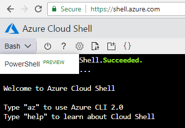

# vFXT Prerequisites
Here are the prerequisites for vFXT cluster creation.

1. [Create a new subscription](#create-a-new-subscription).
1. [Subscription owner permissions](#subscription-owner-permissions).
1. [Quota for the vFXT cluster](#quota-for-the-vfxt-cluster).
1. [Accepting the Legal Terms for the marketplace images](#accepting-the-legal-terms-for-the-two-marketplace-images).
1. [Create an Azure RBAC Role](#create-an-azure-rbac-role)

## Create a new Subscription

It is highly recommended to create a separate subscription for each Avere vFXT project.  This allows you to easily track all project resources and expenses.  To do this:

Start by creating a new subscription to track all project resources and expenses.
- Navigate to the [Subscriptions blade](https://ms.portal.azure.com/#blade/Microsoft_Azure_Billing/SubscriptionsBlade)
- Click "+ Add" button at the top
- Sign in, if prompted
- Select an offer and walk through the steps for a new subscription

## Subscription owner permissions
The vFXT creation process expects the user to have owner permissions. The controller node must be able to create and modify configuration of the cluster nodes including network security groups and IP addressing.

Users must either be an owner of the subscription or at minimum be an owner of a Resource Group where the Avere controller and cluster will be installed.  

If you need to allow users without any owner privileges to create vFXT clusters, there is a workaround involving creating and assigning an extra access role. This role gives significant extra permissions to these users. Reference [this link](non_owner.md) for instructions on how to authorize non-owners to create clusters.

## Quota for the vFXT cluster
You must have sufficient quota for the following Azure components.  Here are the steps to [request quota increase](https://docs.microsoft.com/en-us/azure/azure-supportability/resource-manager-core-quotas-request).

> NOTE: The Virtual Machines and SSD are for the vFXT cluster itself.  You need additional quota for the VMs and SSD you intend to use for your compute farm.  Get the quota enabled for the region where you intend to run the workflow.

|Azure component|Quota|
|----------|-----------|
|Virtual Machines|3 or more D16s_v3 or E32s_v3|
|Premium SSD Storage|200GB OS and 1-4TB Cache per node|
|Storage Account|v2|
|BLOB|One LRS BLOB Container (optional)|

## Accepting the Legal Terms for the two marketplace images

For each subscription you use to deploy an Avere vFXT, you will need to accept the Legal Terms, once for each subscription.

Choose either cloud shell or portal to accept the legal terms for the marketplace images.

### Cloud Shell

1. Browse to https://shell.azure.com

2. Change the mode to Powershell, using the shell selector drop down

   

3. Type in the following commands for each subscription you will use to deploy the Avere vFXT:

   ```powershell
   Select-AzureRmSubscription -SubscriptionID <your-Azure-subscription-id>

   Get-AzureRmMarketplaceTerms -Publisher "microsoft-avere" -Product "vfxt" -Name "avere-vfxt-controller" | Set-AzureRmMarketplaceTerms -Accept

   Get-AzureRmMarketplaceTerms -Publisher "microsoft-avere" -Product "vfxt" -Name "avere-vfxt-node" | Set-AzureRmMarketplaceTerms -Accept
   ```
### Azure Portal

1. Find the Avere images, by browsing for the [Azure marketplace](https://ms.portal.azure.com/#blade/Microsoft_Azure_Marketplace/GalleryFeaturedMenuItemBlade/selectedMenuItemId/home) and searching for **Avere**.

2. For each the controller and the vFXT node enable programmatic access to your subscription BELOW the Create button. You’ll only need to do this once for each subscription. 

   

   

## Create an Azure RBAC Role

The Avere vFXT cluster uses managed service identity (MSI) to read Azure resource properties required for operation, and write access to the network interface resources as part of the high availability (HA) capabilities.  This RBAC role is only used for the vFXT cluster, and not used for the controller.

1. Open the Cloud Shell in Azure Portal or browse to https://shell.azure.com.

2. Run ```az account set --subscription YOUR_SUBSCRIPTION_ID```

3. Download the role, and paste in your subscription ID, by running the following commands:

```bash
wget -O- https://averedistribution.blob.core.windows.net/public/vfxtdistdoc.tgz | tar zxf - avere-cluster.json
vi avere-cluster.json
```


4. Create the role by running the az role definition create command.

```bash
az role definition create --role-definition /avere-cluster.json
```