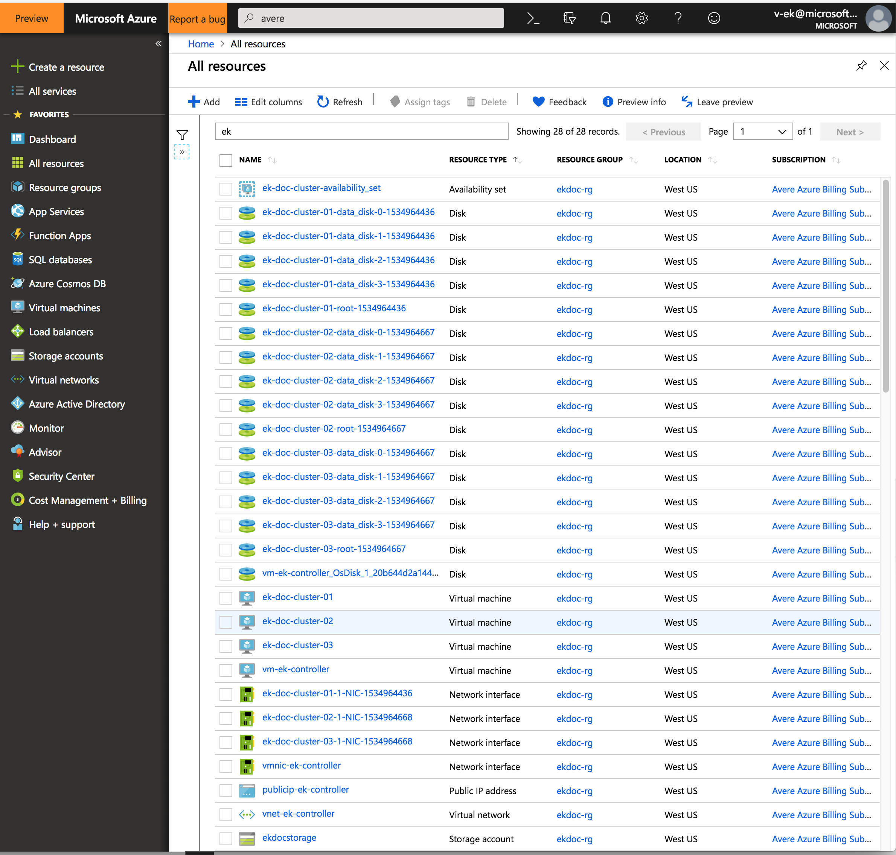

# Managing cluster VM instances from the Azure portal

There are several options for stopping, starting and removing vFXT clusters:

- [vfxt.py](start_stop_vfxt-py.md) - The cluster creation script can be used to safely stop or destroy the entire cluster from the command line.
- [Avere Control Panel](start_stop_gui.md) - The cluster administrative tool can be used to stop or reboot single nodes as well as the entire cluster. It is the safest option to guarantee that changed cache data is written to backend storage before shutdown.
- Azure portal - The portal can be used to destroy cluster VMs individually, but data integrity is not guaranteed if the cluster is not shut down cleanly first.

This document explains actions available from the Azure portal. Read the linked documents above to learn about other options for controlling cluster elements. 

## Actions from the Azure portal

The Azure portal can be used for the following actions: 

- Restarting stopped vFXT nodes 
- Permanently destroying and removing cluster resources.
- Destroying a vFXT cluster if you do not need to ensure that any changed data in the cluster cache is written to the core filer

## Restarting vFXT instances

If you need to restart a stopped instance, you must use the Azure portal. Select **Virtual machines** in the left menu and then click on the VM name in the list to open its overview page.

Click the **Start** button at the top of the overview page to reactivate the VM.

## Deleting cluster nodes

If you want to delete one node from the vFXT cluster but keep the remainder of the cluster, you must first remove the node from the cluster using the Avere Control Panel.

**Caution:** If you delete a node without first removing it from the vFXT cluster, data might be lost.

To permanently destroy one or more instances used as vFXT node, use the Azure portal.
Select **Virtual machines** in the left menu and then click on the VM name in the list to open its overview page.

Click the **Delete** button at the top of the overview page to permanently destroy the VM.

## Destroying the cluster from the Azure portal

**NOTE:** If you want any remaining client changes in the cache to be written to backend storage, either use the vfxt.py ``--destroy`` option or use the Avere Control Panel to shut down the cluster cleanly before removing the node instances in the Azure portal.

You can destroy node instances permanently by deleting them in the Azure portal. You can delete them one at a time as described above, or you can use the **Virtual Machines** page to find all of the cluster VMs, select them with the checkboxes, and click the **Delete** button to remove them all in one action.

## Deleting additional cluster resources

If you created additional resources specifically for the vFXT cluster, you might want to remove them as part of tearing down the cluster. Of course, you should not destroy elements that contain data you need, or any items that are shared with other projects.

In addition to deleting the cluster nodes, consider removing these components: 

* The cluster controller VM
* Data disks associated with cluster nodes
* Network interfaces and public IPs associated with cluster components
* Virtual networks
* Storage accounts (**only** if they contain no important data)
* Availability set 

## Deleting a resource group

If you created a resource group specifically for the cluster, you can destroy all related resources for the cluster by destroying the resource group. 

**Caution:** Only destroy the resource group if you are certain that nothing of value resides within the group. For example, make sure you have moved any needed data from any storage containers within the resource group.  

To delete a resource group, click **Resource groups** in the left menu of the portal, and filter the list of resource groups to find the one you created for the vFXT cluster. Select the resource group and click the three dots at the right of the panel. Choose **Delete resource group**. The portal will ask you to confirm the deletion, which is irreversable.  

