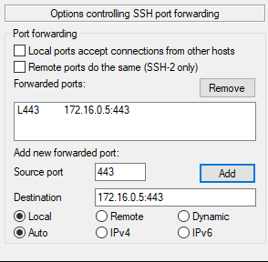
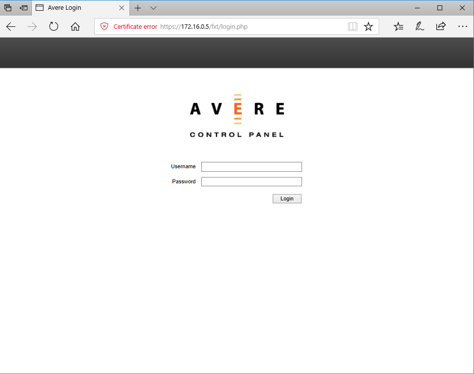
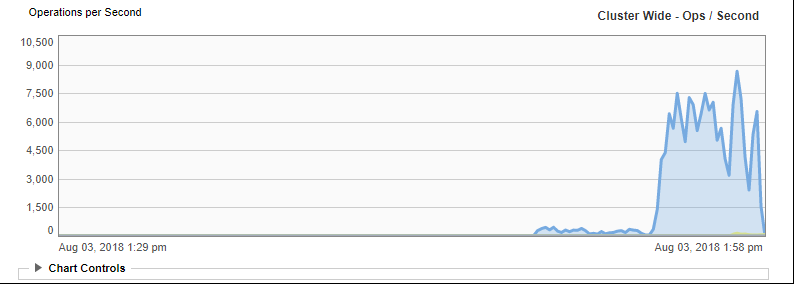
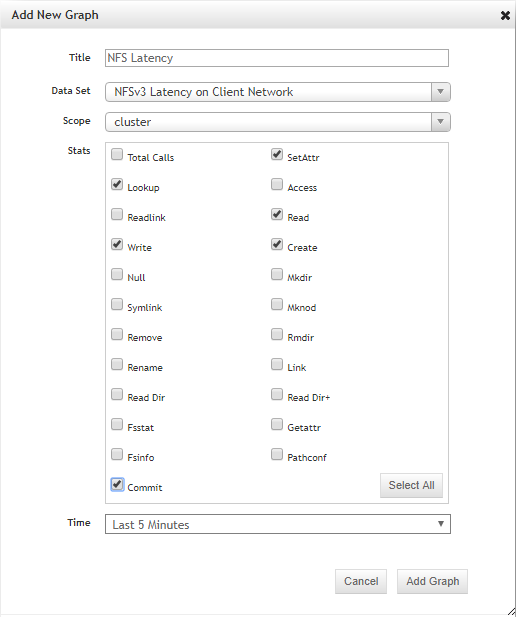

# Using the Avere vFXT

Now that you have deployed your vFXT, you are ready to use it.

The Avere vFXT cluster is a great fit for the following workloads:

  * High-Performance NFSv3/SMB2 file serving
  * Compute farms with 1000-40,000 CPU cores
  * READ-heavy application workloads, clustered NAS
  * NAS from NetApp or Dell EMC Isilon

# Explore the Avere vFXT Web UI

1. Define an SSH Tunnel to port 443 on the management IP (in the output of the vFXT creation), and SSH to the controller machine.  Below is the tunnel definition in putty in Windows:


	
2. Browse to <a href="https://localhost/fxt/login.php" target="_blank">https://localhost/fxt/login.php</a>, clicking "Details" and "Go on to the webpage" to bypassing security check.


	
3. Login with `admin` and the password you configured during the vFXT deployment.
	
4. Once logged in, your first task is to backup your encryption key by browsing to <a href="https://localhost/avere/fxt/cloudFilerKeySettings.php" target="_blank">https://localhost/avere/fxt/cloudFilerKeySettings.php</a>

5. Now browse around and explore the UI.

# Using the Controller Mount the NFS vFXT Shares

These instructions will continue to work with the controller node you created in the first deployment.

1. If not already logged in, ssh to the controller.

2. Prepare the mount points:

```bash
sudo -s
apt-get update
apt-get install nfs-common
mkdir -p /nfs/node1
mkdir -p /nfs/node2
mkdir -p /nfs/node3
chown nobody:nogroup /nfs/node1
chown nobody:nogroup /nfs/node2
chown nobody:nogroup /nfs/node3
```

3. Edit `/etc/fstab` and add the following lines, updating the ip addresses using the IP Addresses from the vFXT deployment, or listed on the front page of the Web UI.

```bash
172.16.0.12:/msazure	/nfs/node1	nfs auto,rsize=524288,wsize=524288,nofail,noatime,nolock,intr,tcp,actimeo=1800 0 0
172.16.0.13:/msazure	/nfs/node2	nfs auto,rsize=524288,wsize=524288,nofail,noatime,nolock,intr,tcp,actimeo=1800 0 0
172.16.0.14:/msazure	/nfs/node3	nfs auto,rsize=524288,wsize=524288,nofail,noatime,nolock,intr,tcp,actimeo=1800 0 0
```

4. To mount all shares, type `mount -a`

5. type `df -h | grep msazure` to see the newly mounted shares.

6. type `exit` to leave root

# Using the vFXT with some Clients

When testing the vFXT, you will need to start thinking in parallel, and adjust your tools to read/write in parallel as much as possible.  For example, tools like cp, and rsync run in serial, and will have poor performance on the vFXT.  This section provides two examples for parallelism, but for a more thorough review of the parallism required, please review [Getting data onto the vFXT cluster](getting_data_onto_vfxt.md).

## Example #1: Parallel client copy

To increase ingestion of files, you must parallelize the file creation.

The script below will add the executable to `parallelcp` (this assumes Ubuntu, if not ubuntu, you need to install parallel separately):

```bash
sudo touch /usr/bin/parallelcp && sudo chmod 755 /usr/bin/parallelcp && sudo sh -c "/bin/cat >/usr/bin/parallelcp" <<EOM 
#!/bin/bash

display_usage() { 
    echo -e "\nUsage: \$0 SOURCE_DIR DEST_DIR\n" 
} 

if [  \$# -le 1 ] ; then 
    display_usage
    exit 1
fi 
 
if [[ ( \$# == "--help") ||  \$# == "-h" ]] ; then 
    display_usage
    exit 0
fi 

SOURCE_DIR="\$1"
DEST_DIR="\$2"

if [ ! -d "\$SOURCE_DIR" ] ; then
    echo "Source directory \$SOURCE_DIR does not exist, or is not a directory"
    display_usage
    exit 2
fi

if [ ! -d "\$DEST_DIR" ] && ! mkdir -p \$DEST_DIR ; then
    echo "Destination directory \$DEST_DIR does not exist, or is not a directory"
    display_usage
    exit 2
fi

if [ ! -w "\$DEST_DIR" ] ; then
    echo "Destination directory \$DEST_DIR is not writeable, or is not a directory"
    display_usage
    exit 3
fi

if ! which parallel > /dev/null ; then
    sudo apt-get update && sudo apt install -y parallel
fi

DIRJOBS=225
JOBS=225
find \$SOURCE_DIR -mindepth 1 -type d -print0 | sed -z "s/\$SOURCE_DIR\///" | parallel --will-cite -j\$DIRJOBS -0 "mkdir -p \$DEST_DIR/{}"
find \$SOURCE_DIR -mindepth 1 ! -type d -print0 | sed -z "s/\$SOURCE_DIR\///" | parallel --will-cite -j\$JOBS -0 "cp -P \$SOURCE_DIR/{} \$DEST_DIR/{}"
EOM
```

This parallel copy is used in the next example.

## Example #2

**Prerequisite** Ensure you have installed the parallelcp from the first example. 

These instructions will compile glibc, using the source files from the avere share.

Run the following commands to compile glibc, where the source files are stored on the avere mount point, and the object files are stored on the local harddrive.

The below script uses parallel copy script above.  Notice that to gain parallelization, parallelcp and make is used with `-j`:

```bash
sudo apt-get update
sudo apt install -y gcc bison gcc binutils make parallel
cd
wget https://mirrors.kernel.org/gnu/libc/glibc-2.27.tar.bz2
tar jxf glibc-2.27.tar.bz2
ln -s /nfs/node1 avere
time parallelcp glibc-2.27 avere/glibc-2.27
cd
mkdir obj
mkdir usr
cd obj
/home/azureuser/avere/glibc-2.27/configure --prefix=/home/azureuser/usr
time make -j
```

While the compile is happening, browse the webui, and the analytics tab to see the performance characteristics of the avere cluster.  The above script will yield a pattern similar to below:



On the analytics page, you can add the following latency graph to understand the client latency.



## Other Useful Client Tips

Here are some additional ways to scan through the files:

1. To read through all files, try 
```bash
find . -type f | xargs md5sum
```

2. To clear out client cache:
```bash
sudo bash
echo 3 > /proc/sys/vm/drop_caches
```

3. Here is another command if you want to bypass the client cache:
```bash
for i in $(find . -type f); do dd if=$i of=/dev/null iflag=direct bs=524288 ; done
```

Here are some other examples:

  * [VDBench - measuring vFXT Performance](vdbench.md) - Deploys VDBench on an N-Node cluster to demonstrate the storage performance characteristics of the Avere vFXT cluster.
  * [Maya + Azure Batch + Avere vFXT Demo](maya_azure_batch_avere_vfxt_demo.md) - Demonstrates how to use the Autodesk Maya Renderer with Azure Batch and the Avere vFXT to generate a rendered movie.
