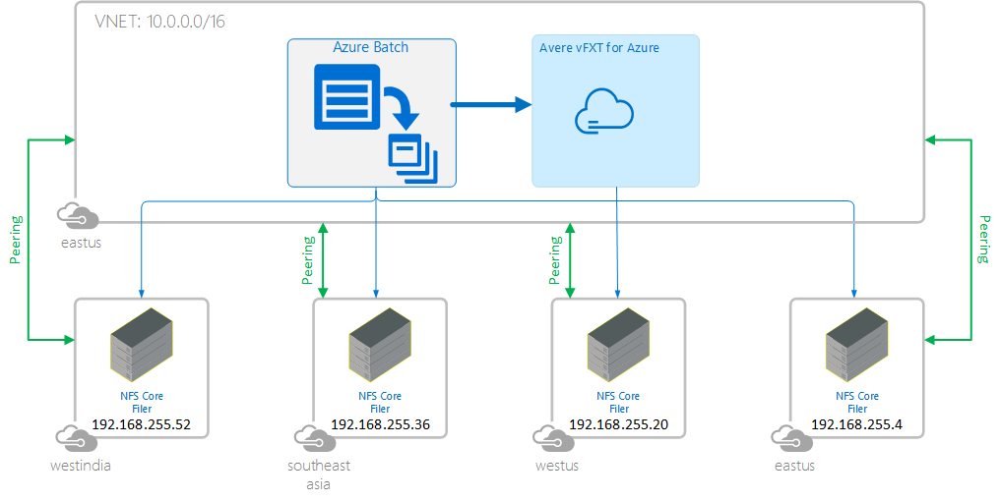
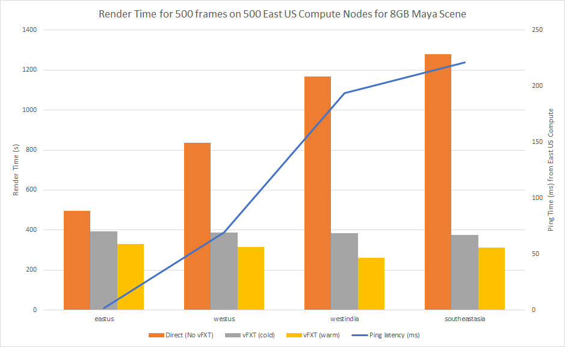

# Why use Avere vFXT Edge Filer? - A study to illustrate the benefits of the Avere vFXT for rendering

Avere Virtual FXT (vFXT) Edge filers allow you to run compute workflows in Azure Compute without having to worry about moving your NAS.  The vFXT accomplishes this by performing read-ahead caching, which aids in hiding latency when trying to use cloud computing against on-premises storage. The benefits of this technology include:

  * Leveraging your current on-premises NAS environment alongside Azure Compute
  * Hiding latency to cloud compute resources with cloud caching
  * Avoids having to copy any of your data into the cloud

A key question is how much of a difference does the Avere vFXT make to a local NFS filer and remote NFS filers at varying distances and latencies.  This study reviews the setup of the experiment, shows the results, and makes conclusions based on results.

# Setup

For this study, we use a similar rendering configuration described in [Rendering using Azure Batch and Avere vFXT](maya_azure_batch_avere_vfxt_demo.md).  For each mounted NFS path, we measure the time it takes to render 500 frames across 500 nodes in parallel.  The render includes the reading of the scene from the NFS path, and writing the rendered frame to the same NFS path for each of the 500 nodes. 

The Azure Compute and Avere vFXT resources reside in East US.  The NFS core filers are installed in each of East US, West US, Southeast Asia, and West India.  [Virtual Network Peering](https://docs.microsoft.com/en-us/azure/virtual-network/virtual-network-peering-overview) is used to connect all the resources together.  The architecture is shown in the following diagram:

   

To setup the above architecture run the following steps:

1. Deploy an Avere vFXT in East US as described in [Deploy](jumpstart_deploy.md).

2. To have enough IPs for the 500 batch nodes you will need to add a subnet to the VNET created in #1.  In the Azure Portal browse to the VNET and add a new subnet ```10.0.4.0/22``` for an additional capacity of 1024 addresses.

3. Deploy an NFS NAS core filer in separate VNETs using the [NFS Deployment templates](../src/tutorials/nfslatency/azuredisknfs) and with the following VNET and subnet configurations:

   | VNET | VNET Location | Address Prefix | Subnet Prefix(s) |
   | --- | --- | --- | --- |
   | Compute and vFXT | East US | 10.0.0.0/16 | 10.0.0.0/24 (vFXT), 10.0.4.0/22 (Azure Batch Compute) |
   | NFS East US | East US | 192.168.255.0/28 | 192.168.255.0/28 |
   | NFS West US | West US | 192.168.255.16/28 | 192.168.255.16/28 |
   | NFS Southeast Asia | Southeast Asia | 192.168.255.32/28 | 192.168.255.32/28 |
   | NFS West India | West India | 192.168.255.48/28 | 192.168.255.48/28 |

4. On each NFS server install your Maya Render scene in the directories according to [the prepare content instructions](maya_azure_batch_avere_vfxt_demo.md#prepare-content-and-infrastructure).  For this experiment we used an 8GB render scene with multiple textures.

5. Setup two-way VNET peering from the Avere vFXT VNET to each of the NAS VNETs as shown in the [peering templates and parameter templates](../src/tutorials/nfslatency/vnetpeering).

6. [Access the Avere vFXT management UI](access_cluster.md), add each [NFS NAS as a core filer](configure_storage.md#nas-core-filer), and then for each regional NFS NAS add the following [named namespaces (junctions)](configure_storage.md#create-a-junction):

   | Region | namespace |
   | --- | --- |
   | eastus | eastus |
   | westus | westus |
   | westindia | westindia |
   | southeastasia | southeastasia |

7. Your Azure batch machines will need to mount all the NFS exports created above.  To do this choose one machine (eastus NFS recommended) as the bootstrap machine and add the following file to the ```/bootstrap``` folder of the NFS export, and edit the file with the IP addresses of each NFS server.  For example, SSH to the machine and run:

   ```bash
   # SSH to eastus NFS server
   sudo mkdir -p /datadisks/disks1/bootstrap
   sudo wget -O /datadisks/disks1/bootstrap/centosbootstrap.sh https://raw.githubusercontent.com/Azure/Avere/master/src/tutorials/nfslatency/batch/centosbootstrap-nfsexperiment.sh
   # edit the file to update the IP addresses of each server
   vi centosbootstrap.sh
   ```

8. [Setup Azure Batch](maya_azure_batch_avere_vfxt_demo.md#create-an-azure-batch-account-and-a-pool) and create a 500 single core low-priority nodes, ensuring you pass in the above boot.  As a tip, it is useful to add 20 extra nodes to iron out the bumps of the nodes that get pre-empted.  The mount points are under NFS and are setup as shown in the following table on each batch node:

   | Host | Exported Path or vFXT Namespace Path | Mounted Path |
   | ---- | --- | --- | 
   | 192.168.255.4 (eastus vnet subnet)  | /datadisks/disk1 | /nfs/eastus |
   | 192.168.255.20 (westus vnet subnet)  | /datadisks/disk1 | /nfs/westus |
   | 192.168.255.52 (westindia vnet subnet)  | /datadisks/disk1 | /nfs/westindia |
   | 192.168.255.36 (southeastasia vnet subnet)  | /datadisks/disk1 | /nfs/southeastasia |
   | Round Robin vServer IP (eastus) |  /eastus | /nfs/eastusvfxt |
   | Round Robin vServer IP (eastus) |  /westus | /nfs/westusvfxt |
   | Round Robin vServer IP (eastus) |  /westindia | /nfs/westindiavfxt |
   | Round Robin vServer IP (eastus) |  /southeastasia | /nfs/southeastasiavfxt |

Once everything is setup, run a [500 frame job](maya_azure_batch_avere_vfxt_demo.md#production-run-a-job-to-render-the-demo-scene) using the following experiments for each region and the mountpoints specified in the above table:
1. 500 frames directly to the NAS
2. Cold vFXT: 500 frames against the vFXT namespace for that region
3. Warm vFXT: 500 frames against the vFXT namespace for that region

If you need to re-run the cold experiment, you have to:
1. delete your pool
2. on the vFXT Management UI, on the manage core filers page, you need to invalidate the cache which can take up to 30 minutes.

# Results

The timing results to render 500 frames on 500 nodes of a Maya scene of 8GB are shown in the following table and corresponding chart:

| NFS Location | Roundtrip Latency (ms) to East US | Direct Connect (s) | Cold E32x3 vFXT (s)  | Warm E32x3 vFXT (s)  |
| ---- | ---- | ---- | ---- | ---- |
| NFS East US | 1.9ms | 497 | 393 | 331 |
| NFS West US | 69.5ms | 836 | 386 | 316 |
| NFS West India | 194ms | 1168 | 384 | 262 |
| NFS Southeast Asia | 221ms | 1280 | 375 | 312 |



As expected the direct to NAS render times worsened as the latencies increased.  However, in the cold vFXT case the rendering times were equal regardless of where the NFS Filer was located.  Also, the data shows that the second or "Warm" run was faster than the first "Cold" run.

# Conclusion

As demonstrated by the above experiments, the Avere vFXT hides NAS Filer Latency regardless of where the NFS Filer is located in the world.  Warming the cache of the vFXT further increases the performance.  The Avere vFXT is well suited to high parallel HPC workloads like rendering that require high I/O and many heavy repeated reads.