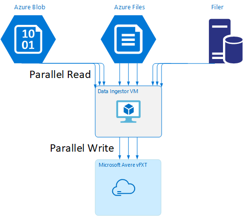

# Data Ingestor - Ingesting data into the Avere vFXT

This template implements a data ingestor VM containing recommended tools for parallel ingestion in to the Avere vFXT.

Use python 2.7 with this project.  The script `gen-arm-templates.py` takes as inputs `installdataingestor.sh`, and `base-template*.json`, and outputs to `dataingestor-azuredeploy.*.json`.

The data ingestor VM contains the following tools:

1. msrsync -  available from GitHub at https://github.com/jbd/msrsync

2. parallelcp - mentioned in the [ingestion guide](../../docs/getting_data_onto_vfxt.md#using-the-parallel-copy-script).

To learn more about parallel ingestion, please refer to the [ingestion guide](../../docs/getting_data_onto_vfxt.md#using-the-parallel-copy-script).

To install from the portal, launch the deployment by clicking the "Deploy to Azure" button:

