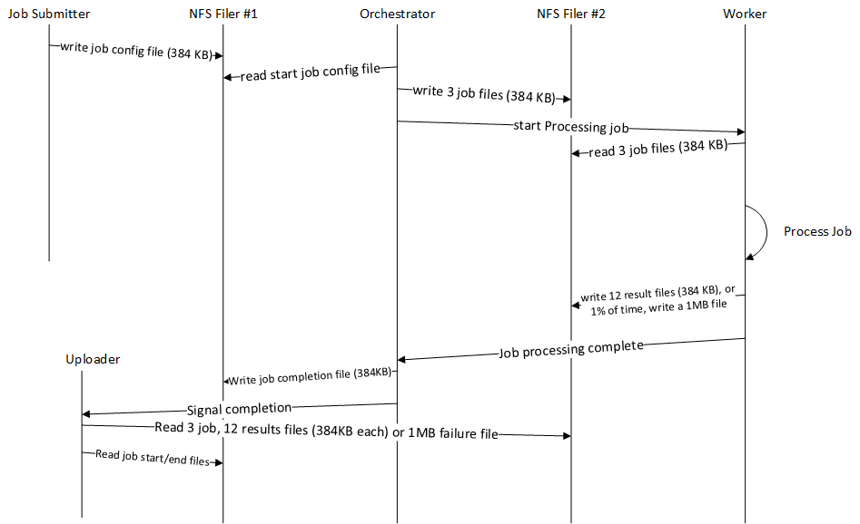

# EDA Simulator to test Filer Performance

This EDA Simulator helps test filer performance.  The simulator has 5 components:
 1. **jobsubmitter** - the task that submits job config files for processing
 1. **orchestrator** - the task the reads the job config files and writes workstart files, and submits work to workers for processing.  This also receives completed jobs from workers, writes a job complete file, and submits a job for upload.
 1. **worker** - the task that takes a workitem, reads the start files, and writes the complete files and or error file depending on error probability. 
 1. **uploader** - this task receives upload tasks for each completed job, and reads all job config files and job work files.
 1. **statscollector** - this process collects all the file statistics for each batch run and prints the raw results, and summary to the statistics output directory.
 
The job uses Azure Storage Queue for work management, and uses event hub for measuring file statistics.  The goal of the EDA simulator is to test with various filers to understand the filer performance characteristics.

The first four components listed above implement the following message sequence chart:



## Installation Instructions for Linux

 1. If not already installed go, install golang:

```bash
wget https://dl.google.com/go/go1.11.2.linux-amd64.tar.gz
tar xvf go1.11.2.linux-amd64.tar.gz
sudo chown -R root:root ./go
sudo mv go /usr/local
mkdir ~/gopath
echo "export GOPATH=$HOME/gopath" >> ~/.profile
echo "export PATH=$PATH:/usr/local/go/bin:$GOPATH/bin" >> ~/.profile
source ~/.profile
rm go1.11.2.linux-amd64.tar.gz
```

 2. setup edasim code
```bash
# apply fix for storage queue, remove following lines once fix #9 is committed
cd $GOPATH
go get -v github.com/Azure/Avere/src/go/...
```

## Storage Preparation

 1. use the portal or cloud shell to create you storage account
 1. create the following queues
     1. jobcomplete
     1. jobprocess
     1. jobready
     1. uploader
 1. use the portal or cloud shell to get the storage account key and set the following environment variables
```bash
export AZURE_STORAGE_ACCOUNT=YOUR_STORAGE_ACCOUNT
export AZURE_STORAGE_ACCOUNT_KEY=YOUR_STORAGE_ACCOUNT_KEY
```

The eda simulator will automatically create the necessary queues.

## Event Hub Preparation

 1. use the portal or cloud shell to create an "Event Hubs Namespace" Resource with Pricing Tier "Standard" resource in the same region as the vFXT.  For this example, we created `edasimeventhub`
 1. once created, browse to the "Event Hubs Namespace" in the portal and click "+Event Hub" to add an event hub keeping the defaults of 2 partition counts and 1 day message retention.  For this example, we created event hub `edasim`
 1. once created, browse to "Shared Access Policies", click on "RootManageSharedAccessKey" and copy the primary key
 1. next you will need to set your environment variables with everything you just created:

```bash
export AZURE_EVENTHUB_SENDERKEYNAME="RootManageSharedAccessKey"
export AZURE_EVENTHUB_SENDERKEY="PASTE_SENDER_KEY_HERE"
export AZURE_EVENTHUB_NAMESPACENAME="edasimeventhub"
export AZURE_EVENTHUB_HUBNAME="edasim"
```

## Build Environment String

Using the storage and event hub values above, build a one line string to be used later in deployment:

```bash
AZURE_STORAGE_ACCOUNT=YOUR_STORAGE_ACCOUNT AZURE_STORAGE_ACCOUNT_KEY="YOUR_STORAGE_ACCOUNT_KEY" AZURE_EVENTHUB_SENDERKEYNAME="RootManageSharedAccessKey" AZURE_EVENTHUB_SENDERKEY="PASTE_SENDER_KEY_HERE" AZURE_EVENTHUB_NAMESPACENAME="edasimeventhub" AZURE_EVENTHUB_HUBNAME="edasim"
```

## Deployment of Avere vFXT

These deployment instructions describe the installation of all components required to run Vdbench:

1. Deploy an Avere vFXT as described in [the Avere vFXT documentation](https://aka.ms/averedocs).

2. If you have not already done so, ssh to the controller, and mount to the Avere vFXT:

    1. Run the following commands:
        ```bash
        sudo -s
        apt-get update
        apt-get install nfs-common
        mkdir -p /nfs/node0
        mkdir -p /nfs/node1
        mkdir -p /nfs/node2
        chown nobody:nogroup /nfs/node0
        chown nobody:nogroup /nfs/node1
        chown nobody:nogroup /nfs/node2
        ```

    2. Edit `/etc/fstab` to add the following lines but *using your vFXT node IP addresses*. Add more lines if your cluster has more than three nodes.
        ```bash
        10.0.0.12:/msazure	/nfs/node0	nfs hard,nointr,proto=tcp,mountproto=tcp,retry=30 0 0
        10.0.0.13:/msazure	/nfs/node1	nfs hard,nointr,proto=tcp,mountproto=tcp,retry=30 0 0
        10.0.0.14:/msazure	/nfs/node2	nfs hard,nointr,proto=tcp,mountproto=tcp,retry=30 0 0
        ```

    3. To mount all shares, type `mount -a`

4. On the controller, setup all edasim binaries (using instructions to build above), bootstrap scripts, and service configuration files:
    ```bash
    # download the bootstrap files
    mkdir /nfs/node0/bootstrap
    cd /nfs/node0/bootstrap
    curl --retry 5 --retry-delay 5 -o bootstrap.jobsubmitter.sh https://raw.githubusercontent.com/Azure/Avere/master/src/go/cmd/edasim/deploymentartifacts/bootstrap/bootstrap.jobsubmitter.sh
    curl --retry 5 --retry-delay 5 -o bootstrap.orchestrator.sh https://raw.githubusercontent.com/Azure/Avere/master/src/go/cmd/edasim/deploymentartifacts/bootstrap/bootstrap.orchestrator.sh
    curl --retry 5 --retry-delay 5 -o bootstrap.onpremjobuploader.sh https://raw.githubusercontent.com/Azure/Avere/master/src/go/cmd/edasim/deploymentartifacts/bootstrap/bootstrap.onpremjobuploader.sh
    curl --retry 5 --retry-delay 5 -o bootstrap.worker.sh https://raw.githubusercontent.com/Azure/Avere/master/src/go/cmd/edasim/deploymentartifacts/bootstrap/bootstrap.worker.sh

    # copy in the built binaries
    mkdir /nfs/node0/bootstrap/edasim
    cp $GOPATH/bin/* /nfs/node0/bootstrap/edasim

    # download the rsyslog scripts
    mkdir /nfs/node0/bootstrap/rsyslog
    cd /nfs/node0/bootstrap/rsyslog
    curl --retry 5 --retry-delay 5 -o 30-orchestrator.conf https://raw.githubusercontent.com/Azure/Avere/master/src/go/cmd/edasim/deploymentartifacts/bootstrap/rsyslog/30-orchestrator.conf
    curl --retry 5 --retry-delay 5 -o 31-worker.conf https://raw.githubusercontent.com/Azure/Avere/master/src/go/cmd/edasim/deploymentartifacts/bootstrap/rsyslog/31-worker.conf
    curl --retry 5 --retry-delay 5 -o 32-onpremjobuploader.conf https://raw.githubusercontent.com/Azure/Avere/master/src/go/cmd/edasim/deploymentartifacts/bootstrap/rsyslog/32-onpremjobuploader.conf

    # download the service scripts
    mkdir /nfs/node0/bootstrap/systemd
    cd /nfs/node0/bootstrap/systemd
    curl --retry 5 --retry-delay 5 -o onpremjobuploader.service https://raw.githubusercontent.com/Azure/Avere/master/src/go/cmd/edasim/deploymentartifacts/bootstrap/systemd/onpremjobuploader.service
    curl --retry 5 --retry-delay 5 -o orchestrator.service https://raw.githubusercontent.com/Azure/Avere/master/src/go/cmd/edasim/deploymentartifacts/bootstrap/systemd/orchestrator.service
    curl --retry 5 --retry-delay 5 -o worker.service https://raw.githubusercontent.com/Azure/Avere/master/src/go/cmd/edasim/deploymentartifacts/bootstrap/systemd/worker.service
    ```

6. Deploy the eda simulator cluster by clicking the "Deploy to Azure" button below and for `appEnvironmentVariables` use the one line environment variable string you created above.  Here are the following nodes of the cluster:
    1. **jobsubmitter node(s)** - VMs with the script `job_submitter.sh` and `stats_collector.sh` in the user home dir.  These are the two manual parts of the run where the job batch and statscollector collects and summarizes the perf runs from each batch run.
    1. **orchestrator node(s)** - running orchestrators to process jobs and create work
    1. **worker node(s)** - running orchestrators to process work
    1. **onpremjobuploader node(s)** - running job uploaders to upload the processed work

    <a href="https://portal.azure.com/#create/Microsoft.Template/uri/https%3A%2F%2Fraw.githubusercontent.com%2FAzure%2FAvere%2Fmaster%2Fsrc%2Fgo%2Fcmd%2Fedasim%2Fdeploymentartifacts%2Ftemplate%2Fazuredeploy.json" target="_blank">
    
    </a>

## To Run

Use the portal to get the ip of job submitter machine and login.  In the user root adjust and use the `job_submitter.sh` script to submit batches of varying sizes.  After the batch is complete run the `stats_collector.sh` script to collect and summarize the stats.

To look at logs on the orchestrator, worker, or edasim machines, tail the logs under /var/log/edasim/ directory.
