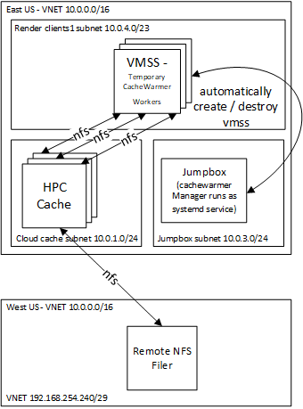

# CacheWarmer for HPC Cache

This is an example of how to setup the CacheWarmer for [Azure HPC Cache](https://azure.microsoft.com/services/hpc-cache/).

The CacheWarmer runs as a service on the jumpbox, and watches a pre-defined directory for a job file.  The job file describes the HPC Cache mount addresses, export path, and path to warm.  For example, the following file is an example of this file:

```bash
{
  "WarmTargetMountAddresses": [
    "10.0.1.11",
    "10.0.1.12",
    "10.0.1.13"
  ],
  "WarmTargetExportPath": "/animation",
  "WarmTargetPath": "/scene1"
}
```

The CacheWarmer will then automatically start VMSS SPOT instances to warm the target through each of the mount addresses.  Once warmed, the VMSS instances will be destroyed.

This examples configures a render network, jumpbox, and HPC Cache with 1 filer as shown in the diagram below:



To simulate latency, the NFS filer will live in a different vnet, resource group, and region.

A nfs filer will be used to hold the bootstrap directory and the warm job directories.  The example is broken into 3 phases.  The third phase demonstrates how to chain up the terraform modules including deployment of the HPC Cache, mounting all junctions, building and installation of the CacheWarmer, and finally the job submission.  Once the 3 phase has completed the cache is warmed with the desired content.


## Deploy the Virtual Networks and Filer

These steps deploy the virtual networks and filer.  It is best to spread the filer network in a separate region from the HPC Cache so that latency exists, and you get a feel for the performance of HPC Cache over high latency.

1. browse to https://shell.azure.com

2. Specify your subscription by running this command with your subscription ID:  ```az account set --subscription YOUR_SUBSCRIPTION_ID```.  You will need to run this every time after restarting your shell, otherwise it may default you to the wrong subscription, and you will see an error similar to `azurerm_public_ip.vm is empty tuple`.

2. get the terraform examples
```bash
mkdir tf
cd tf
git init
git remote add origin -f https://github.com/Azure/Avere.git
git config core.sparsecheckout true
echo "src/terraform/*" >> .git/info/sparse-checkout
git pull origin master
```

3. `cd src/terraform/examples/HPC\ Cache/cachewarmer/1.networkandfiler/`

4. `code main.tf` to edit the local variables section at the top of the file, to customize to your preferences.  This is where you can spread the two networks across regions.  If you are using an [ssk key](https://docs.microsoft.com/en-us/azure/virtual-machines/linux/mac-create-ssh-keys), ensure that ~/.ssh/id_rsa is populated.

5. execute `terraform init` in the directory of `main.tf`.

6. execute `terraform apply -auto-approve` to deploy the virtual networks and the filer

7. save the output to use for the installation of the Jumpbox and the HPC Cache.

## Deploy the Jumpbox

These steps install the Jumpbox.

1. using the existing https://shell.azure.com, change to `2.jumpbox`

```bash
cd ~/tf/src/terraform/examples/HPC\ Cache/cachewarmer/2.jumpbox
```

2. `code main.tf` to edit the local variables section at the top of the file, to customize to your preferences including pasting in the output values from the previous deployment.

3. execute `terraform init` in the directory of `main.tf`.

4. execute `terraform apply -auto-approve` to deploy the jumpbox

5. Now logon to the jumpbox and ssh to the filer to prepare content on "/data".  One good potential content is the 218GB [Moana Island Scene from  Walt Disney Animation Studios](https://www.technology.disneyanimation.com/islandscene).

## Deploy the HPC Cache and the CacheWarmer

These steps install the HPC Cache and the CacheWarmer and submit a job.

1. using the existing https://shell.azure.com, change to `3.hpccacheandcachewarmer`

```bash
cd ~/tf/src/terraform/examples/HPC\ Cache/cachewarmer/3.hpccacheandcachewarmer
```

2. `code main.tf` to edit the local variables section at the top of the file, to customize to your preferences.  Set the warm directory

3. execute `terraform init` in the directory of `main.tf`.

4. execute `terraform apply -auto-approve` to build the vfxt cluster

To submit addition directories for warming, you would submit the `cachewarmer_submitjob` module, or you can write a file similar to the following to the warm directory in this example `/.cachewarmjob` folder on the HPC Cache:

```bash
{
  "WarmTargetMountAddresses": [
    "10.0.1.11",
    "10.0.1.12",
    "10.0.1.13"
  ],
  "WarmTargetExportPath": "/animation",
  "WarmTargetPath": "/scene1"
}
```