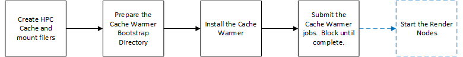

# CacheWarmer for HPC Cache

This is an example of how to setup the CacheWarmer for [Azure HPC Cache](https://azure.microsoft.com/services/hpc-cache/).  The purpose of the CacheWarmer is to pre warm the [Azure HPC Cache](https://azure.microsoft.com/services/hpc-cache/).  This ensures render nodes are not idle while waiting for the files to populate in the cache.

This examples configures a render network, controller, and [Azure HPC Cache](https://azure.microsoft.com/services/hpc-cache/) with 1 filer as shown in the diagram below:


To simulate latency, the NFS filer may be configured to be deployed in a different region.

This terraform example demonstrates how to chain up the terraform modules including deployment of the HPC Cache, mounting all junctions, install the CacheWarmer, and finally the job submission.  The job submission blocks until the cache is warmed.



This example uses the Avere Controller for two purposes:
1. runs the cachewarmer manager and has the properly scoped credentials to read / write from the storage queue, and ability to create the VMSS
1. is used as the image for the worker nodes because it already has NFS software pre-installed, and can operate in an environment locked down from the Internet.

**Important Note** the storage account used in this example must be installed in the same resource group as the Avere controller to ensure access.  A version 1 storage account is used in this example, because it has an inexpensive queue cost.

## CacheWarmer Components

The cachewarmer is made up of the following components:

1. **cachewarmer-manager** - the cachewarmer manager watches an azure storage queue for jobs.  When a job appears it scans the file system producing work items into an azure storage queue for cache workers to read from the cache described by the mount addresses.  Directories and files will be chunked up into manageable work.  For example, a 2GB file will be split up into multiple pieces for warming.  Additionally the cache manager will start a configurable number of SPOT VMSS D2sv3 worker nodes to perform the warming.  Once complete the vmss will be deleted.  A sample cache warmer job is shown below:
    ```json
    {
      "WarmTargetMountAddresses": [
        "10.0.1.7",
        "10.0.1.8",
        "10.0.1.9"
      ],
      "WarmTargetExportPath": "/data",
      "WarmTargetPath": "/tools",
      "InclusionList": [],
      "ExclusionList": [],
      "MaxFileSizeBytes": 0
    }
    ```
1. **cachewarmer-worker** - the cachewarmer worker picks up work items from an azure storage queue, and mounts the cache and reads the files according to the work item.  A sample worker job is shown below:
    ```json
    {
      "WarmTargetMountAddresses": [
        "10.0.1.7",
        "10.0.1.8",
        "10.0.1.9"
      ],
      "WarmTargetExportPath": "/data",
      "WarmTargetPath": "/tools/bootstrap",
      "StartByte": -1,
      "StopByte": -1,
      "ApplyFilter": false,
      "StartFileFilter": "",
      "EndFileFilter": "",
      "InclusionList": [],
      "ExclusionList": [],
      "MaxFileSizeBytes": 0
    }
    ```

1. **cachewarmer-jobsubmitter** - the cachewarmer job submitter is a simple command line tool to post a cachewarmer job to an Azure Storage queue.

Each of the above tools require that the environment be logged into azure via the az command line, or via a manager service identity on an Azure VM.  It uses the access to read and write the the Azure Storage queue or create / delete the VMSS.

## Cachwarmer Installation

The following terraform modules install and configure the cache-warmer on the Avere controller.  The controller has a scoped managed identity that can create a Virtual Machine Scale Set in the same resource group as the controller and read and write to the Azure Storage queue.

If you have locked down the internet, for each component below pay attention to the note "Locked Down internet".

### CacheWarmer Prepare Bootstrap Module

**Purpose** Installs the cache warmer installation scripts and binaries into a folder on the NFS filer.  This folder is referred to as the "bootstrap" directory.

**Module Location** [https://github.com/Azure/Avere/tree/main/src/terraform/modules/cachewarmer_prepare_bootstrapdir](https://github.com/Azure/Avere/tree/main/src/terraform/modules/cachewarmer_prepare_bootstrapdir)

**Locked Down internet** If you have a proxy, this module will work with a proxy.  Otherwise this module will not work in a locked down internet environement.  Instead, you can manually populate the bootstrap directory using the script [cachewarmer_prepare_bootstrap.sh](https://github.com/Azure/Avere/blob/main/src/terraform/modules/cachewarmer_prepare_bootstrapdir/cachewarmer_prepare_bootstrap.sh).  Additionally if you want to build your own cache warmer binaries from the [golang source](../../../../go/cmd/cachewarmer), refer to the script [cachewarmer_build.sh](https://github.com/Azure/Avere/blob/main/src/terraform/modules/cachewarmer_prepare_bootstrapdir/cachewarmer_build.sh).

### CacheWarmer Install Manager Module

**Purpose** Installs the cachewarmer manager as a systemd service.  It is recommended to install on the Avere controller as it has the properly scoped managed identity.

**Module Location** [https://github.com/Azure/Avere/tree/main/src/terraform/modules/cachewarmer_manager_install](https://github.com/Azure/Avere/tree/main/src/terraform/modules/cachewarmer_manager_install)

**Locked Down internet** This module must applied from a machine that is able to reach the ip addresses on the VNET to install the manager.  See how to install [terraform and az](../../vfxt/pipeline) on a linux or windows machine.  Also, once the manager is running the VMSS nodes it creates do not require access to the internet because they are based on the Avere controller image which has all the necessary NFS packages already installed.

### CacheWarmer Install Worker Module

**Purpose** Installs the cachewarmer worker as a systemd service.  This is optional since the manager will create VMSS workers.  However, it is recommended to install on the Avere controller along side the manager as it can take care of small jobs without the manager ever needing to start a VMSS.

**Module Location** [https://github.com/Azure/Avere/tree/main/src/terraform/modules/cachewarmer_worker_install](https://github.com/Azure/Avere/tree/main/src/terraform/modules/cachewarmer_worker_install)

**Locked Down internet** This module must applied from a machine that is able to reach the ip addresses on the VNET to install the manager.  See how to install [terraform and az](../../vfxt/pipeline) on a linux or windows machine.

### CacheWarmer Submit Jobs Module

**Purpose** Executes the cachewarmer-jobsubmitter to post a job to the Azure storage queue.  It is recommended to target the controller as the controller has the appropriate scoped managed identity that can post to the storage account.  Otherwise you need to start a Linux machine that has az tool already logged in, or an Azure service principal defined.

**Module Location** [https://github.com/Azure/Avere/tree/main/src/terraform/modules/cachewarmer_submitjobs](https://github.com/Azure/Avere/tree/main/src/terraform/modules/cachewarmer_submitjobs)

**Locked Down internet** This module must applied from a machine that is able to reach the ip addresses on the VNET to install the manager.  See how to install [terraform and az](../../vfxt/pipeline) on a linux or windows machine.

**Alternatives to this Module** there are two alternatives to this module:
1. run the command line directly from a known machine (ensuring a service principal or `az login` has been run)
1. post to the job directly to the Azure Storage queue
```json
{
  "WarmTargetMountAddresses": [
    "10.0.1.7",
    "10.0.1.8",
    "10.0.1.9"
  ],
  "WarmTargetExportPath": "/data",
  "WarmTargetPath": "/tools",
  "InclusionList": [],
  "ExclusionList": [],
  "MaxFileSizeBytes": 0
}
```

## Deployment Instructions

To run the example, execute the following instructions.  This assumes use of Azure Cloud Shell, but you can use in your own environment.  If you are installing into your own environment, follow the [instructions to setup terraform and az cli](../../vfxt/pipeline) for the environment closest to yours.

1. browse to https://shell.azure.com.  **Important** If your cloud virtual network is locked down to internet access and you do not have a proxy, you must install [terraform and az cli](../../vfxt/pipeline) on a linux machine that can reach the nodes in the cloud virtual network.

1. Specify your subscription by running this command with your subscription ID:  ```az account set --subscription YOUR_SUBSCRIPTION_ID```.  You will need to run this every time after restarting your shell, otherwise it may default you to the wrong subscription, and you will see an error similar to `azurerm_public_ip.vm is empty tuple`.

1. Since this example uses the Avere controller (for the reasons mentioned above) ensure you have run the following command at least once for your subscription. `az vm image terms accept --urn microsoft-avere:vfxt:avere-vfxt-controller:latest`

1. get the terraform examples
    ```bash
    mkdir tf
    cd tf
    git init
    git remote add origin -f https://github.com/Azure/Avere.git
    git config core.sparsecheckout true
    echo "src/terraform/*" >> .git/info/sparse-checkout
    git pull origin main
    ```

1. `cd src/terraform/examples/HPC\ Cache/cachewarmer`

1. `code config.auto.tfvars` to edit the variables.  If you are using an [ssk key](https://docs.microsoft.com/en-us/azure/virtual-machines/linux/mac-create-ssh-keys), ensure that ~/.ssh/id_rsa is populated.

1. execute `terraform init` in the directory of `main.tf`.

1. execute `terraform apply -auto-approve` to build the HPC Cache and the cachewarmer

To submit additional directories for warming, you can rename the `cachewarmer_submitjobs` module, use the cachewarmer-jobsubmitter from the controller, or insert a json entry in the storage queue in the following format ([Azure Storage Explorer](https://azure.microsoft.com/en-us/features/storage-explorer/) makes this easy to do):

```bash
{
  "WarmTargetMountAddresses": [
    "10.0.1.7",
    "10.0.1.8",
    "10.0.1.9"
  ],
  "WarmTargetExportPath": "/data",
  "WarmTargetPath": "/tools",
  "InclusionList": [],
  "ExclusionList": [],
  "MaxFileSizeBytes": 0
}
```

When you are done using the cluster, you can destroy it by running `terraform destroy -auto-approve` or just delete the three resource groups created.
