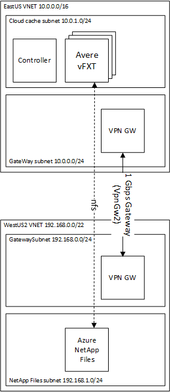

# Avere vFXT with an Azure Netapp Files Volume

An Avere vFXT compliments an Azure Netapp Files Volume by extending the reach of the data outside of the region where the Azure Netapp resides.  The Avere vFXT provides the following advantages:

1. **Single Point of Truth** - the Avere ensures there is only a single source of truth for the data.  There are no data corruption issues due to replication.

2. **Avere Hides Latency** - the Avere hides latency from clients mounting the Azure Netapp Files directly across regions.

3. **Avere vFXT can be deployed to any region** - the Avere vFXT can be deployed to regions where NetApp Files does not exist as listed in the region availability for the NetApp files.

The [NetApp document](https://docs.microsoft.com/en-us/azure/azure-netapp-files/azure-netapp-files-create-volumes#best-practice) due to it's use of a [load balancer](https://docs.microsoft.com/en-us/azure/virtual-network/virtual-networks-faq#what-are-the-constraints-related-to-global-vnet-peering-and-load-balancers).  This is easily resolved by using Azure's VNet-to-VNet VPN gateway.  The VNet-to-VNet gateway can be cheaper than VNET peering in some scenarios since you only pay for the egress, and not both the ingress and egress of the VNET peering.

This examples configures a render network, controller, and vfxt where the netapp is configured in a different region.  The VNet-to-VNet connects the two regions as shown in the following diagram.  A 1 Gbps link is configured but this can be configured to be as high as 10 Gbps.



## Deployment Instructions

To run the example, execute the following instructions.  This assumes use of Azure Cloud Shell, but you can use in your own environment, ensure you install the vfxt provider as described in the [build provider instructions](../../../providers/terraform-provider-avere#build-the-terraform-provider-binary).  However, if you are installing into your own environment, you will need to follow the [instructions to setup terraform for the Azure environment](https://docs.microsoft.com/en-us/azure/terraform/terraform-install-configure).

1. browse to https://shell.azure.com

2. Specify your subscription by running this command with your subscription ID:  ```az account set --subscription YOUR_SUBSCRIPTION_ID```.  You will need to run this every time after restarting your shell, otherwise it may default you to the wrong subscription, and you will see an error similar to `azurerm_public_ip.vm is empty tuple`.

3. double check your Avere vFXT prerequisites, including running `az vm image accept-terms --urn microsoft-avere:vfxt:avere-vfxt-controller:latest`: https://docs.microsoft.com/en-us/azure/avere-vfxt/avere-vfxt-prereqs

4. Ensure you have requested your subscription has been onboarded to Azure Netapp File and registered your subscription as described here: https://docs.microsoft.com/en-us/azure/azure-netapp-files/azure-netapp-files-register.

5. If not already installed, run the following commands to install the Avere vFXT provider for Azure:
```bash
mkdir -p ~/.terraform.d/plugins
# install the vfxt released binary from https://github.com/Azure/Avere
wget -O ~/.terraform.d/plugins/terraform-provider-avere https://github.com/Azure/Avere/releases/download/tfprovider_v0.8.4/terraform-provider-avere
chmod 755 ~/.terraform.d/plugins/terraform-provider-avere
```

6. get the terraform examples
```bash
mkdir tf
cd tf
git init
git remote add origin -f https://github.com/Azure/Avere.git
git config core.sparsecheckout true
echo "src/terraform/*" >> .git/info/sparse-checkout
git pull origin master
```

7. `cd src/terraform/examples//HPC\ Cache/netapp-across-region`

8. `code main.tf` to edit the local variables section at the top of the file, to customize to your preferences.  If you are using an [ssk key](https://docs.microsoft.com/en-us/azure/virtual-machines/linux/mac-create-ssh-keys), ensure that ~/.ssh/id_rsa is populated.

9. execute `terraform init` in the directory of `main.tf`.

10. execute `terraform apply -auto-approve` to build the vfxt cluster

Once installed you will be able to login and use the vFXT cluster according to the vFXT documentation: https://docs.microsoft.com/en-us/azure/avere-vfxt/avere-vfxt-cluster-gui.

When you are done using the cluster, you can destroy it by running `terraform destroy -auto-approve` or just delete the resource groups created.