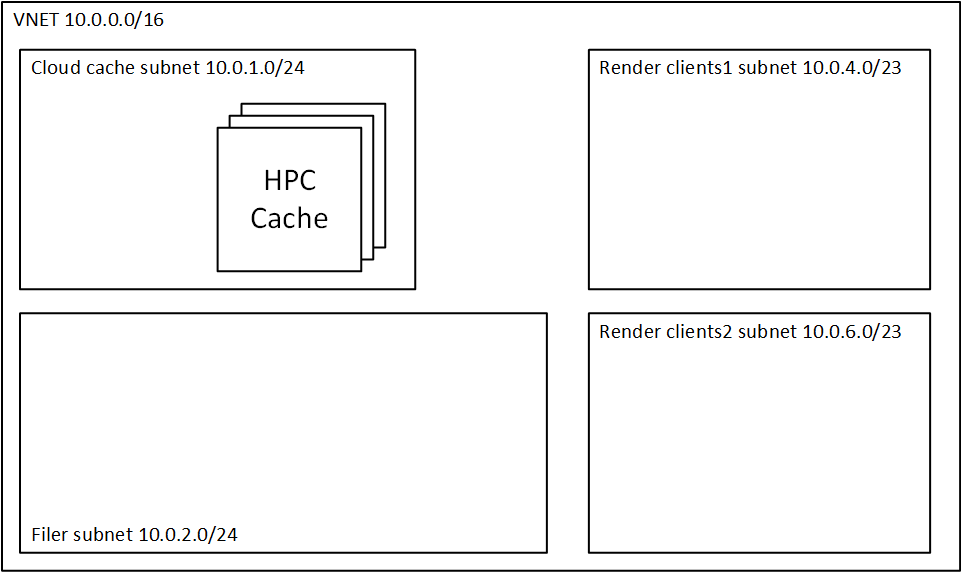

# HPC Cache Deployment with no Filers

This example shows how to deploy an HPC Cache by itself.

This example currently uses `azurerm_template_deployment` to deploy a template, but will be replaced soon by a native azurerm module.

This examples configures a render network, controller, and HPC Cache without any filers as shown in the diagram below:



## Deployment Instructions

To run the example, execute the following instructions.  This assumes use of Azure Cloud Shell.  If you are installing into your own environment, you will need to follow the [instructions to setup terraform for the Azure environment](https://docs.microsoft.com/en-us/azure/terraform/terraform-install-configure).

1. browse to https://shell.azure.com

2. Specify your subscription by running this command with your subscription ID:  ```az account set --subscription YOUR_SUBSCRIPTION_ID```.  You will need to run this every time after restarting your shell, otherwise it may default you to the wrong subscription, and you will see an error similar to `azurerm_public_ip.vm is empty tuple`.

3. double check your [HPC Cache prerequisites](https://docs.microsoft.com/en-us/azure/hpc-cache/hpc-cache-prereqs)

4. get the terraform examples
```bash
mkdir tf
cd tf
git init
git remote add origin -f https://github.com/Azure/Avere.git
git config core.sparsecheckout true
echo "src/terraform/*" >> .git/info/sparse-checkout
git pull origin master
```

6. `cd src/terraform/examples/HPC\ Cache/no-filers`

7. `code main.tf` to edit the local variables section at the top of the file, to customize to your preferences

8. execute `terraform init` in the directory of `main.tf`.

9. execute `terraform apply -auto-approve` to build the HPC Cache cluster

Once installed you will be able to mount the HPC Cache cluster, using the according to the `mount_addresses` output and following the [documentation](https://docs.microsoft.com/en-us/azure/hpc-cache/hpc-cache-mount).

When you are done using the cluster, you can destroy it by running `terraform destroy -auto-approve` or just delete the three resource groups created.