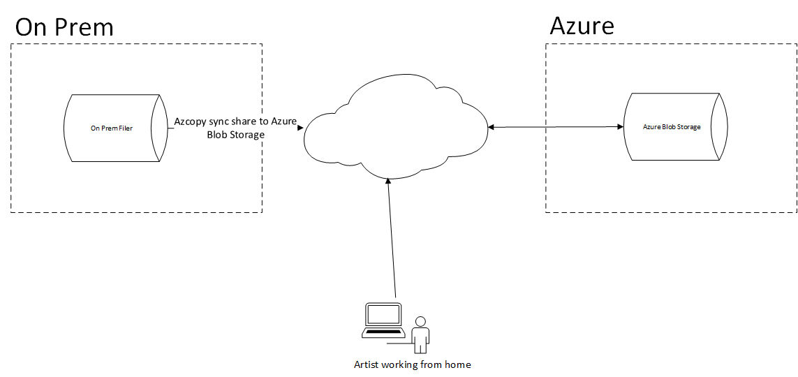

# Testing azcopy sync command

This examples creates a windows VM, and storage account for purpose of showing the azcopy sync command, where filer is directory in your cloudshell.



## Deployment Instructions

To run the example, execute the following instructions.  This assumes use of Azure Cloud Shell.

1. browse to https://shell.azure.com

2. get the terraform examples
```bash
mkdir tf
cd tf
git init
git remote add origin -f https://github.com/Azure/Avere.git
git config core.sparsecheckout true
echo "src/terraform/*" >> .git/info/sparse-checkout
git pull origin master
```

3. `cd src/terraform/examples/azcopysync`

4. `code main.tf` to edit the local variables section at the top of the file, to customize to your preferences.

5. execute `terraform init` in the directory of `main.tf`.

6. execute `terraform apply -auto-approve` to deploy.

7. once, run the az commands from the output to get your SAS URL (copy and paste it somewhere):

```bash
### begin output commands (copy paste from the terraform output commands)
export SAS_PREFIX=https://abanhowestorageaccount.blob.core.windows.net/previz?
export SAS_SUFFIX=$(az storage container generate-sas --account-name abanhowestorageaccount --https-only --permissions acdlrw --start 2020-04-06T00:00:00Z --expiry 2021-01-01T00:00:00Z --name previz --output tsv)
#### end output commands

export SAS_URL="${SAS_PREFIX}${SAS_SUFFIX}"
echo $SAS_URL
```

8. For this example, we'll use the tf directory created in this tutorial, sync your ~/tf directory to the storage account:
```bash
azcopy sync ~/tf $SAS_URL
```

9. RDP to the windows machine using the username and address from the output variables

10. Install azcopy from https://aka.ms/downloadazcopy-v10-windows.  Open powershell as administrator and type:

```powershell
mkdir \azcopy
cd \azcopy
[Net.ServicePointManager]::SecurityProtocol = [Net.SecurityProtocolType]::Tls12
Invoke-WebRequest -Uri https://aka.ms/downloadazcopy-v10-windows -OutFile azcopy.zip
Expand-Archive azcopy.zip
copy .\azcopy\azcopy_windows_amd64_10.3.4\azcopy.exe c:\windows\system32\.
```

10. create the data directory and map to v:\ drive
```powershell
mkdir c:\data
subst v: c:\data
```

10. using the SAS URL you created earlier create the sync files, and run the `syncfrom.ps1`

```powershell
$env:SAS_URL=# copy the SAS_URL value from the cloudshell you generated earlier
"azcopy sync '$env:SAS_URL' c:\data" > c:\azcopy\syncfrom.ps1
"azcopy sync c:\data '$env:SAS_URL'" > c:\azcopy\syncto.ps1
c:\azcopy\syncfrom.ps1
```

11. Try creating some files and observe that `c:\azcopy\syncfrom.ps1` doesn't clobber the files.  Observe that `c:\azcopy\syncto.ps1` uploads the new files correctly.  In explorer browse to `V:\` drive.

The end result is that you now have a `V:\` drive containing the files of the original tf folder:


Note that the storage account has "softdelete" on for 7 days and will preserve files in case of accidental overwrites or deletions.

When you are done with the example, you can destroy it by running `terraform destroy -auto-approve` or just delete the resource group created.