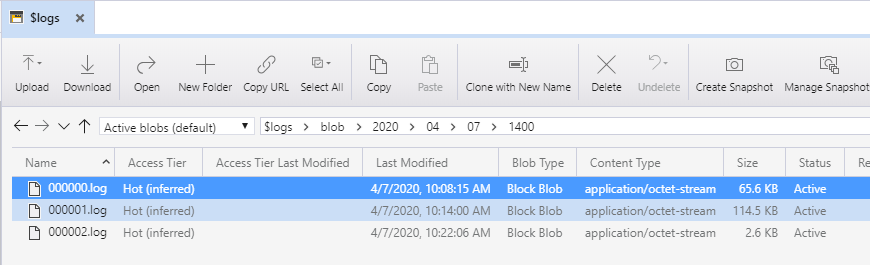

# Testing azcopy sync command

The purpose of this example is to show how the `azcopy sync` command can be used to keep remote artists in sync with a central source of data.  This example creates a storage account with a 7 day deletion retention policy, meaning if there are deletes or modifications of files between artists, these can be recovered.

This examples creates a windows VM, and an storage account, where the on-prem filer is a directory in your cloudshell.


## Deployment Instructions

To run the example, execute the following instructions.  This assumes use of Azure Cloud Shell.

1. browse to https://shell.azure.com

2. Specify your subscription by running this command with your subscription ID:  ```az account set --subscription YOUR_SUBSCRIPTION_ID```.  You will need to run this every time after restarting your shell, otherwise it may default you to the wrong subscription and your resources will end up in that subscription.

3. get the terraform examples
```bash
mkdir tf
cd tf
git init
git remote add origin -f https://github.com/Azure/Avere.git
git config core.sparsecheckout true
echo "src/terraform/*" >> .git/info/sparse-checkout
git pull origin master
```

4. `cd src/terraform/examples/azcopysync`

5. `code main.tf` to edit the local variables section at the top of the file, to customize to your preferences.

6. execute `terraform init` in the directory of `main.tf`.

7. execute `terraform apply -auto-approve` to deploy.

8. once, run the az commands from the output to get your SAS URL (copy and paste it somewhere):

```bash
### begin output commands (copy paste from the terraform output commands)
export SAS_PREFIX=https://abanhowestorageaccount.blob.core.windows.net/previz?
export SAS_SUFFIX=$(az storage container generate-sas --account-name abanhowestorageaccount --https-only --permissions acdlrw --start 2020-04-06T00:00:00Z --expiry 2021-01-01T00:00:00Z --name previz --output tsv)
#### end output commands

export SAS_URL="${SAS_PREFIX}${SAS_SUFFIX}"
echo $SAS_URL
```

9. For this example, we'll use the tf directory created in this tutorial, sync your ~/tf directory to the storage account:
```bash
azcopy sync ~/tf $SAS_URL
```

10. using the `rdp_address` and `rdp_username` from the terraform output variables, RDP to the windows machine using the username and address from the output variables

11. Open powershell as administrator and use the following commands to install azcopy from https://aka.ms/downloadazcopy-v10-windows:

```powershell
mkdir \azcopy
cd \azcopy
[Net.ServicePointManager]::SecurityProtocol = [Net.SecurityProtocolType]::Tls12
Invoke-WebRequest -Uri https://aka.ms/downloadazcopy-v10-windows -OutFile azcopy.zip
Expand-Archive azcopy.zip
copy .\azcopy\azcopy_windows_amd64_10.3.4\azcopy.exe c:\windows\system32\.
```

12. create the data directory and map to v:\ drive
```powershell
mkdir c:\data
subst v: c:\data
```

13. using the SAS URL you created earlier create the sync files, and run the `syncfrom.ps1`

```powershell
$env:SAS_URL='' # paste the SAS_URL value from the cloudshell in the single quotes
"azcopy sync '$env:SAS_URL' c:\data" > c:\azcopy\syncfrom.ps1
"azcopy sync c:\data '$env:SAS_URL'" > c:\azcopy\syncto.ps1
# the following line is needed for Windows 10
Set-ExecutionPolicy -ExecutionPolicy Unrestricted -Force
c:\azcopy\syncfrom.ps1
```

14. Try creating some files and observe that `c:\azcopy\syncfrom.ps1` doesn't clobber the files.  Observe that `c:\azcopy\syncto.ps1` uploads the new files correctly, by adjusting the order of path from your previous cloud shell.  In explorer browse to `V:\` drive.

The end result is that you now have a `V:\` drive containing the files of the original tf folder:


Note that the storage account has "softdelete" on for 7 days and will preserve files in case of accidental modifications or deletions.

When you are done with the example, you can destroy it by running `terraform destroy -auto-approve` or just delete the resource group created.

## Audit access

The SAS URI generated above can be used from anywhere.  However, you can generate a SAS for each artist and their source IP by using the `--ip` parameter on the [az storage container generate-sas](https://docs.microsoft.com/en-us/cli/azure/storage/container?view=azure-cli-latest#az-storage-container-generate-sas) command line as shown above.

Additionally, you can enable logging on the account enabling the "Logging" flags in this [article](https://docs.microsoft.com/en-us/azure/storage/common/storage-monitor-storage-account).

One the logging is enabled you access the logs via the `$logs` container as shown in the screen shot of [Azure Storage Explorer](https://azure.microsoft.com/en-us/features/storage-explorer/):



The following are sample logs after downloading one of the log files:

```
2.0;2020-04-07T14:06:54.8894735Z;GetBlob;SASSuccess;206;7;7;sas;;aenhowestorageaccount;blob;"https://aenhowestorageaccount.blob.core.windows.net:443/previz/src/terraform/examples/jumpbox/main.tf?se=2021-01-01T00%3A00%3A00Z&amp;sig=XXXXX&amp;sip=24.155.118.199&amp;sp=racwdl&amp;spr=https&amp;sr=c&amp;st=2020-04-06T00%3A00%3A00Z&amp;sv=2018-11-09&amp;timeout=901";"/aenhowestorageaccount/previz/src/terraform/examples/jumpbox/main.tf";2a16ee81-c01e-0010-73e5-0cd55c000000;0;24.155.118.199:61943;2018-03-28;532;0;478;2017;0;;;"&quot;0x8D7DAFB6E490984&quot;";Tuesday, 07-Apr-20 13:56:11 GMT;"If-Unmodified-Since=Tuesday, 07-Apr-20 13:56:12 GMT";"AzCopy/10.3.4 Azure-Storage/0.7 (go1.13; Windows_NT)";;"4317add7-4052-49b1-45ec-0747a1797a2b";;;;;;;;
2.0;2020-04-07T14:06:54.9385068Z;GetBlob;SASSuccess;206;43;2;sas;;aenhowestorageaccount;blob;"https://aenhowestorageaccount.blob.core.windows.net:443/previz/src/terraform/examples/vfxt/3-filers/README.md?se=2021-01-01T00%3A00%3A00Z&amp;sig=XXXXX&amp;sip=24.155.118.199&amp;sp=racwdl&amp;spr=https&amp;sr=c&amp;st=2020-04-06T00%3A00%3A00Z&amp;sv=2018-11-09&amp;timeout=901";"/aenhowestorageaccount/previz/src/terraform/examples/vfxt/3-filers/README.md";2a16eea6-c01e-0010-13e5-0cd55c000000;0;24.155.118.199:61943;2018-03-28;540;0;478;2964;0;;;"&quot;0x8D7DAFB6E497EC3&quot;";Tuesday, 07-Apr-20 13:56:11 GMT;"If-Unmodified-Since=Tuesday, 07-Apr-20 13:56:12 GMT";"AzCopy/10.3.4 Azure-Storage/0.7 (go1.13; Windows_NT)";;"3495f5cd-8671-45c6-5c3b-ea4fd86926bb";;;;;;;;
2.0;2020-04-07T14:06:54.9865415Z;GetBlob;SASSuccess;206;44;2;sas;;aenhowestorageaccount;blob;"https://aenhowestorageaccount.blob.core.windows.net:443/previz/src/terraform/examples/vfxt/vdbench/azureblobfiler/main.tf?se=2021-01-01T00%3A00%3A00Z&amp;sig=XXXXX&amp;sip=24.155.118.199&amp;sp=racwdl&amp;spr=https&amp;sr=c&amp;st=2020-04-06T00%3A00%3A00Z&amp;sv=2018-11-09&amp;timeout=901";"/aenhowestorageaccount/previz/src/terraform/examples/vfxt/vdbench/azureblobfiler/main.tf";2a16eec7-c01e-0010-32e5-0cd55c000000;0;24.155.118.199:61943;2018-03-28;552;0;478;7217;0;;;"&quot;0x8D7DAFB6E470D53&quot;";Tuesday, 07-Apr-20 13:56:11 GMT;"If-Unmodified-Since=Tuesday, 07-Apr-20 13:56:12 GMT";"AzCopy/10.3.4 Azure-Storage/0.7 (go1.13; Windows_NT)";;"b5924eeb-84cd-4e3a-4f09-7fadd6542dab";;;;;;;;
2.0;2020-04-07T14:06:55.0305726Z;GetBlob;SASSuccess;206;4;4;sas;;aenhowestorageaccount;blob;"https://aenhowestorageaccount.blob.core.windows.net:443/previz/.git/logs/refs/remotes/origin/pr200218f?se=2021-01-01T00%3A00%3A00Z&amp;sig=XXXXX&amp;sip=24.155.118.199&amp;sp=racwdl&amp;spr=https&amp;sr=c&amp;st=2020-04-06T00%3A00%3A00Z&amp;sv=2018-11-09&amp;timeout=901";"/aenhowestorageaccount/previz/.git/logs/refs/remotes/origin/pr200218f";2a16eee3-c01e-0010-4ee5-0cd55c000000;0;24.155.118.199:61943;2018-03-28;532;0;475;180;0;;;"&quot;0x8D7DAFB6E3EA764&quot;";Tuesday, 07-Apr-20 13:56:11 GMT;"If-Unmodified-Since=Tuesday, 07-Apr-20 13:56:12 GMT";"AzCopy/10.3.4 Azure-Storage/0.7 (go1.13; Windows_NT)";;"cbf3467b-b22d-4a57-6d05-06bf4e61def0";;;;;;;;
2.0;2020-04-07T14:06:55.0806070Z;GetBlob;SASSuccess;206;3;3;sas;;aenhowestorageaccount;blob;"https://aenhowestorageaccount.blob.core.windows.net:443/previz/.git/refs/remotes/origin/pr032020?se=2021-01-01T00%3A00%3A00Z&amp;sig=XXXXX&amp;sip=24.155.118.199&amp;sp=racwdl&amp;spr=https&amp;sr=c&amp;st=2020-04-06T00%3A00%3A00Z&amp;sv=2018-11-09&amp;timeout=901";"/aenhowestorageaccount/previz/.git/refs/remotes/origin/pr032020";2a16ef20-c01e-0010-0ae5-0cd55c000000;0;24.155.118.199:61943;2018-03-28;525;0;472;41;0;;;"&quot;0x8D7DAFB6E3E8050&quot;";Tuesday, 07-Apr-20 13:56:11 GMT;"If-Unmodified-Since=Tuesday, 07-Apr-20 13:56:12 GMT";"AzCopy/10.3.4 Azure-Storage/0.7 (go1.13; Windows_NT)";;"814843f5-86a7-4728-4124-f2e893ee6302";;;;;;;;
```