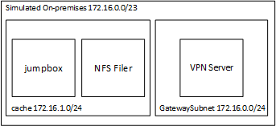

# Simulated On-premises Environment

This folder contains a simulated on-premises environment with the following architecture:

The components are summarized as follows:
* **VPN Server** - this is a VPN Gateway with Site-to-site configuration, or for more realistic example, create a [Vyos Image](../../vpn-single-tunnel-vyos#image-creation)
* **NFS Filer** - this is a linux server with NFS enabled.
* **Jumpbox** - this is a VM with access via a public IP address.
