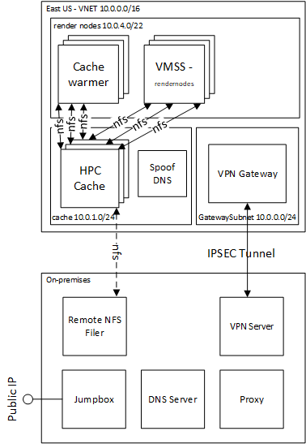

# Linux Render Farm On Azure

This folder contains all the automation to configure all infrastructure described in the [first render pilot](../securedimage/Azure%20First%20Render%20Pilot.pdf) for a Linux render farm.  A simulated on-premises environment is provided for experimentation without using a real on-premises environment.



## Terraform Project Organization

There are multilple ways to organize and structure Terraform.  The approach that seemed to strike the right balance between security, complexity, and Terraform best practices is outlined in [Terraform Structures and Layouts by Laura Martin](https://www.surminus.com/blog/terraform-structures-and-layouts/).

The organization principles are as follows:
1. Security is first priority.  This is achieved using a keyvault, and storing terraform state in a storage account.
1. Major Infrastructure Groups that share a similar life cycle are in their own folder
1. Configuration is captured in "config.* files".

When deploying to multiple regions there are two approaches that are [debated in the Terraform community](https://www.reddit.com/r/Terraform/comments/o7hch1/what_folder_structure_do_you_use_for_terraform/) each with advantages and disadvantages:
1. **Replicate the folders for each environment** - the first approach is to replicate the folders for each environment.  This ensure that each environment and associated configuration lives on its own.  The downside is that there is a lot of replication of code, but the upside is that human error with "terraform apply" does not overwrite the wrong environment.
2. **Workspaces** - Use [Terraform workspaces](https://www.terraform.io/docs/cloud/guides/recommended-practices/part3.3.html#3-design-your-organization-s-workspace-structure).  In this approach, you would have different `*.tfvars` and `*.backend` files for the environment.  For example `eastus.tfvars` and `eastus.tfvars` for east us and `westus2.tfvars` and `westus2.tfvars` for west us2.  The disadvantage of this approach is that human error in setting the wrong environment or specifying the wrong tfvars file, will overwrite the infrastructure in the wrong environment.

## Pre-requisites

To run the example, execute the following instructions.  This assumes use of Azure Cloud Shell.  If you are installing into your own environment, you will need to follow the [instructions to setup terraform for the Azure environment](https://docs.microsoft.com/en-us/azure/terraform/terraform-install-configure).

1. browse to https://shell.azure.com, and choose a Bash shell.

1. Specify your subscription by running this command with your subscription ID:  ```az account set --subscription YOUR_SUBSCRIPTION_ID```.  You will need to run this every time after restarting your shell, otherwise it may default you to the wrong subscription, and you will see an error similar to `azurerm_public_ip.vm is empty tuple`.

1. get the terraform examples
```bash
mkdir tf
cd tf
git init
git remote add origin -f https://github.com/Azure/Avere.git
git config core.sparsecheckout true
echo "src/terraform/*" >> .git/info/sparse-checkout
git pull origin main
```

1. If deploying the cachewarmer or the Avere vFXT, you will need the controller image.To use it you must accept the terms as part of the Avere vFXT prerequisites, including running `az vm image terms accept --urn microsoft-avere:vfxt:avere-vfxt-controller:latest`: https://docs.microsoft.com/en-us/azure/avere-vfxt/avere-vfxt-prereqs

1. If deploying the Avere vFXT, run the following commands to install the Avere vFXT provider for Azure:
```bash
version=$(curl -s https://api.github.com/repos/Azure/Avere/releases/latest | jq -r .tag_name | sed -e 's/[^0-9]*\([0-9].*\)$/\1/')
browser_download_url=$(curl -s https://api.github.com/repos/Azure/Avere/releases/latest | jq -r .assets[].browser_download_url | grep -e "terraform-provider-avere$")
mkdir -p ~/.terraform.d/plugins/registry.terraform.io/hashicorp/avere/$version/linux_amd64
wget -O ~/.terraform.d/plugins/registry.terraform.io/hashicorp/avere/$version/linux_amd64/terraform-provider-avere_v$version $browser_download_url
chmod 755 ~/.terraform.d/plugins/registry.terraform.io/hashicorp/avere/$version/linux_amd64/terraform-provider-avere_v$version
```

### 0. Security

To ensure security, Terraform requires a keyvault, and a storage account to hold the tfstate files.

The keyvault stores all the secrets used in this example.  Be sure to configure the following Secrets with keys:
* `vpngatewaykey` - this is the subnet to contain the VPN gateway
* `virtualmachine` - this configures the password for the virtual machines used in this example
* `AvereCache` - this configures the secret to be used with the Avere Cache

The tfstate files contain secrets, so it is recommended to use a protected backend for storing of these files.  For this example, an Azure Storage Account is deployed and used to store the tfstate files.  Here are good articles related to terraform backends:
1. **Backends** - https://www.terraform.io/language/settings/backends
1. **AzureRM Backend** - https://www.terraform.io/language/settings/backends/azurerm

### Steps to Deploy

1. Before deploying, ensure you have Role `Key Vault Secrets Officer`.  To do this, open https://portal.azure.com, and browse to Subscriptions=>Access Control (IAM) and add "Key Vault Secrets Officer" to your id.
1. `cd ~/tf/src/terraform/examples/centos-e2e/0.security`
1. `code config.tfvars` and edit the values to your desired values.
1. `terraform init` and `terraform apply -auto-approve`
1. **Important** once deployed, browse to the keyvault in the portal and update each of the 3 **Secrets**.
1. **Important** `code ../globalconfig.backend` to edit and update with the output variables.  This will be used to store the tfstate.
1. **Important** `code ../globalconfig.tfvars` to edit and update with location and keyvault id.  This will be used for secret retrieval.

## 1.Network

This sets up a VNET with the following subnets:

1. GatewaySubnet
2. Cache
3. Render Nodes

### Steps to Deploy

1. `cd ~/tf/src/terraform/examples/centos-e2e/1.network`
1. `code config.auto.tfvars` and edit the variables
1. `terraform init -backend-config ../globalconfig.backend`
1. `terraform apply -auto-approve -var-file ../globalconfig.tfvars`

## Appendix.A-SimulatedOnPrem

Skip this step if you have an on-premises environment.  Otherwise this step will deploy the [simulated on-prem environment](Appendix.A-SimulatedOnPrem/).

Please note that a real on-premises environment must have VPN or ExpressRoute connectivity to Azure with non-overlapping subnet ranges.  Also, an NFS filer with the following access is required:
* `no_root_squash` - this is needed because HPC Cache or vFXT works at the root level
* `rw` - read/write is needed for the HPC Cache or vFXT to write files
* **ip range is open** - ensure the HPC Cache or vFXT subnet is specified in the export.  Also, if any render clients are writing around, you will also need to open up the subnet range of the render clients, otherwise this is not needed.

### Steps to Deploy

For deployment of the simulated on-premises environment, consider a different region from rest of the example to simulate a higher latency.

1. `cd ~/tf/src/terraform/examples/centos-e2e/Appendix.A-SimulatedOnPrem`
1. `code config.auto.tfvars` and edit the values to your desired values.  For the Moana SAS urls, you can leave these blank to not populate or download the 3 files from [Disney](https://www.disneyanimation.com/resources/moana-island-scene/) to a blob storage account.  Once downloaded to the blob storage account, you can create SAS Urls to each blob using [Azure Storage Explorer](https://azure.microsoft.com/en-us/features/storage-explorer/).
1. `terraform init -backend-config ../globalconfig.backend`
1. `terraform apply -auto-approve -var-file ../globalconfig.tfvars`

## 1. Network Vpnconnection

This step connects the on-prem gateway with the cloud gateway.  Here are the steps to deploy:

1. `cd ~/tf/src/terraform/examples/centos-e2e/1.network.vpnconnection`
1. `code config.auto.tfvars` and edit the values to your desired values.
1. `terraform init -backend-config ../globalconfig.backend`
1. `terraform apply -auto-approve -var-file ../globalconfig.tfvars`

## 2. Image

## 3. Cache

This step setups an HPC Cache or Avere vFXT with an optional DNS server for "spoofing" the filer fqdn so cloud clients mount to the cache ip addresses instead of the onpremises filer.

1. if deploying the Avere vFXT, please confirm the [pre-requisites for vFXT listed above](#pre-requisites).
1. `cd ~/tf/src/terraform/examples/centos-e2e/3.cache`
1. `code config.auto.tfvars` and edit the values to your desired values.
1. `terraform init -backend-config ../globalconfig.backend`
1. `terraform apply -auto-approve -var-file ../globalconfig.tfvars`

## 4. VMSS


## Security and Threat modeling

Per the [security best practices](../security), it is recommended to perform a simple threat modeling exercise to know where vulnerabilities may exist:

1. Azure Access
    1. For vFXT deployment, Azure deployment requires a variety of Managed Identity roles, described in [Managed Identity and Roles](../../../vfxt#managed-identity-and-roles) require owner or user
    1. The controller and vFXT used managed identities.  The managed identies are scoped to the resource groups and roles described in [Managed Identity and Roles](../../../vfxt#managed-identity-and-roles).  To further lockdown, user created managed identities may be used.  For more information, refer to [Avere vFXT using User Assigned Managed Identity](../vfxt/user-assigned-managed-identity).

1. Secrets
    1. no secrets live in code or printed to logs
    1. secrets are stored and retrieved from in keyvault
    1. Terraform tfstate files are stored in a secure blob storage account.

1. Network Egress
    1. When the onprem proxy is provided, the cloud network Egress is locked down with Network Security Groups (NSGs).  All control plane traffic goes back to the onprem and studios have not found too much impact with the extra latency for the controlplane traffic.
    1. When HPC Cache is used, the cache subnet is opened to the "AzureCloud" security tag.  There is potential for egress here.
    1. If the controller receives a public IP, port 22 (SSH) will be exposed to the internet.  If no public IP, the terraform needs to be run from a machine that access to the private ip.  To setup an on-prem machine, refer to [Terraform setup for vFXT for various OS's](../vfxt/pipeline).
    1. When using the CacheWarmer, the blob storage account is exposed to the Internet.  This can be locked down to the subnets for VNET.