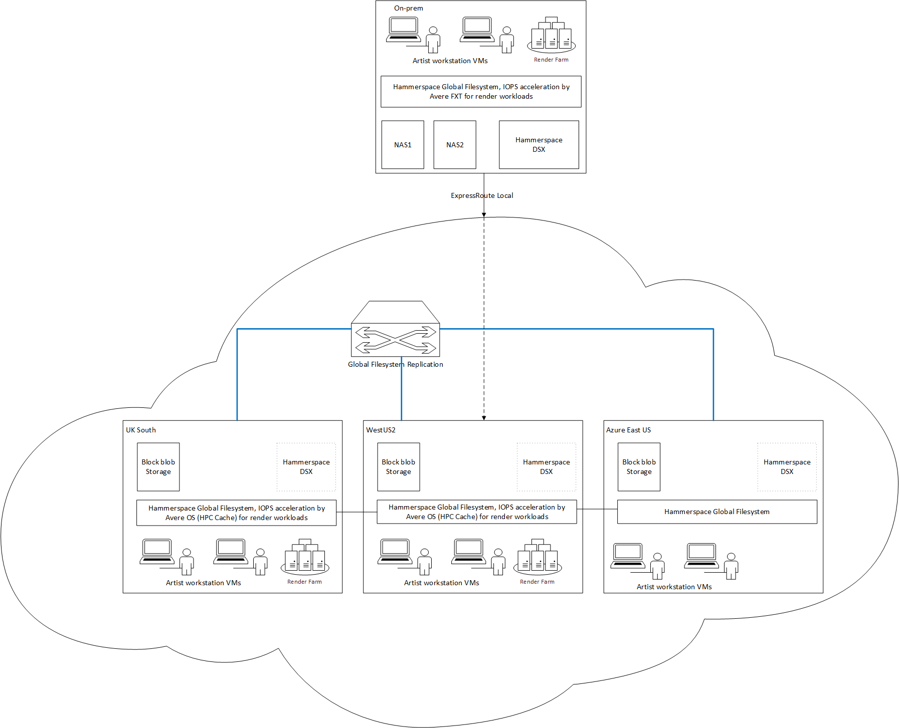

# Create a Multi-Region Artist and Render Studio in Azure

This example shows how to configure a multi-region artist and render studio in Azure.  The global storage infrastructure is enabled by Avere and Hammerspace, and provides a low latency, high throughput NFS / SMB endpoints from each global region.  The architecture includes a license server, an HQueue server, cloud cache and render nodes:



# Hammerspace Licensing

To use this example, please contact a [Hammerspace representative](https://hammerspace.com/contact/) to get access to the Hammerspace Azure Image.

Once you have the Hammerspace Image ID, use the [Hammerspace Image copy instructions](HammerspaceCopyImage.md) to copy the image, and now you will be ready to deploy, and can proceed to the deployment instructions.

Visit the Rendering SKUs page to see the recommended [Hammerspace SKUs for rendering](../../modules/hammerspace/hammerspaceskus.md).

## Deployment Instructions

The deployment instructions configure the following in phases:
1. **0.network** - build out the multi-region virtual network on Azure.
1. **1.domaincontroller** - build a windows domain controller.
1. **2.storage** - build hammerspace instances in each region.
1. **3.cache** - build out the Avere Cache in one region and mount the storage.
1. **4.windowsclient** - build out windows workstations in each region, and join the domain

## Pre-requisites

Before running the examples you will need to setup the following pre-requisites:

1. **cloudshell** - all setup can be run through cloudshell.  You can also setup your own environment, but you will need ssh, git, az cli, and terraform.
    1. browse to https://shell.azure.com

    1. Specify your subscription by running this command with your subscription ID:  ```az account set --subscription YOUR_SUBSCRIPTION_ID```.  You will need to run this every time after restarting your shell, otherwise it may default you to the wrong subscription, and you will see an error similar to `azurerm_public_ip.vm is empty tuple`.

    1. to enable the ability to run the cache, execute the following `az vm image terms accept --urn microsoft-avere:vfxt:avere-vfxt-controller:latest`: https://docs.microsoft.com/en-us/azure/avere-vfxt/avere-vfxt-prereqs

    1. If not already installed, run the following commands to install the Avere vFXT provider for Azure:
    ```bash
    # for terraform >= 0.13.*
    mkdir -p ~/.terraform.d/plugins/registry.terraform.io/hashicorp/avere/1.0.0/linux_amd64
    browser_download_url=$(curl -s https://api.github.com/repos/Azure/Avere/releases/latest | jq -r .assets[0].browser_download_url)
    wget -O ~/.terraform.d/plugins/registry.terraform.io/hashicorp/avere/1.0.0/linux_amd64/terraform-provider-avere_v1.0.0 $browser_download_url
    chmod 755 ~/.terraform.d/plugins/registry.terraform.io/hashicorp/avere/1.0.0/linux_amd64/terraform-provider-avere_v1.0.0
    # for terraform 0.12.*
    mkdir -p ~/.terraform.d/plugins
    cp ~/.terraform.d/plugins/registry.terraform.io/hashicorp/avere/1.0.0/linux_amd64/terraform-provider-avere_v1.0.0 ~/.terraform.d/plugins
    ```

    1. get the terraform examples
    ```bash
    mkdir tf
    cd tf
    git init
    git remote add origin -f https://github.com/Azure/Avere.git
    git config core.sparsecheckout true
    echo "src/terraform/*" >> .git/info/sparse-checkout
    git pull origin main
    ```

## Step 0 - Network

The first step is to setup the Virtual Network, subnets, and network security groups:

1. continuing from the previous instructions browse to the houdini network directory: `cd ~/tf/src/terraform/examples/hammerspace-multi-region/0.network`

1. `code main.tf` to edit the local variables section at the top of the file, to customize to your preferences.  Visit the Rendering SKUs page to see the recommended [Hammerspace SKUs for rendering](../../modules/hammerspace/hammerspaceskus.md).

1. execute `terraform init` in the directory of `main.tf`.

1. execute `terraform apply -auto-approve` to build the network

Once deployed, capture the output variables to somewhere safe, as they will be needed in the following deployments.

The directory `~/tf/src/terraform/examples/hammerspace-multi-region/0.network/fourthregion` shows how to add an additional region.

## Step 1 - Windows Domain Controller

The next step is to build out the windows domain controller.

Run the following steps for each of the above deployment.

1. continuing from the previous instructions browse to the Windows VM directory: `cd ~/tf/src/terraform/examples/hammerspace-multi-region/1.windowsdc`

1. `code main.tf` to edit the local variables section at the top of the file, to customize to your preferences.

1. execute `terraform init` in the directory of `main.tf`.

1. execute `terraform apply -auto-approve` to build the windows VM

1. next [install the domain controller and the DNS server.](../houdinienvironment/WindowsDC.md)

1. if not already done, use the address from the windows domain controller, and re-apply your previous network terraform with the `dns_servers` set with the new address.  This will ensure all machines on the global network use the domain controller as their DNS server.

## Step 2 - Hammerspace

The next step is to establish the global file system with Hammerspace:

1. `cd ~/tf/src/terraform/examples/hammerspace-multi-region/2.hammerspace`

1. `code main.tf`, paste the output from 0.network in the local variables, and edit the remaining local variables section at the top of the file, to customize to your preferences.

1. execute `terraform init` in the directory of `main.tf`.

1. execute `terraform apply -auto-approve` to deploy the storage

Once deployed, capture the output variables to somewhere safe, as they will be needed in the following deployments.

The directory `~/tf/src/terraform/examples/hammerspace-multi-region/2.hammerspace/fourthregion` shows how to add an additional region.

Once deployed perform the additional configuration:

1. ssh to `admin@anvilip` and login with webui username and password and run the following commands to update the host name:
    `local-site-update --name NEWNAME`
1. browse to `https://anvilip:8443` and login login with webui username and password and join the domain through the "Administration=>Active Directory" section.
1. browse to "Infrastructure & Data=>Storage Systems" and add the share azure storage account.  You can get the key through the portal.
1. once the storage is added, click "+volume" and add the shared global container for each site.
1. add a global share, and add each site to it.
1. enable the objectives `keeponline` and `placeonsharedobjectvolume` on the newly created share at each site.

## Step 3 - Cache

At this point you are now ready to scale the render nodes.

1. verify you have completed all pre-requisites above

1. continuing from the previous steps, browse to the cache directory: `cd ~/tf/src/terraform/examples/hammerspace-multi-region/3.cache`

1. `code main.tf` to edit the local variables section at the top of the file, to customize to your preferences.  You will need to paste in the output values from the deployment of the storage and the network steps.  The cifs configuration will automatically join the Avere to the domain controller, and expose the CIFS share as described in these  [manual CIFS instructions](averecifs.md)

1. execute `terraform init` in the directory of `main.tf`.

1. execute `terraform apply -auto-approve` to deploy the storage.

## Step 4 - Windows client

Use the windows templates to deploy into each region, and follow the steps:

1. continuing from the previous steps, browse to the cache directory: `cd ~/tf/src/terraform/examples/hammerspace-multi-region/4.windowsclient`

1. `code main.tf` to edit the local variables section at the top of the file, to customize to your preferences.

1. execute `terraform init` in the directory of `main.tf`.

1. execute `terraform apply -auto-approve` to deploy the storage.
