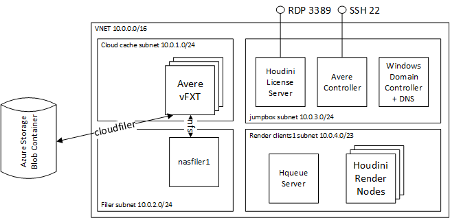

# Create a Houdini Render Farm On Azure

This example shows how to configure the end to end infrastructure for a Houdini render farm on Azure.  This example provides the azure infrastructure required to implement a [Houdini RenderFarm](https://www.sidefx.com/faq/question/indie-renderfarm-setup/) ([also described here](http://www.sidefx.com/docs/houdini/render/cloudfarm.html#rendering-on-cloud)).  The architecture includes a license server, an HQueue server, cloud cache and render nodes:



## Deployment Instructions

The deployment instructions are based on the [first render pilot document](https://aka.ms/first-render-pilot) with two phases:
1. **Phase 1: single frame render** - this sets up the pre-requisites of network, storage, render node, and supporting nodes
    1. **0.network** - build out the virtual network on Azure and connect to onprem if required.
    1. **1.storage** - build a backing storage solution: this could connecting back to on-prem filer, or all in cloud blob storage, or cloud filer.
    1. **2.base image** - this step builds the license server, queue server, and render node.  At this point you should be able to render your first frame
1. **Phase 2: scaling the render farm**
    1. **3.cache** - build out the Avere cache
    1. **4.rendernodes** - scale the render nodes with VMSS

## Pre-requisites

Before running the examples you will need to setup the following pre-requisites:

1. **cloudshell** - all setup can be run through cloudshell.  You can also setup your own environment, but you will need ssh, git, az cli, and terraform.
    1. browse to https://shell.azure.com

    1. Specify your subscription by running this command with your subscription ID:  ```az account set --subscription YOUR_SUBSCRIPTION_ID```.  You will need to run this every time after restarting your shell, otherwise it may default you to the wrong subscription, and you will see an error similar to `azurerm_public_ip.vm is empty tuple`.

    1. to enable the ability to run the cache, execute the following `az vm image accept-terms --urn microsoft-avere:vfxt:avere-vfxt-controller:latest`: https://docs.microsoft.com/en-us/azure/avere-vfxt/avere-vfxt-prereqs

    1. If not already installed, run the following commands to install the Avere vFXT provider for Azure:
    ```bash
    mkdir -p ~/.terraform.d/plugins
    # install the vfxt released binary from https://github.com/Azure/Avere
    wget -O ~/.terraform.d/plugins/terraform-provider-avere https://github.com/Azure/Avere/releases/download/tfprovider_v0.9.2/terraform-provider-avere
    chmod 755 ~/.terraform.d/plugins/terraform-provider-avere
    ```

    1. get the terraform examples
    ```bash
    mkdir tf
    cd tf
    git init
    git remote add origin -f https://github.com/Azure/Avere.git
    git config core.sparsecheckout true
    echo "src/terraform/*" >> .git/info/sparse-checkout
    git pull origin master
    ```

1. **storage** - if using an on-prem filer, you will need to establish an [Azure VPN Gateway](https://azure.microsoft.com/en-us/services/vpn-gateway/) to on-premises for connectivity to backend storage, rendering license server, active directory server, or render manager.  This step is configured after building out the Virtual Network in step 0 below.

## Phase 1 Single Frame Render: Step 0 - Network

The first step is to setup the Virtual Network, subnets, and network security groups:

1. continuing from the previous instructions browse to the houdini network directory: `cd ~/tf/src/terraform/examples/houdinienvironment/0.network`

1. `code main.tf` to edit the local variables section at the top of the file, to customize to your preferences.

1. execute `terraform init` in the directory of `main.tf`.

1. execute `terraform apply -auto-approve` to build the network

Once deployed, capture the output variables to somewhere safe, as they will be needed in the following deployments.

Once your virtual network is setup, determine if you need to establish an [Azure VPN Gateway](https://azure.microsoft.com/en-us/services/vpn-gateway/) to on-premises for connectivity to backend storage, rendering license server, active directory server, or render manager.

## Phase 1 Single Frame Render: Step 1 - Storage

The next step is to establish backend storage.  If using a backend storage filer, you can skip this step.  Otherwise if you are using cloud based storage, proceed through the following steps:

1. decide whether to use blob based storage or an nfs filer and run the following steps:
    1. if using blob based storage: `cd ~/tf/src/terraform/examples/houdinienvironment/1.storage/blobstorage`.  You will need to additionally install the Avere Cache in step 3 so that nfs or smb clients can mount.
    1. if using an nfs cloud filer: `cd ~/tf/src/terraform/examples/houdinienvironment/1.storage/nfsfiler`

1. `code main.tf` to edit the local variables section at the top of the file, to customize to your preferences.

1. execute `terraform init` in the directory of `main.tf`.

1. execute `terraform apply -auto-approve` to deploy the storage

Once deployed, capture the output variables to somewhere safe, as they will be needed in the following deployments.

## Phase 1 Single Frame Render: Step 2a - Deploy Windows VM

The next step is to build out the node types:
* **render node** - (required) this contains the Houdini software
* **HQueue server** - (optional) this is the Houdini scheduler and will not be needed if this is being handled by a node on prem
* **license server** - (optional) this is the Houdini license server.  This may not be needed if a license server on-prem can be used.  This server will need to be long lived since it requires manual registration with SideFX.
* **Domain Controller** - (optional) this will be needed for SMB access to the Cache.

Run the following steps for each of the above deployment.

1. continuing from the previous instructions browse to the Windows VM directory: `cd ~/tf/src/terraform/examples/houdinienvironment/2.windowsstockvm`

1. copy the main.tf to a new directory

```bash
mkdir -p rendernode
cp main.tf setupMachine.ps1 rendernode/.
cd rendernode
```

1. `code main.tf` to edit the local variables section at the top of the file, to customize to your preferences.

1. execute `terraform init` in the directory of `main.tf`.

1. execute `terraform apply -auto-approve` to build the windows VM

Repeat each of the above for the nodes you need.

## Phase 1 Single Frame Render: Step 2b Test Single Frame Render and Capture Images

At this point you can test a single frame render.  Once the single frame render is complete, follow the instructions to capture the render node, HQueue server and DC controller into windows images: https://docs.microsoft.com/en-us/azure/virtual-machines/windows/capture-image-resource.  Capture these images in a long lived resource group.

## Phase 2 Scaling: Step 3 - Cache

At this point you are now ready to scale the render nodes.

1. verify you have completed all pre-requisites above

1. continuing from the previous steps, browse to the cache directory: `cd ~/tf/src/terraform/examples/houdinienvironment/3.cache`

1. `code main.tf` to edit the local variables section at the top of the file, to customize to your preferences.  You will need to paste in the output values from the deployment of the storage and the network steps.

1. execute `terraform init` in the directory of `main.tf`.

1. execute `terraform apply -auto-approve` to deploy the storage.

## Phase 2 Scaling: step 3a - Setup CIFS/SMB on Avere

To configure Avere with CIFS, you will need to perform the following steps:

1. **Configure Windows Domain Controller** - Using the instructions from [Phase 1->Step2](#phase-1-single-frame-render-step-2a---deploy-windows-vm), create a Windows Server.  Next [install the domain controller and the DNS server.](WindowsDC.md)

1. **Configure Avere and setup the CIFS Share** - Next you will need to join the Avere to the domain controller, and expose the CIFS share using the [CIFS instructions](averecifs.md).

## Phase 2 Scaling: Step 4 - Render Nodes

At this point you are now ready to deploy your custom images previously created.  Before running you can modify the powershell script located at `~/tf/src/terraform/examples/houdinienvironment/setupMachine.ps1`

1. continuing from the previous steps, decide what you need to deploy:
    1. **HQueue or Windows Domain Controller images** - use the single vm image deployment by browsing to the vm directory `cd ~/tf/src/terraform/examples/houdinienvironment/4.rendernodes/vm`
    1. **render nodes** - use the VMSS deployment by browsing to the vmss directory `cd ~/tf/src/terraform/examples/houdinienvironment/4.rendernodes/vmss`

1. `code main.tf` to edit the local variables section at the top of the file, to customize to your preferences.  You will need to paste in the output values from the deployment of the storage, network, and cache steps.

1. execute `terraform init` in the directory of `main.tf`.

1. execute `terraform apply -auto-approve` to build the windows VM

At this point you should have a complete rendering environment where you can run scale tests.