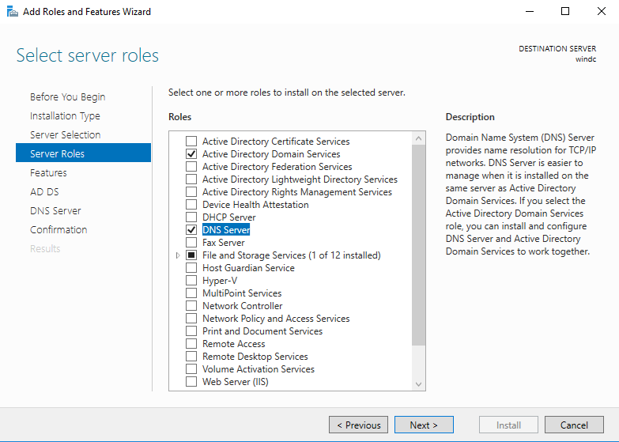
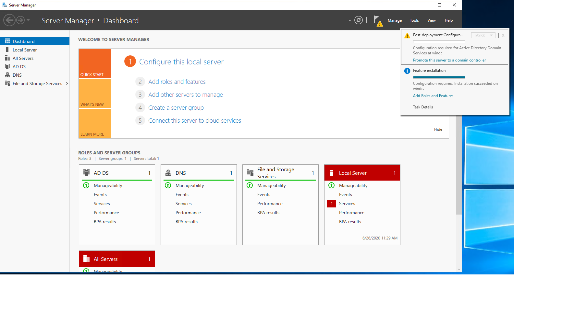
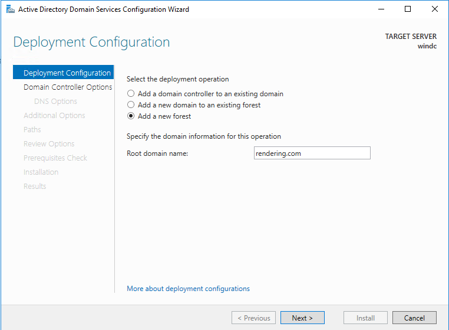
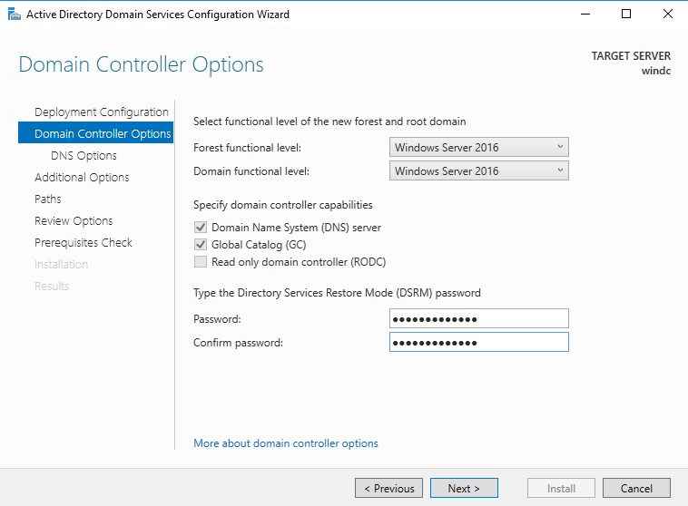
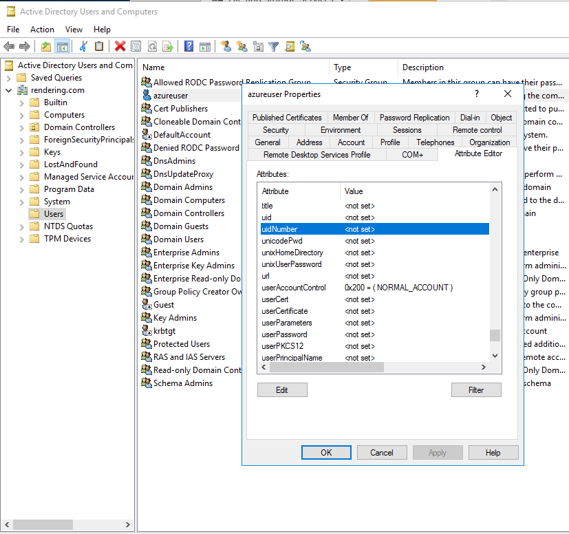
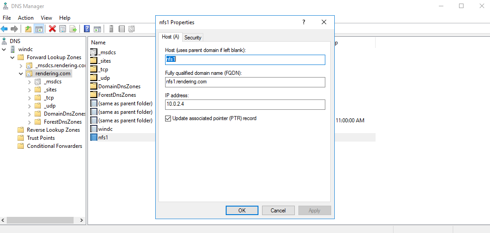

# Minimal Setup Windows DC for rendering

Here are the minimal steps to configure a Windows machine with a domain controller.  In this example, we will setup the following:
1. Add DNS and Domain Controller
1. Add dns domain "rendering.com"
1. Add domain "rendering"
1. Add uid / gid to default user "azureuser".  This values will be 1000 / 1000 as assigned by CentOS using the same name.

## Installation

1. install a Windows Server VM according to instructions, and ensure you use a static private ip:  https://github.com/Azure/Avere/tree/master/src/terraform/examples/houdinienvironment.

1. RDP to the Windows VM, and open the Server Manager

1. Click "Add Roles and Features Wizard"

1. Click through the "Server Roles" section and to install the domain controller select "Active Directory Domain Services" and the "DNS Server" as shown in the image below.

    

       
    

1. Click Next all the way through to Confirmation, and then click on the Install button.

## Configuration

The machine is now ready to configure.

1. back at the server button, click the warning in the top right, and click "Promote this server to a domain controller".

    

       
    

1. Click "Add a new forest" and put in a root domain name as shown below, and click Next.
 
    

       
    

1. in the Domain Controller options select only the DNS and GC, and add your password, and click Next.
 
    

       
    

1. Click Next all the way through to Install, and click Install to create the new forest.  The VM will restart.

1. After restart, open Server Manager, and up in the top right corner click Tools->Active Directory Users and Computers

1. Choose "View->Advanced Features" from the menu in the Active Directory Users and Computers management console.

1. On the left, browse to the domain, and "users" and then double click on the user to edit properties, and Browse to the Attribute Editor as shown below:

    

       
    

1. Set the `uidNumber` and `gidNumber` to `1000` for azureuser since that is what is set for uid and gid in centos.

## Add core NFS filer to DNS

1. this is required by Avere
 
1. open server manager, click Tools->DNS to open the DNS Manager

1. In the DNS manager add the dns record for the nameserver, as shown below:

    

       
    
