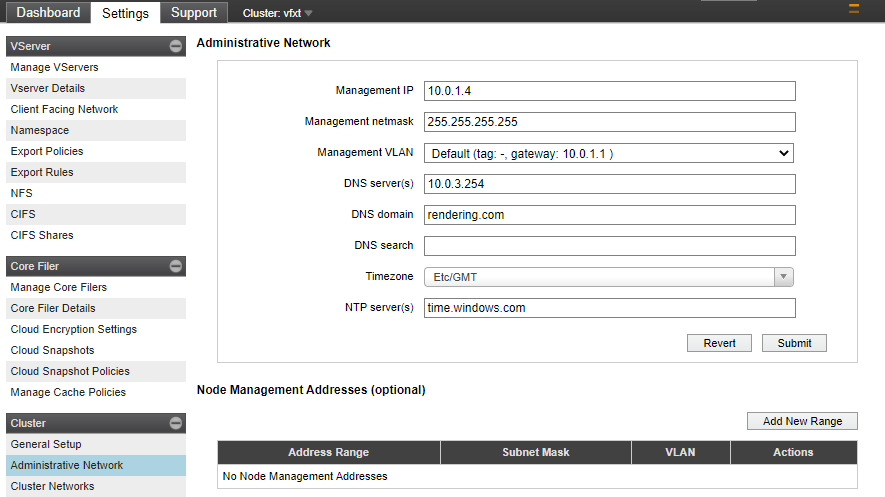
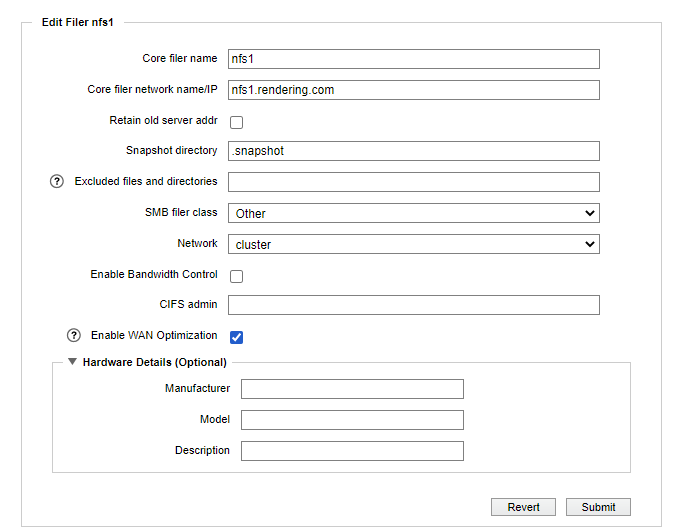
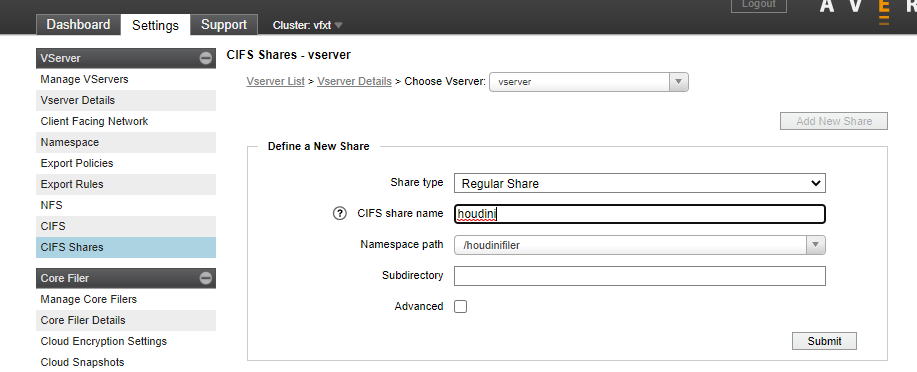

# Configure CIFs share on Avere

This page shows the steps to configure CIFS on Avere.

All the steps below assume you have brought up the [vFXT Cluster GUI](https://docs.microsoft.com/en-us/azure/avere-vfxt/avere-vfxt-cluster-gui) in the browser.

## Configure DNS

1. Browse to Settings->Administrative Network and configure the DNS server:

    

       
    

## Configure Directory Services

The following steps set the AD Domain for the directory services.

1. Browse to Settings->Directory services

1. Cick on `default` and add in the AD Domain (eg. rendering.com)

## Configure CIFS

1. Browse to Settings->CIFS

1. Click "Enable CIFS", and add username, password, and if required by your organization, organizational unit.

## Configure the coreFiler

1. Browse to Settings->Core Filer Details

1. Click on the core filer name to launch the settings

1. ensure you are using a DNS name under "Core filer network name/IP" field

    

       
    

## Add the CIFS share

1. Browse to Settings->CIFS Shares

1. Click "Add New Share", name the share, and point at the correct namespace path:

    

       
    

