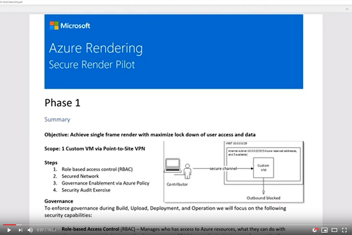
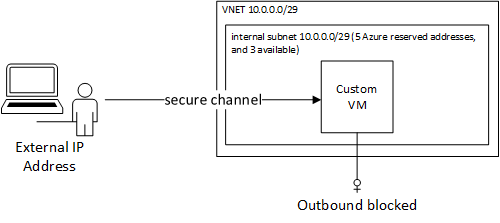

# Secured Image

This example provides a concrete implementation of the first phase of the [Azure Rendering POC](AzureRenderingPOCMar2020.pdf).  The goal is the achieve the first frame render and maximize security using Azure primitives of Role Based Access Control ([RBAC](https://docs.microsoft.com/en-us/azure/role-based-access-control/overview)), [network security](https://docs.microsoft.com/en-us/azure/security/fundamentals/network-overview), and [governance enablement via Azure Policy](https://azure.microsoft.com/en-us/solutions/governance/). 

[](https://youtu.be/CNiQU9qbMDk)

This example shows an Azure administrator how to take an on-prem Ubuntu 18.04 image, upload it to Azure, and then provide access to a Contributor to create the virtual network and a virtual machine as shown in the following architecture:



The steps to for creation to deployment are the following:
1. [Build the custom image By Administrator](CreateUploadUbuntu.md#build-the-custom-image-by-administrator)
2. [Upload the Custom Image via a managed disk By Administrator](CreateUploadUbuntu.md#upload-the-custom-image-via-a-managed-disk-by-administrator)
3. [Create the access for the Contributor By Administrator](#create-the-access-for-the-contributor-by-administrator)
4. [Deployment Custom Image By Contributor](#deployment-custom-image-by-contributor)

## Create the access for the Contributor By Administrator

The contributor will get the following roles from the [Azure built-in roles](https://docs.microsoft.com/en-us/azure/role-based-access-control/built-in-roles):

   | Resource Group | Role Required | Details |
   | --- | --- | --- |
   | Sandbox | [Virtual Machine Contributor](https://docs.microsoft.com/en-us/azure/role-based-access-control/built-in-roles#virtual-machine-contributor) | needed to create the virtual machine  |
   | Sandbox | [Network Contributor](https://docs.microsoft.com/en-us/azure/role-based-access-control/built-in-roles#network-contributor) | needed to create network resources |
   | CustomImage | [Reader](https://docs.microsoft.com/en-us/azure/role-based-access-control/built-in-roles#reader) | the custom image resource groups holds the managed image |

Here are the steps to lock down the contributor to the resource groups holding the VM and the custom image.

1. Find the object ID of the user:
```bash
az ad user list --display-name "FIRSTNAME LASTNAME" --query "[].objectId"
```
2. Set the environment variables:
```bash
export SUBSCRIPTION=#YOUR SUBSCRIPTION
export TARGET_LOCATION=eastus # your target location
export AZURE_SANDBOX_GROUP=#the target VM resource group
export AZURE_CUSTOM_IMAGE_GROUP=#the resource group containing the custom image
export SP_APP_ID=# the object ID from above
```
3. Create the sandbox resource group
```bash
az account set --subscription $SUBSCRIPTION
az group create --location $TARGET_LOCATION --name $AZURE_SANDBOX_GROUP
```
4. Set the Subscription and Create the sandbox resource group
```bash
az role assignment create --role "Virtual Machine Contributor" --scope /subscriptions/$SUBSCRIPTION/resourceGroups/$AZURE_SANDBOX_GROUP --assignee $SP_APP_ID
az role assignment create --role "Network Contributor" --scope /subscriptions/$SUBSCRIPTION/resourceGroups/$AZURE_SANDBOX_GROUP --assignee $SP_APP_ID
az role assignment create --role "Reader" --scope /subscriptions/$SUBSCRIPTION/resourceGroups/$AZURE_CUSTOM_IMAGE_GROUP --assignee $SP_APP_ID
```

Please wait a few minutes for the RBAC assignments to propagate globally.

## Deployment Custom Image By Contributor

To run the example, execute the following instructions.  This assumes use of Azure Cloud Shell.  If you are installing into your own environment, you will need to follow the [instructions to setup terraform for the Azure environment](https://docs.microsoft.com/en-us/azure/terraform/terraform-install-configure).

1. browse to https://shell.azure.com

2. Specify your subscription by running this command with your subscription ID:  ```az account set --subscription YOUR_SUBSCRIPTION_ID```.  You will need to run this every time after restarting your shell, otherwise it may default you to the wrong subscription, and you will see an error similar to `azurerm_public_ip.vm is empty tuple`.

3. get the terraform examples
```bash
mkdir tf
cd tf
git init
git remote add origin -f https://github.com/Azure/Avere.git
git config core.sparsecheckout true
echo "src/terraform/*" >> .git/info/sparse-checkout
git pull origin master
```

4. `cd src/terraform/examples/securedimage`

7. `code main.tf` to edit the local variables section at the top of the file, to customize to your preferences

8. execute `terraform init` in the directory of `main.tf`.

9. execute `terraform apply -auto-approve` to build the HPC Cache cluster

Once installed you will be able to login and use your custom image.

When you are done using the filer, you can destroy it by running `terraform destroy -auto-approve`.