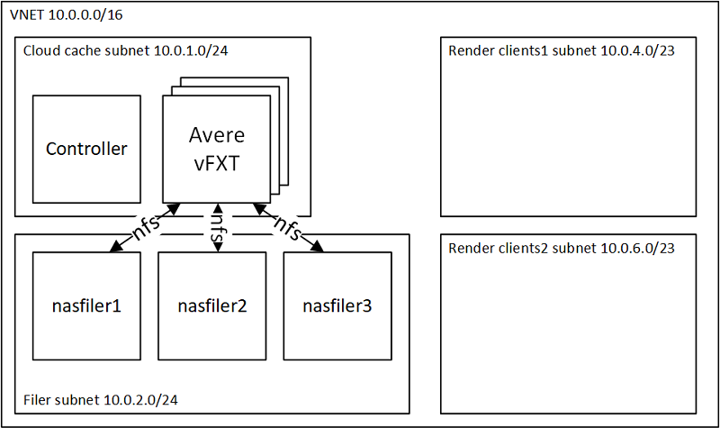

# Avere vFXT with 3 Filers

This examples configures a render network, controller, and vfxt with 3 filers as shown in the diagram below:



## Deployment Instructions

To run the example, execute the following instructions.  This assumes use of Azure Cloud Shell, but you can use in your own environment, ensure you install the vfxt provider as described in the [build provider instructions](../../../providers/terraform-provider-avere#build-the-terraform-provider-binary).  Also if installing your own environment, you will need to [install terraform](https://www.terraform.io/downloads.html).

1. browse to https://shell.azure.com

2. If not already installed, run the following commands to install the Avere vFXT provider for Azure:
```bash
mkdir -p ~/.terraform.d/plugins
# install the vfxt released binary from https://github.com/Azure/Avere
wget -O ~/.terraform.d/plugins/terraform-provider-avere https://github.com/Azure/Avere/releases/download/tfprovider_v0.3.0/terraform-provider-avere
chmod 755 ~/.terraform.d/plugins/terraform-provider-avere
```

3. get the terraform examples
```bash
mkdir tf
cd tf
git init
git remote add origin -f https://github.com/Azure/Avere.git
git config core.sparsecheckout true
echo "src/terraform/*" >> .git/info/sparse-checkout
git pull origin master
```

5. `cd src/terraform/examples/vfxt/3-filers`

6. edit the local variables section of `main.tf`, to customize to your preferences

7. execute `terraform init` in the directory of `main.tf`.

8. execute `terraform apply -auto-approve` to build the vfxt cluster

Once installed you will be able to login and use the vFXT cluster according to the vFXT documentation: https://docs.microsoft.com/en-us/azure/avere-vfxt/avere-vfxt-cluster-gui.

Try to scale up and down the cluster, adjust the customer settings, add new junctions, etc, by editing the `main.tf`, and running `terraform apply -auto-approve`.

When you are done using the cluster, you can destroy it by running `terraform destroy -auto-approve` or just delete the three resource groups created.