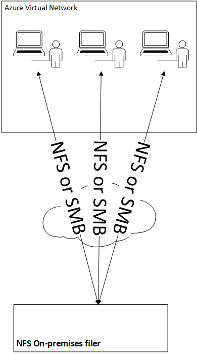
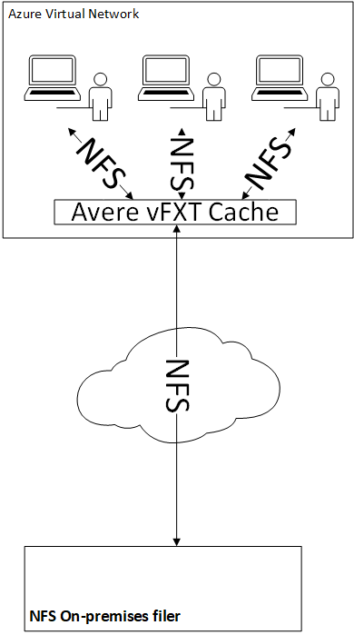
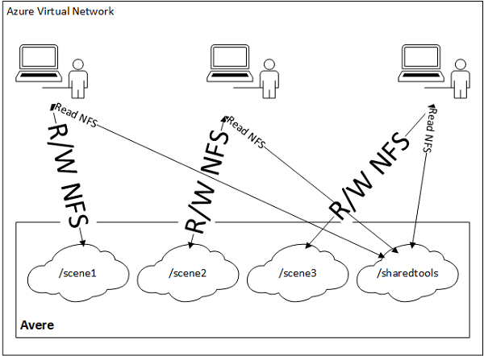
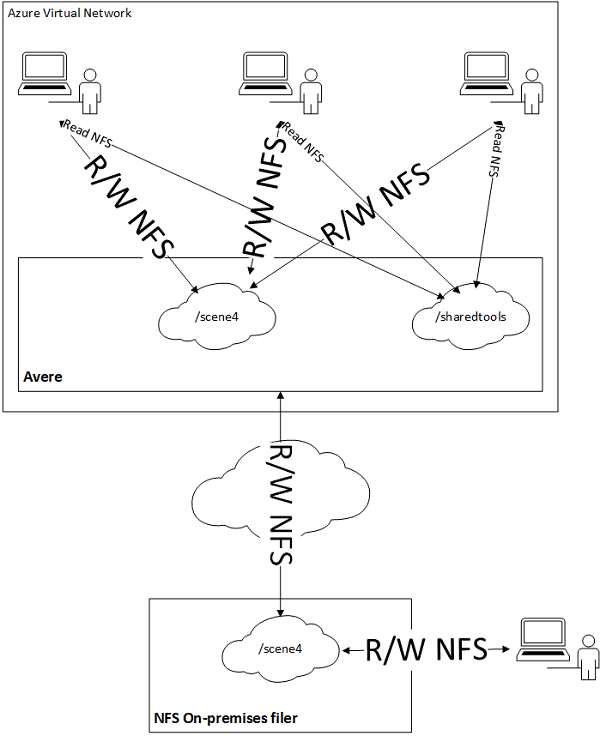
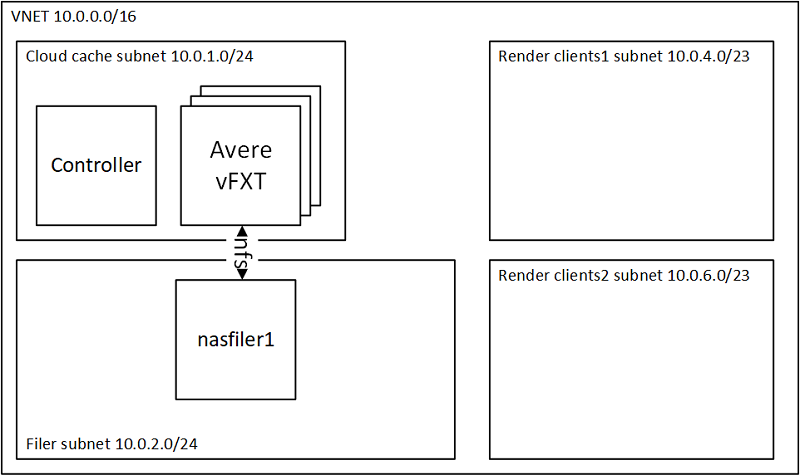

# Experimental: Reducing Latency for Cloud Workstations Connected to On-premises NFS Filers

Once remote cloud workstations have been deployed, users discover that creation, deletion, and listing of files on remote NFS shares are slow due to high latency back to on-premises NFS Filers.  This guide shows how to use Avere vFXT to reduce latency to for cloud workstations connected to an on-premises NFS Filer.  The following table shows where the Avere vFXT edge cache fits within the cloud workstation architecture:

| Cloud Workstations Without Avere | Cloud Workstations With Avere |
| --- | --- |
|  |  |

**Important Note:** The cloud workstation feature is experimental: the Avere vFXT performs best for read workloads, but the two cache policies outlined here should improve the artist or user experience over not using Avere.

## Cache Policy "Isolated Cloud Workstation"

The first and most performant cache policy to consider is named "Isolated Cloud Workstation".  This cache policy is used when users are isolated and not collaborating on the same workload.  The following image shows a concrete example where artists are independently working on scenes.  They may have shared read access to a tools directory, and this also works for the isolated cache policy.  The following diagram illustrates the "Isolated Cloud Workstation" cache policy.

<div style="text-align:center"></div>

## Cache Policy "Collaborating Cloud Workstation"

The second cache policy is named "Collaborating Cloud Workstation".  This policy is used when users are collaborating on the same workload. The following image shows a concrete example where artists are working together on the same scene.  There may also be an artist on-premises also working on the same workload.  The following diagram illustrates the "Collaborating Cloud Workstation" cache policy. 

<div style="text-align:center"></div>

## Deployment Instructions of Avere vFXT

This examples configures a render network, controller, and vfxt with 1 filer as shown in the diagram below, and let's you choose between Isolated or Shared workstation cache policies:



To run the example, execute the following instructions.  This assumes use of Azure Cloud Shell, but you can use in your own environment, ensure you install the vfxt provider as described in the [build provider instructions](../../../providers/terraform-provider-avere#build-the-terraform-provider-binary).  However, if you are installing into your own environment, you will need to follow the [instructions to setup terraform for the Azure environment](https://docs.microsoft.com/en-us/azure/terraform/terraform-install-configure).

1. browse to https://shell.azure.com

2. Specify your subscription by running this command with your subscription ID:  ```az account set --subscription YOUR_SUBSCRIPTION_ID```.  You will need to run this every time after restarting your shell, otherwise it may default you to the wrong subscription, and you will see an error similar to `azurerm_public_ip.vm is empty tuple`.

3. double check your Avere vFXT prerequisites, including running `az vm image accept-terms --urn microsoft-avere:vfxt:avere-vfxt-controller:latest`: https://docs.microsoft.com/en-us/azure/avere-vfxt/avere-vfxt-prereqs

4. If not already installed, run the following commands to install the Avere vFXT provider for Azure:
```bash
mkdir -p ~/.terraform.d/plugins
# install the vfxt released binary from https://github.com/Azure/Avere
wget -O ~/.terraform.d/plugins/terraform-provider-avere https://github.com/Azure/Avere/releases/download/tfprovider_v0.9.0/terraform-provider-avere
chmod 755 ~/.terraform.d/plugins/terraform-provider-avere
```

5. get the terraform examples
```bash
mkdir tf
cd tf
git init
git remote add origin -f https://github.com/Azure/Avere.git
git config core.sparsecheckout true
echo "src/terraform/*" >> .git/info/sparse-checkout
git pull origin master
```

6. Determine your workstation usage and determine which cache policy you can use as discussed in [reducing latency for cloud workstations](README.md):
    1. If using isolated cloud workstations `cd src/terraform/examples/vfxt/cloudworkstation/isolatedcloudworkstation`
    2. If using collaborating cloud workstations `cd src/terraform/examples/vfxt/cloudworkstation/collaboratingcloudworkstation`

7. `code main.tf` to edit the local variables section at the top of the file, to customize to your preferences.  If you are using an [ssk key](https://docs.microsoft.com/en-us/azure/virtual-machines/linux/mac-create-ssh-keys), ensure that ~/.ssh/id_rsa is populated.

8. execute `terraform init` in the directory of `main.tf`.

9. execute `terraform apply -auto-approve` to build the vfxt cluster

Once installed you will be able to login and use the vFXT cluster according to the vFXT documentation: https://docs.microsoft.com/en-us/azure/avere-vfxt/avere-vfxt-cluster-gui.

Try to scale up and down the cluster, adjust the customer settings, add new junctions, etc, by editing the `main.tf`, and running `terraform apply -auto-approve`.

When you are done using the cluster, you can destroy it by running `terraform destroy -auto-approve` or just delete the three resource groups created.


