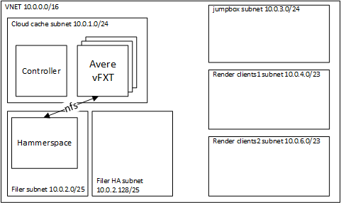

# Avere vFXT with a Hammerspace Filer

This examples configures a render network, controller, and vfxt with a Hammerspace filer as shown in the diagram below:



# Hammerspace Licensing

To use this example, please contact a [Hammerspace representative](https://hammerspace.com/contact/) to get access to the Hammerspace Azure Image.

Once you have the Hammerspace Image ID, use the [Hammerspace Image copy instructions](../../hammerspace/HammerspaceCopyImage.md) to copy the image, and now you will be ready to deploy, and can proceed to the deployment instructions.

## Deployment Instructions

To run the example, execute the following instructions.  This assumes use of Azure Cloud Shell, but you can use in your own environment, ensure you install the vfxt provider as described in the [build provider instructions](../../../providers/terraform-provider-avere#build-the-terraform-provider-binary).  However, if you are installing into your own environment, you will need to follow the [instructions to setup terraform for the Azure environment](https://docs.microsoft.com/en-us/azure/terraform/terraform-install-configure).

1. browse to https://shell.azure.com

2. Specify your subscription by running this command with your subscription ID:  ```az account set --subscription YOUR_SUBSCRIPTION_ID```.  You will need to run this every time after restarting your shell, otherwise it may default you to the wrong subscription, and you will see an error similar to `azurerm_public_ip.vm is empty tuple`.

3. double check your Avere vFXT prerequisites, including running `az vm image accept-terms --urn microsoft-avere:vfxt:avere-vfxt-controller:latest`: https://docs.microsoft.com/en-us/azure/avere-vfxt/avere-vfxt-prereqs

4. If not already installed, run the following commands to install the Avere vFXT provider for Azure:
```bash
mkdir -p ~/.terraform.d/plugins
# install the vfxt released binary from https://github.com/Azure/Avere
wget -O ~/.terraform.d/plugins/terraform-provider-avere https://github.com/Azure/Avere/releases/download/tfprovider_v0.9.31/terraform-provider-avere
chmod 755 ~/.terraform.d/plugins/terraform-provider-avere
```

5. get the terraform examples
```bash
mkdir tf
cd tf
git init
git remote add origin -f https://github.com/Azure/Avere.git
git config core.sparsecheckout true
echo "src/terraform/*" >> .git/info/sparse-checkout
git pull origin main
```

6. `cd src/terraform/examples/vfxt/1-filer`

7. `code main.tf` to edit the local variables section at the top of the file, to customize to your preferences.  If you are using an [ssk key](https://docs.microsoft.com/en-us/azure/virtual-machines/linux/mac-create-ssh-keys), ensure that ~/.ssh/id_rsa is populated.

8. execute `terraform init` in the directory of `main.tf`.

9. execute `terraform apply -auto-approve` to build the vfxt cluster

Once installed you will be able to login and use the vFXT cluster according to the vFXT documentation: https://docs.microsoft.com/en-us/azure/avere-vfxt/avere-vfxt-cluster-gui.

Try to scale up and down the cluster, adjust the customer settings, add new junctions, etc, by editing the `main.tf`, and running `terraform apply -auto-approve`.

When you are done using the cluster, you can destroy it by running `terraform destroy -auto-approve` or just delete the three resource groups created.