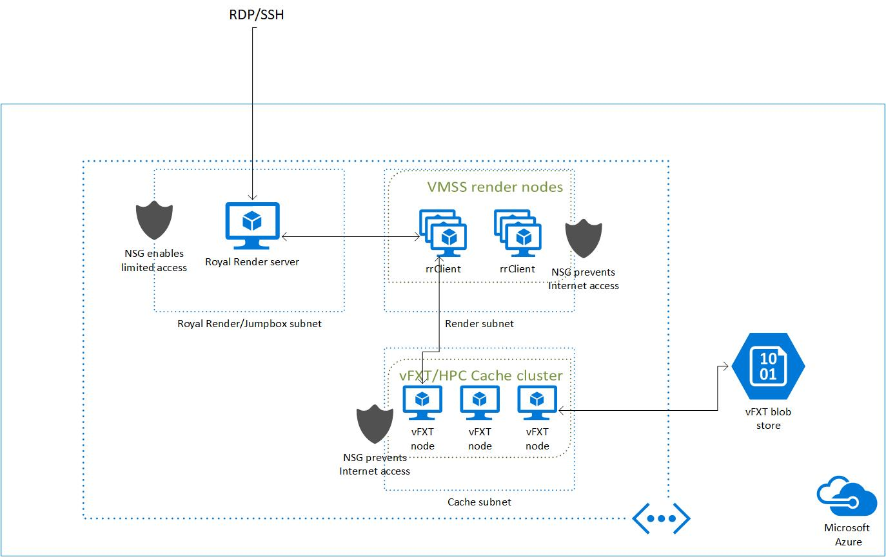

# Royal Render End to End Example

The example in this folder deploys a Royal Render server on Azure and a Virtual Machine Scale Set (VMSS) with Royal Render agents (rCloud rrClient) to pick up jobs.

## Architecure



## Deployment Instructions

1. browse to https://shell.azure.com

2. Specify your subscription by running this command with your subscription ID:  ```az account set --subscription YOUR_SUBSCRIPTION_ID```.  You will need to run this every time after restarting your shell, otherwise it may default you to the wrong subscription, and you will see an error similar to `azurerm_public_ip.vm is empty tuple`.

3. double check your Avere vFXT prerequisites, including running `az vm image terms accept --urn microsoft-avere:vfxt:avere-vfxt-controller:latest`: https://docs.microsoft.com/en-us/azure/avere-vfxt/avere-vfxt-prereqs

4. If not already installed, run the following commands to install the Avere vFXT provider for Azure:
```bash
mkdir -p ~/.terraform.d/plugins
# install the vfxt released binary from https://github.com/Azure/Avere
wget -O ~/.terraform.d/plugins/terraform-provider-avere https://github.com/Azure/Avere/releases/download/tfprovider_v0.9.31/terraform-provider-avere
chmod 755 ~/.terraform.d/plugins/terraform-provider-avere
```


5. get the terraform examples
```bash
mkdir tf
cd tf
git init
git remote add origin -f https://github.com/Azure/Avere.git
git config core.sparsecheckout true
echo "src/terraform/*" >> .git/info/sparse-checkout
git pull origin main
```

6. `cd src/terraform/examples/vfxt/royal-render`

7. `code main.tf` to edit the local variables section at the top of the file, to customize to your preferences.  If you are using an [ssh key](https://docs.microsoft.com/en-us/azure/virtual-machines/linux/mac-create-ssh-keys), ensure that ~/.ssh/id_rsa is populated.

8. execute `terraform init` in the directory of `main.tf`.

9.  execute `terraform apply -auto-approve` to build the vfxt cluster

When you are done using the cluster, you can destroy it by running `terraform destroy -auto-approve` or just delete the three resource groups created.

## Royal Render Server

### VNC

If you plan to VNC into the Royal Render server, you will need to [open a port](https://docs.microsoft.com/en-us/azure/virtual-machines/windows/nsg-quickstart-portal), e.g. port 5901, in the 'ssh_nsg' Network Security Group to set up the tunnel to the VM. `tightvncserver` is installed on the CueBot VM, these are sample commands to configure VNC:
```
vncserver
vncserver -kill :1
mv ~/.vnc/xstartup ~/.vnc/xstartup.bak
nano ~/.vnc/xstartup
```
Add the following to the xstartup file:
```
#!/bin/bash
xrdb $HOME/.Xresources
startxfce4 &
```

Then change permissions and restart vncserver
```
sudo chmod +x ~/.vnc/xstartup
vncserver
```

To start a tunnel from your local machine, you'll need to ensure you have the private key that is the pair of the public key used in the main.tf file. Then use the following command:

```
ssh -I <path to private key> -L 5901:127.0.0.1:5901 -C -N -l azureuser <cuebot VM IP address>
```

Connect to your server by using a local VNC app, e.g. Screen Sharing on OS X, and use the address `127.0.0.1:5901`