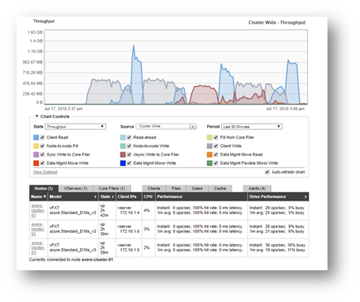
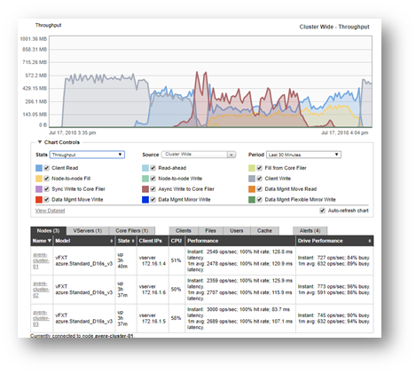

# Vdbench - measuring Avere vFXT for Azure performance against Azure Blob filers or NFS filers

This is a basic setup to generate small and medium sized workloads to test the performance of [Avere vFXT for Azure](https://azure.microsoft.com/services/storage/avere-vfxt/) memory and disk subsystems.  The suggested configuration is 12 x Standard_D2s_v3 clients for each group of 3 vFXT nodes or for each 2 GB/s of throughput capacity in an HPC cache.

## Deployment Instructions

To run the example, execute the following instructions.  This assumes use of Azure Cloud Shell, but you can use in your own environment, ensure you install the vfxt provider as described in the [build provider instructions](../../../providers/terraform-provider-avere#build-the-terraform-provider-binary).  However, if you are installing into your own environment, you will need to follow the [instructions to setup terraform for the Azure environment](https://docs.microsoft.com/en-us/azure/terraform/terraform-install-configure).

Before starting, download the latest vdbench from https://www.oracle.com/technetwork/server-storage/vdbench-downloads-1901681.html.  To download you will need to create an account with Oracle and accept the license.  Upload to a storage account or something similar where you can create a personal downloadable URL.

1. browse to https://shell.azure.com

2. Specify your subscription by running this command with your subscription ID:  ```az account set --subscription YOUR_SUBSCRIPTION_ID```.  You will need to run this every time after restarting your shell, otherwise it may default you to the wrong subscription, and you will see an error similar to `azurerm_public_ip.vm is empty tuple`.

3. double check your Avere vFXT prerequisites, including running `az vm image accept-terms --urn microsoft-avere:vfxt:avere-vfxt-controller:latest`: https://docs.microsoft.com/en-us/azure/avere-vfxt/avere-vfxt-prereqs

4. If not already installed, run the following commands to install the Avere vFXT provider for Azure:
```bash
mkdir -p ~/.terraform.d/plugins
# install the vfxt released binary from https://github.com/Azure/Avere
wget -O ~/.terraform.d/plugins/terraform-provider-avere https://github.com/Azure/Avere/releases/download/tfprovider_v0.9.31/terraform-provider-avere
chmod 755 ~/.terraform.d/plugins/terraform-provider-avere
```

5. get the terraform examples
```bash
mkdir tf
cd tf
git init
git remote add origin -f https://github.com/Azure/Avere.git
git config core.sparsecheckout true
echo "src/terraform/*" >> .git/info/sparse-checkout
git pull origin main
```

6. Decide to use either the NFS filer or Azure storage blob test and cd to the directory:
    1. for Azure Storage Blob testing: `cd src/terraform/examples/vfxt/vdbench/azureblobfiler`
    2. for NFS filer testing: `cd src/terraform/examples/vfxt/vdbench/nfsfiler`

7. `code main.tf` to edit the local variables section at the top of the file, to customize to your preferences.  If you are using an [ssk key](https://docs.microsoft.com/en-us/azure/virtual-machines/linux/mac-create-ssh-keys), ensure that ~/.ssh/id_rsa is populated.

8. execute `terraform init` in the directory of `main.tf`.

9. execute `terraform apply -auto-approve` to build the vfxt cluster with a 12 node VMSS configured to run VDBench.

## Using vdbench

1. After deployment is complete, login to the controller as specified by the `ssh_command_with_avere_tunnel` terraform output variable, and create the [ssh key](https://docs.microsoft.com/en-us/azure/virtual-machines/linux/mac-create-ssh-keys) to be used by vdbench on the jumpbox:

   ```bash
   touch ~/.ssh/id_rsa
   chmod 600 ~/.ssh/id_rsa
   vi ~/.ssh/id_rsa
   ```
2. execute the command from the `vmss_addresses_command` terraform output variable to get one ip address of a VMSS node, and run the following commands to copy the `id_rsa` file, and login to the node, replace USERNAME with the controller username and IP_ADDRESS with ip address of a VMSS node:

   ```bash
   scp ~/.ssh/id_rsa USERNAME@IP_ADDRESS:.ssh/.
   ssh USERNAME@IP_ADDRESS
   ```

3. During installation, `copy_dirsa.sh` was installed to `~/.` on the vdbench client machine, to enable easy copying of your private key to all vdbench clients.  Run `~/copy_idrsa.sh` to copy your private key to all vdbench clients, and to add all clients to the "known hosts" list. (**Note** if your ssh key requires a passphrase, some extra steps are needed to make this work. Consider creating a key that does not require a passphrase for ease of use.)


### Memory test 

1. To run the memory test (approximately 20 minutes), issue the following command:

   ```bash
   cd
   ./run_vdbench.sh inmem.conf uniquestring1
   ```

2. Browse to the Azure HPC Cache resource in the portal or log in to Avere vFXT cluster GUI (Avere Control Panel - instructions [here](https://docs.microsoft.com/azure/avere-vfxt/avere-vfxt-cluster-gui)) to watch the performance metrics. You will see a similar performance chart to the following:

   

### On-disk test

1. To run the on-disk test (approximately 40 minutes) issue the following command:

   ```bash
   cd
   ./run_vdbench.sh ondisk.conf uniquestring2
   ```

2. Log in to the Avere Control Panel ([instructions](https://docs.microsoft.com/azure/avere-vfxt/avere-vfxt-cluster-gui)) to watch the performance metrics. You will see a performance chart similar to the following one:

   
