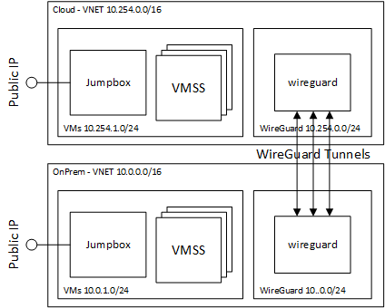

# WireGuard Multi-tunnel implementation using ECMP on Azure

When implementing a cloud burst solution a common need of rendering studios is a high bandwidth connection back to on-premises.  This can be achieved through [Azure ExpressRoute](https://azure.microsoft.com/en-us/services/expressroute/).  However, [Azure ExpressRoute](https://azure.microsoft.com/en-us/services/expressroute/) can take 45 to 90 waiting for a connectivity parter to install an interconnect.

In the meantime a VPN connection may provide bandwidth, but that comes with a limitation of about 1.25Gbps using an IPSec tunnel with Azure VPN.  This limitation is due to IPSec limited to a single CPU CPU core and this limit is documented on [slide 36 of Parallelizing IPSec by Steffen Classert](https://www.strongswan.org/docs/Steffen_Klassert_Parallelizing_IPsec.pdf).

One approach to go higher than 1.25Gbps is to use multiple VPN tunnels in parallel.  However, the [Azure VPN documentation](https://docs.microsoft.com/en-us/azure/vpn-gateway/tutorial-site-to-site-portal#addconnect) says that multiple tunnels can be used each to seperate non-overlapping address spaces.  To get around this limitation, Azure has introduced [Azure Virtual WAN](https://docs.microsoft.com/en-us/azure/virtual-wan/virtual-wan-about) that can support multiple tunnels using Equal-cost multi-path routing (ECMP) with a [limit of 20Gbps](https://docs.microsoft.com/en-us/azure/virtual-wan/virtual-wan-faq#what-is-the-total-vpn-throughput-of-a-vpn-tunnel-and-a-connection).  This solution works with multiple partner devices, and if you have a Barracuda device, there is a good article on how to configure [multi-tunnels with Azure Virtual WAN](https://campus.barracuda.com/product/cloudgenfirewall/doc/79463437/how-to-configure-automatic-connectivity-to-azure-virtual-wan/).

However, for customers that do not have these devices, you can use ECMP with [WireGuard](https://www.wireguard.com/).  [WireGuard](https://www.wireguard.com/) is a modern high performance secure VPN.  The goal of WireGuard is to be faster and simpler than IPSec.  This document shows how to configure WireGuard in Azure and on-prem to achieve multi-Gbps of connectivity.  An advantage of this WireGuard configuration is that only a single Public IP address is required to implement multiple tunnels.

It is important to note that the ECMP algorithm of linux affinitizes a source and destination address pair to a tunnel.  This means that the bandwidth of a single connection is limited to the throughput of a single tunnel.  ECMP will only help 10's or 1000's of multiple source/desitination address pair connections.

The architecture of this example is shown below and has the following components:
1. **WireGuard VM** - isolated in it's own subnet, and and NSG only allows communication to the remote WireGuard server
1. **Jumpbox VM** - provides access to the cloud or on-prem virtual network
1. **VMSS** - used for testing performance of the WireGuard tunnels.  The instance count of these is set to 0 if no performance testing required.



## Deployment Instructions

1. browse to https://shell.azure.com, and choose a Bash shell.

1. Specify your subscription by running this command with your subscription ID:  ```az account set --subscription YOUR_SUBSCRIPTION_ID```.  You will need to run this every time after restarting your shell, otherwise it may default you to the wrong subscription, and you will see an error similar to `azurerm_public_ip.vm is empty tuple`.

1. get the terraform examples
```bash
mkdir tf
cd tf
git init
git remote add origin -f https://github.com/Azure/Avere.git
git config core.sparsecheckout true
echo "src/terraform/*" >> .git/info/sparse-checkout
git pull origin main
```
1. `cd ~/tf/src/terraform/examples/vpn-multi-tunnel-wireguard`

1. `code config.auto.tfvars` and edit the variables to match your needs.  Note that the VMSS instance count is only required 

1. `terraform init`

1. `terraform apply -auto-approve`

Once deployed you can login to the cloud or onprem vms and use `iperf3` to test out the tunnel performance:
    1. **iperf3 server** - `iperf3 -s -B CLIENT_IP_ADDRESS`, example `iperf3 -s -B 10.0.1.4`
    2. **iperf3 client** - `iperf3 -c CLIENT_IP_ADDRESS -P PARALLEL_CONNECTIONS`, here is an example with 16 parallel connections: `iperf3 -c 10.0.1.4 -P 16`.  Note that this test will affinitize to a single tunnel, because ECMP affinitizes the source / address pair to a single tunnel.

## Performance Characteristics

Here are the performance characteristic using a variety of SKUs.  

Please note that these numbers are under ideal circumstances maximizing utilization on all tunnels.  Performance will vary based on the randomization of the tunnels chosen by the "Hash-based multipath routing" algorithm of the Linux Kernel.

This is a non-exhaustive test, but a good price per value VM for a [WireGuard](https://www.wireguard.com/) server is the Standard_F8s_v2 with a 3 tunnel configuration.  The terraform code of this example can be used to test other SKU / Tunnel Count combination to find the best value SKU / performance SKU.

The following table shows eastus WireGuard VM to another eastus WireGuard VM with 2.6 ms of latency across the tunnel.

| Azure SKU | Expected Network Bandwidth (Mbps) | Single Tunnel (Mbps) | 3 Tunnels (Mbps) | Approx East US $USD/hour |
| --- | --- | --- | --- | --- |
| Standard_DS14_v2 | 12000 | 2200 | 4352 |  $1.482 |
| Standard_F16s_v2 | 7000 | 2200 | 4157 |  $0.677 |
| Standard_F8s_v2 | 3500 | 2200 | 3788 |  $0.338 |
| Standard_F2s_v2 | 875 | 949 to 1740 (highly variable) | 1729 |  $0.085 |
| Standard_D16s_v4 | 8000 | 2200 | 4188 |  $0.768 |
| Standard_D8s_v4 | 4000 | 2000 | 4003 |  $0.384 |
| Standard_D2s_v4 | 1000 | 2000 | 1879 |  $0.960 |

[WireGuard](https://www.wireguard.com/) performance degrades over higher latency links, however multiple tunnels still provide benefit, and this can be seen in the following table.

| Region1 | Region2 | SKU | Ping Latency Across Tunnel (ms) | Single Tunnel (Mbps) | 3 Tunnels (Mbps) |
| --- | --- | --- | --- | --- | --- |
| eastus | eastus | Standard_F16s_v2 | 2.6 | 2200 | 4157.44 |
| eastus | canadaeast | Standard_F16s_v2 | 33.8 | 1690 | 3840 |
| eastus | westus2 | Standard_F16s_v2 | 69.5 | 1341 | 2225 |
| eastus | southeastasia | Standard_F16s_v2 | 233 | 882 | 1769 |

## References

Thanks to the following articles and websites to help with this project:

1. Klassert, Steffen.  [Parallelizing IPsec: switching SMP to 'On' is not even half the way](https://www.strongswan.org/docs/Steffen_Klassert_Parallelizing_IPsec.pdf).  June 11, 2010.
    * this helped explain why there is a 1Gbps limit on IPSec tunnels, and it is due to a Single cpu managing the network traffic.  Slide 36 provides the details of this limit.

1. ServerFault User: bao7uo. [ServerFault Answer - Hash-based multipath routing](https://serverfault.com/questions/696675/multipath-routing-in-post-3-6-kernels/820319#820319).  April 13, 2017.
    * this helped explain the affinitization of source / destination address pairs, because Hash-based multipath routing with a hash based on source / destination pairs had been added after linux kernel 4.4.  Search for "Hash-based multipath routing" on the [Linux 4.4 release notes](https://kernelnewbies.org/Linux_4.4#head-2583c31a65e6592bef9af426a78940078df7f630).

1. Thangavel, Muthuraj.  [High throughput Site to site VPN on commodity hardware - an adventure with Wireguard, bonding and ECMP](https://blog.muthuraj.in/2020/06/high-throughput-site-to-site-vpn-using.html). June 18, 2020.
    * this article helped explain how to setup ECMP on Linux, including how to add multiple tunnels on overlapping address spaces.

1. [WireGuard Fast, Modern, Secure VPN Tunnel](https://www.wireguard.com/).  July, 2021.
    * this is WireGuard's main website, and helped with understanding and installation of WireGuard.
