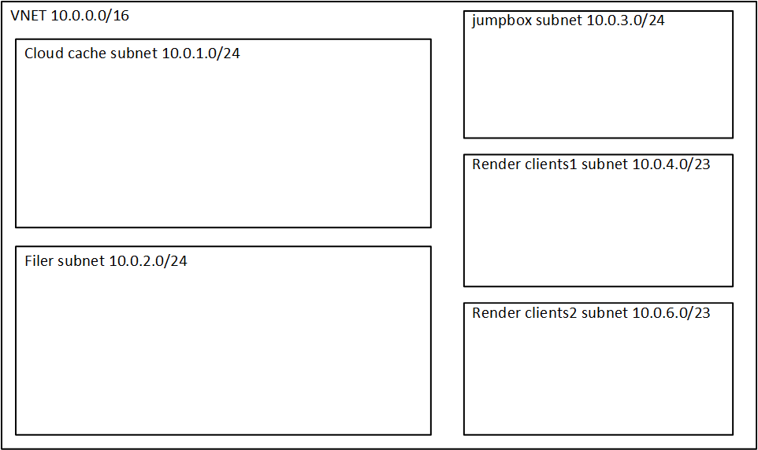

# Render Network

This module creates a sample render network complete with four subnets:
1. **Cloud cache subnet** - this holds the HPC Cache or Avere vFXT
2. **Filer subnet** - this holds the filer subnet
3. **Render Clients 1 Subnet** - this holds one group of render clients
4. **Render Clients 2 Subnet** - this holds a second group of render clients

