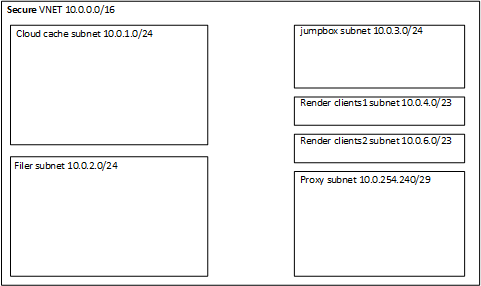

# Secure Render Network

This module creates a sample secure render network complete with six subnets:
1. **Jumpbox subnet** - this holds jumpbox vms for proxy access to the network
2. **Cloud cache subnet** - this holds the HPC Cache or Avere vFXT
3. **Filer subnet** - this holds the filer subnet
4. **Render Clients 1 Subnet** - this holds one group of render clients
5. **Render Clients 2 Subnet** - this holds a second group of render clients
6. **Proxy Subnet** - this holds a tiny subnet to host the http proxy

The [HPC Cache](../../examples/HPC%20Cache) or [Avere for vFXT](../../examples/vfxt) examples shows how to deploy the render network module.