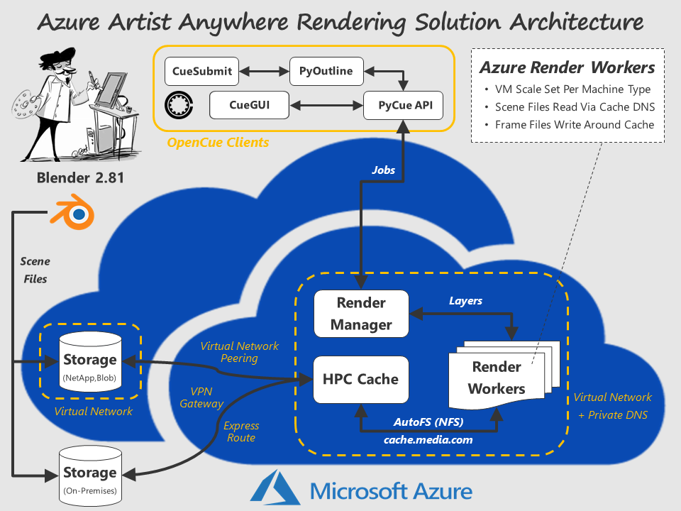
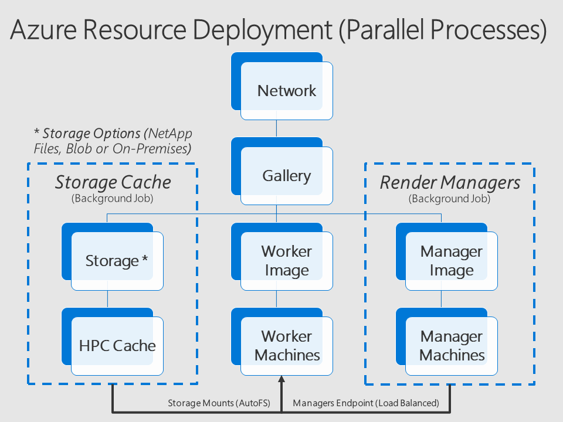
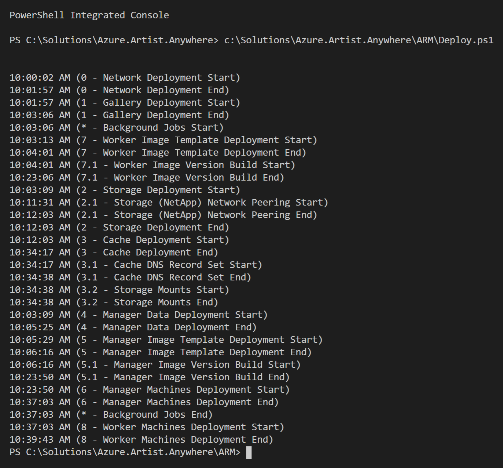

# Azure Artist Anywhere

Azure Artist Anywhere is a set of <a href="https://docs.microsoft.com/en-us/azure/azure-resource-manager/resource-group-overview" target="_blank">Azure Resource Manager (ARM)</a> templates and <a href="https://github.com/PowerShell/PowerShell/releases/latest" target="_blank">PowerShell Core</a> scripts for the automated deployment of a media rendering solution in Azure. By structuring the solution as a set of parameterized templates, it provides a lightweight framework that can be modified and extended to meet various deployment requirements.

Azure Artist Anywhere is composed of the following open-source software and Azure services:

<table>
    <tr>
        <td>
            <a href="https://docs.microsoft.com/en-us/azure/virtual-network/virtual-networks-overview" target="_blank">Azure Virtual Network</a>
        </td>
        <td>
            <a href="https://docs.microsoft.com/en-us/azure/hpc-cache/hpc-cache-overview" target="_blank">Azure HPC Cache</a>
        </td>
        <td>
            <a href="https://www.blender.org/" target="_blank">Blender Rendering</a>
        </td>
    </tr>
    <tr>
        <td>
            <a href="https://docs.microsoft.com/en-us/azure/vpn-gateway/vpn-gateway-about-vpngateways" target="_blank">Azure Virtual Network Gateway</a>
        </td>
        <td>
            <a href="https://docs.microsoft.com/en-us/azure/azure-netapp-files/azure-netapp-files-introduction" target="_blank">Azure NetApp Files</a>
        </td>
        <td>
            <a href="https://www.opencue.io/" target="_blank">OpenCue Render Farm Manager</a>
        </td>
    </tr>
    <tr>
        <td>
             <a href="https://docs.microsoft.com/en-us/azure/virtual-machines/" target="_blank">Azure Virtual Machines</a>
       </td>
        <td>
            <a href="https://docs.microsoft.com/en-us/azure/storage/blobs/storage-blobs-overview" target="_blank">Azure Blob Storage</a>
        </td>
        <td>
            <a href="https://docs.microsoft.com/en-us/azure/postgresql/overview" target="_blank">Azure Database for PostgreSQL</a>
        </td>
    </tr>
    <tr>
        <td>
             <a href="https://docs.microsoft.com/en-us/azure/virtual-machine-scale-sets/overview" target="_blank">Azure Virtual Machine Scale Sets</a>
       </td>
        <td>
            <a href="https://docs.microsoft.com/en-us/azure/virtual-machines/linux/image-builder-overview" target="_blank">Azure Image Builder</a>
        </td>
        <td>
            <a href="https://docs.microsoft.com/en-us/azure/load-balancer/load-balancer-overview" target="_blank">Azure Load Balancer</a>
        </td>
    </tr>
    <tr>
        <td>
             <a href="https://docs.microsoft.com/en-us/azure/dns/private-dns-overview" target="_blank">Azure Private DNS</a>
       </td>
        <td>
            <a href="https://docs.microsoft.com/en-us/azure/virtual-machines/linux/shared-image-galleries" target="_blank">Azure Shared Image Gallery</a>
        </td>
        <td>
        </td>
    </tr>
</table>

The following diagram depicts the high-level solution architecture, including multiple options for networking and storage.

The following diagram depicts the 3 parallel processes (1 main + 2 background jobs) for efficiently deploying the solution.

*Deploy.ps1* is the main orchestration script for deploying the solution. The *Deploy.StorageCache.ps1* script can be executed directly for deployment of the Network, Storage and Cache service tiers only. In contrast, the *Deploy.RenderManagers.ps1* script is not intended to be executed directly. Finally, *Deploy.psm1* is a shared module that is referenced by each script.

The following output from the *Deploy.ps1* orchestration script captures the start / end times for each module deployed. Note that the background job processes have overlapping times as expected in relation to the main deployment process.

For more information, contact Rick Shahid (rick.shahid@microsoft.com)