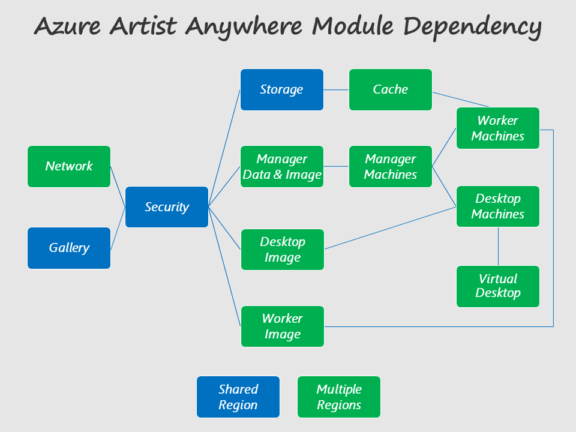
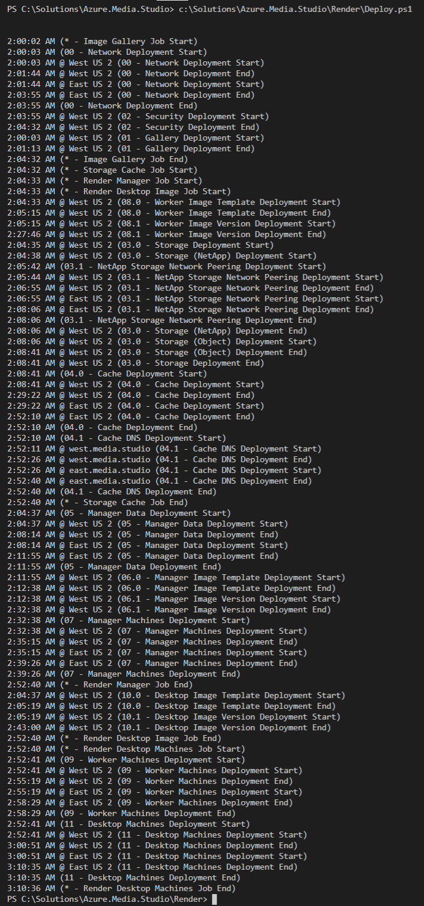

# Azure Artist Anywhere

Azure Artist Anywhere is a modular series of parameterized <a href="https://docs.microsoft.com/en-us/azure/azure-resource-manager/resource-group-overview" target="_blank">Azure Resource Manager (ARM)</a> templates and <a href="https://docs.microsoft.com/en-us/powershell/scripting/overview" target="_blank">PowerShell Core</a> scripts for the automated deployment of an end-to-end media rendering solution in Microsoft Azure. Azure Artist Anywhere provides a lightweight deployment framework that can be modified and extended as needed to meet various requirements.

Azure Artist Anywhere is composed of the following open-source software and Microsoft Azure services:

<table>
    <tr>
        <td>
            <a href="https://docs.microsoft.com/en-us/azure/virtual-network/virtual-networks-overview" target="_blank">Azure Virtual Network</a>
        </td>
        <td>
            <a href="https://docs.microsoft.com/en-us/azure/hpc-cache/hpc-cache-overview" target="_blank">Azure HPC Cache</a>
        </td>
        <td>
            <a href="https://www.blender.org/" target="_blank">Blender 3D Creation Suite</a>
        </td>
    </tr>
    <tr>
        <td>
            <a href="https://docs.microsoft.com/en-us/azure/vpn-gateway/vpn-gateway-about-vpngateways" target="_blank">Azure Virtual Network Gateway</a>
        </td>
        <td>
            <a href="https://docs.microsoft.com/en-us/azure/azure-netapp-files/azure-netapp-files-introduction" target="_blank">Azure NetApp Files</a>
        </td>
        <td>
            <a href="https://www.opencue.io/" target="_blank">OpenCue Render Farm Manager</a>
        </td>
    </tr>
    <tr>
        <td>
            <a href="https://docs.microsoft.com/en-us/azure/virtual-machines/" target="_blank">Azure Virtual Machines</a>
        </td>
        <td>
            <a href="https://docs.microsoft.com/en-us/azure/storage/blobs/storage-blobs-overview" target="_blank">Azure Object (Blob) Storage</a>
        </td>
        <td>
            <a href="https://docs.microsoft.com/en-us/azure/postgresql/overview" target="_blank">Azure Database for PostgreSQL</a>
        </td>
    </tr>
    <tr>
        <td>
            <a href="https://docs.microsoft.com/en-us/azure/virtual-machine-scale-sets/overview" target="_blank">Azure Virtual Machine Scale Sets</a>
        </td>
        <td>
            <a href="https://docs.microsoft.com/en-us/azure/virtual-machines/linux/image-builder-overview" target="_blank">Azure Image Builder</a>
        </td>
        <td>
            <a href="https://docs.microsoft.com/en-us/azure/load-balancer/load-balancer-overview" target="_blank">Azure Load Balancer</a>
        </td>
    </tr>
    <tr>
        <td>
            <a href="https://docs.microsoft.com/en-us/azure/dns/private-dns-overview" target="_blank">Azure Private DNS</a>
        </td>
        <td>
            <a href="https://docs.microsoft.com/en-us/azure/virtual-machines/linux/shared-image-galleries" target="_blank">Azure Shared Image Gallery</a>
        </td>
        <td>
            <a href="https://docs.microsoft.com/en-us/azure/azure-monitor/" target="_blank">Azure Monitor</a>
        </td>
    </tr>
    <tr>
        <td>
            <a href="https://docs.microsoft.com/en-us/azure/active-directory/fundamentals/active-directory-whatis" target="_blank">Azure Active Directory</a>
        </td>
        <td>
            <a href="https://docs.microsoft.com/en-us/azure/key-vault/key-vault-overview" target="_blank">Azure Key Vault</a>
        </td>
        <td>
            <a href="https://docs.microsoft.com/en-us/azure/virtual-desktop/overview" target="_blank">Azure Virtual Desktop</a>
        </td>
    </tr>
</table>

The following diagram depicts the Azure Artist Anywhere solution architecture spanning on-premises and Microsoft Azure.

The following diagram represents the Azure Artist Anywhere deployment modules along with their dependency relationship.

The following list describes each of the Azure Artist Anywhere deployment script files.

* *Deploy.ps1* - main script that orchestrates the overall deployment process

* *Deploy.psm1* - shared module that is referenced from each deployment script

* *Deploy.ImageGallery.ps1* - background job script that deploys shared image gallery

* *Deploy.StorageCache.ps1* - background job script that deploys storage and cache

* *Deploy.RenderManager.ps1* - background job script that deploys render managers

* *Deploy.RenderDesktop.ps1* - background job script that deploys render desktops

Unlike each of the other background job scripts, the *Deploy.StorageCache.ps1* script can be executed directly for deployment of the Network, Storage and Cache modules only.

The following output from a *Deploy.ps1* orchestrated deployment provides the *start* and *end* times for each module deployed. Note that the background jobs have overlapping times as expected in comparison to the main deployment process.

For more information, contact Rick Shahid (rick.shahid@microsoft.com)
