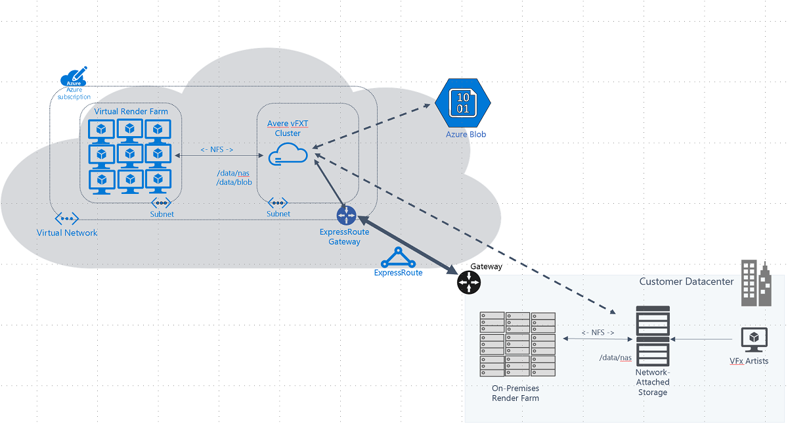

# Azure Cloud Burst Rendering E2E

Cloud Burst rendering is an M&E Rendering scenario and enables VFX and rendering studios the ability to use the elastic capacity of the Azure cloud.  The advantages of this approach are the following:
1. **Speed** - it is immediate to spin up cloud resources in comparison to ordering and installing on prem machines.
1. **Pay Per Use** - you pay for only what you use, and scale the capacity to 0 when you have completed the burst render.  In contrast, on-premises hardware will sit idle when there rendering work isn't using the fully utilizing on-premises capacity.
1. **Cost** - the cloud enables much finer grain cost control than if you were on prem.  It is easy to associate a workload to a feature project, and better understand the cost of that project.
1. **Security and Compliance** - Azure is secure and meets the security and compliance standards required by the MPAA including CDSA, ISE, and TPN.
1. **Avere is license free on Azure** - The Avere vFXT appliance is an NFS filer cache that enables large scale cloud burst rendering.  The Avere vFXT solves the question of "how do I sync my data to and from the cloud and keep it in sync with my on-premises filer".  The Avere vFXT additionally aggregates all remote filers or cloud filers into a single aggregated namespace.

The common components of cloud burst rendering are shown in the following architecture diagram:



This tutorial captures all of the components in the above diagram to enable the burst rendering scenario in Azure.  The audience for this tutorial are medium to large scale rendering studios who are looking to burst greater than 1000 cores or 64 16-core virtual machines in the cloud.  The goals of this tutorial are the following:
1. enable a studio to swap any of the components of this tutorial with their own custom components
1. highlight best practices for running each component in the cloud
1. highlight the best practices for cost savings in the cloud including the recommended SKUs

This tutorial walks through the following architecture components:
 * NFS Filer
 * Azure Region
 * Render Manager
 * Network
 * Building custom image
 * Render with up to 5 VMs 
 * Avere vFXT
 * Scaling Render Nodes
 * Security
 * Azure Render Farm Manager

The goal of this tutorial is to be able to setup a full render environment on Azure and then be able to swap out the components that match to your specific configuration.

# NFS Filer

The NFS filer holds your digital assets, rendering tools, and any other files related to the rendering project.

For this step there are two options:
1. **use your on-premises NFS filer** - The on-premises NFS based filer may have one or more IP addresses.  This on-premises filer will need to be configured to allow `no_root_squash` and access to the avere subnet created in the network section.
1. **build a simple NFS filer** - If you don't have an oprem filer, install the [Simple NFS Filer](simplenfsfiler/).  Once you have completed the installation, you will need to copy digital assets to it.  If you don't have digital assets, copy the blender assets described in this [this article](install_blender.md).

# Azure Region

Once you have determined which filer type you are going to use, you will need to choose a region close to your filer to minimize the latency to the core filer.  Once the region is determined submit quota requests for that region for the render nodes, and 100 E32s_v3 cores and at least 2 Av2 cores for the Avere installation.

Tip: Try out various SKUs for your render nodes to determine which one is the highest performance for your use case.  Three recommended SKU families to try are DSv2 (physical cores), DSv3, and FSv2.  We have observed that the two SKUs that deliver the most value for rendering are the 16 core DS14v2 SKU and 32 core FS32v2 SKU.

# Render Manager

The render manager is responsible for orchestrating the render jobs across the render nodes.  The render manager influences the architecture in the following ways:
1. **DNS** - the render manager passes lists of assets to render nodes
1. **Network access** - network access from the cloud render nodes will need network access to the render manager.
1. **Scaling** - if the render manager participates in scale-up and scale-down of render nodes it will need access to Azure resource manager.

If you do not have a render manager, install the [Opencue](opencue/) render manager for this tutorial.

# Network

This step configures the network on Azure including Virtual Newtork (VNET), subnets, and a Network Security Group (NSG) for each subnet.

In the Azure Portal, browse to Virtual Networks, click "+Add" to start the wizard.  Choose the target region you chose on the previous step.  For the network, pick a private ip range that does not overlap with your on-premises networks, or your other VNETs.  For the first subnet name it "avere" and create a /24 for the "avere" subnet.  Once created, go add another subnet named "renderclients", and make it large enough to fit you maximum nodes.  For example a /24 for 251 nodes or a /22 for about 1020 clients (Azure reserves 4 IP addresses for every subnet).

Once you have created the virtual subnets, you will need to add network security groups to lock down the network to the minimal possible access including blocking the internet.  To do this browse to each subnet and add a network security group.  For the "avere" subnet configure the NSG on the subnet similar to NSG shown in the [avere internet access guide](../../vfxt/internet_access.md).  For the render clients subnet you will need to configure access to the Avere subnet and to the appropriate on-premises networks.

Now the next step is to connect your VNET to your NAS Filer.  Here are the options based on the filer you chose in the earlier steps:
1. **On-prem filer** - There are 3 choices in Azure to connect back to your on-prem filer.  The choices vary in throughput, latency, cost, and speed of deployment:
    1. [Azure VPN Gateway](https://docs.microsoft.com/en-us/azure/vpn-gateway/vpn-gateway-about-vpngateways) – This is the quickest way to setup direct connection to on-premises over the internet, but is limited to 1Gbps over the internet to on-premises.  **Critical Step**: After you have created your Avere vFXT and nodes, follow [this article](set_mtu.md) to correctly set the MTU so that your network connections to and from on-premises do not fail.
    1. [Azure Virtual WAN](https://docs.microsoft.com/en-us/azure/virtual-wan/virtual-wan-about) – This is more involved to setup, but does enable the ability to increase the throughput  tIncreases throughput to 20Gbps over the Internet to on-premises.
    1. [Azure Express Route](https://azure.microsoft.com/en-us/services/expressroute/) – Express route has a capacity of up to 100Gbps private direct connection to Azure.
1. **Simple NFS filer** - If you created the simple NFS filer in the earlier step it will be installed in a separate VNET than the one you have created.  To resolve this, browse to either VNET in the portal, click on the "peering" menu item, and add a peer to join the two vnets.

# Building Custom Image

There are two ways to build custom images on Azure:
1. **import from an existing image** - this approach uses one of your existing images whether they rely on-premisis or in another cloud:
    1. [build from on-premisis and upload to Azure](https://docs.microsoft.com/en-us/azure/virtual-machines/linux/create-upload-centos)
    1. [migrate image from AWS](https://docs.microsoft.com/en-us/azure/site-recovery/migrate-tutorial-aws-azure) - fix safe link.
    1. [migrate image from GCP](../../../docs/CustomImageTransfer_GCE2Azure.md)
1. **build from an Azure stock image** - Another approach is to deploy a virtual machine (VM) on Azure, and install all your render software and render manager agents.  Once this is complete, [this article](https://docs.microsoft.com/en-us/azure/virtual-machines/linux/capture-image) describes how to capture the VM to an image.

If you don't have render software, use the stock image approach above, and use [this article](install_blender.md) to install blender and [this article](../opencue) to install the Opencue agent.

As you are building your image, here are some tips:
* ensure the waagent is installed and able to access the network, otherwise the VM will be stuck in "creating" and be eventually collected by Microsoft
* ensure the waagent starts up before any long running services such as auto-mounter or NFS mounting
* remove the swap partition since waagent will setup the swap partition
* before using the custom image on Azure Batch or VMSS deploy to a single VM instance with boot diagnostics enabled.  Boot diagnostics enables the serial console, and enables easy troubleshooting
* if running on Azure Batch, ensure the ephemeral drive is getting correctly mounted to /mnt/resource is getting correctly mounted, and then Azure Batch will just work.  Azure Batch needs to install an Azure Batch agent to the ephemeral drive.

# Render with up to 5 VMs

Use VM or VMSS to startup more than 1 VM, up to 5 VMs.  This will enable you to iron out all the issues with running from multiple VMs at once.  Once this is working you can install the Avere vFXT, to enable you to scale to hundreds or thousands of VMs.

# Avere vFXT

The Avere vFXT hides latency to the core filer and keeps storage close to the cloud.  To install Avere, verify you have the [prerequisites](https://docs.microsoft.com/en-us/azure/avere-vfxt/avere-vfxt-prereqs), you can use the wizard [Avere vFXT Marketplace Wizard](https://azuremarketplace.microsoft.com/en-us/marketplace/apps/microsoft-avere.vfxt-template?tab=Overview).  Follow the [Add Storage Article](https://docs.microsoft.com/en-us/azure/avere-vfxt/avere-vfxt-add-storage) to add your NFS filer.  Your NFS filer must have `no_root_squash` enabled.

Additionally you may request to the Avere team to be registered into private preview of the cache xervice.  Click [here](https://github.com/Azure/Avere/blob/main/docs/legacy/hpc-cache-preview.md) to learn more about getting started.

# Scaling Render Nodes

To scale out your custom image there are multiple solutions on Azure, in the order of simple to more complex:
1. [VMSS](https://docs.microsoft.com/en-us/azure/virtual-machine-scale-sets/overview) - this is the simplest way to scale quickly.  Here are some related articles
    1. [Best Practices for Improving Azure Virtual Machine (VM) Boot Time](../../../docs/azure_vm_provision_best_practices.md) - The Avere vFXT is commonly used with burstable compute workloads. We hear from our customers that it is very challenging to boot thousands of Azure virtual machines quickly. This article describes best practices for booting thousands of VMs in the fastest possible time.
    1. [VMScaler](../../../src/go/cmd/vmscaler/README.md) - A vm manager that manages a VM farm of low priority VMSS nodes.  The primary use case is cloud burstable render farms by VFX rendering houses.
1. [Azure Batch](../../../docs/maya_azure_batch_avere_vfxt_demo.md) - Demonstrates how to use the Autodesk Maya Renderer with Azure Batch and the Avere vFXT cluster to generate a rendered movie.  Once you have installed Azure Batch, checkout the Azure Render Farm Manager described below.

To keep the costs low here are some tips:
* use low-priority VMs on your VMSS or Azure Batch.  These can save you 70% of your VM cost.  You will need to design your software so that it can handle pre-emption
* the best performance to value SKUs for rendering are the physical core sku DS14v2 / D14v2 or the FS32v2 SKUs
* use ephemeral OS disks - [ephemeral os disks](https://azure.microsoft.com/en-us/updates/azure-ephemeral-os-disk-now-generally-available/) have restricted SKUs, but these can save you approximately 20-30% of your VM cost.

# Security

As you build your solution, build in multiple layers of security.  From outer to inner:

* VNET
    * use NSG's to block in / out internet
    * use NSG's to only allow necessary access between subnets.  For example, restrict NFS access to the Avere subnet to the rendering clients only.
* Disks
    * use encrypted disks everywhere.  By default the disks on the Avere are encrypted
* Secrets
    * use keyvault for keeping track of your secrets
    * store your private SSH keys in keyvault and use them for communicating between nodes.
    * have a policy to rotate certs
* RBAC
    * use RBAC to restrict Azure resources from each other

If your automation uses SSH to communicate to hosts, one common error is the failed `known_hosts` error "REMOTE HOST IDENTIFICATION HAS CHANGED!".  This is common because of restoration of hosts after low-priority eviction or scale-down then scale-up because the new hosts assume a new identity.  Provided you have the security layers in place discussed previously, the best way to handle this is to disable the host check.  There are two ways to do this:

1. **disable host check in config** - for the automation user, disable the host check by adding the following rule to `.ssh/config` file.  SSH config does not allow CIDR ranges, so you have to use patterns, and the below example allows 10.0.0.0/16:
    ```
    Host 10.0.*
        StrictHostKeyChecking no
        UserKnownHostsFile=/dev/null
        LogLevel=error
    ```
2. **disable host check on command line** - here are the ssh command line parameters to disable the host check:
    ```
    ssh -o KnownHostsFile=/dev/null -o StrictHostKeyChecking=no 
    ```

# Azure Render Farm Manager

If you have used Azure Batch for scaling you can install the [Azure Render Farm Manager](https://github.com/Azure/azure-render-farm-manager).  The Azure Render Farm Manager enables you to create and manage your cloud hybrid render farm.