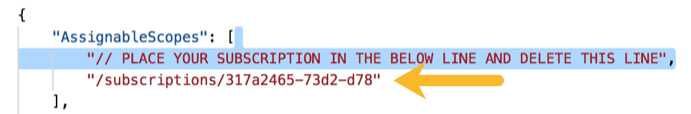

# Avere vFXT cluster controller node - ARM template deployment

This template implements [Deploy](../../docs/jumpstart_deploy.md).

<a href="https://portal.azure.com/#create/Microsoft.Template/uri/https%3A%2F%2Fraw.githubusercontent.com%2FAzure%2FAvere%2Fmaster%2Fsrc%2Fvfxt%2Fazuredeploy.json" target="_blank">

</a>

# Experimental: Avere vFXT controller and vFXT - ARM template deployment

An experimental template to deploy everything in one deployment is listed below.  To create, you will need to create a scoped role, and then a service principal using that role.  Here are the instructions:

1. Open the cloud shell in the Azure portal or browse to https://shell.azure.com.

2. Run ```az account set --subscription YOUR_SUBSCRIPTION_ID```

3. Use these commands to create the role file: 

```bash
/bin/cat <<EOM >avere-create-cluster.json
{
    "AssignableScopes": [
        "// PLACE YOUR SUBSCRIPTION IN THE BELOW LINE AND DELETE THIS LINE",
        "/subscriptions/<subscription here>"
    ],
    "Name": "avere-create-cluster",
    "IsCustom": "true",
    "Description": "Create Avere vFXT Clusters",
    "NotActions": [],
    "Actions": [
          "Microsoft.Authorization/*/read",
          "Microsoft.Authorization/roleAssignments/*",
          "Microsoft.Authorization/roleDefinitions/*",
          "Microsoft.Compute/*/read",
          "Microsoft.Compute/availabilitySets/*",
          "Microsoft.Compute/virtualMachines/*",
          "Microsoft.Network/*/read",
          "Microsoft.Network/networkInterfaces/*",
          "Microsoft.Network/virtualNetworks/subnets/join/action",
          "Microsoft.Network/virtualNetworks/subnets/read",
          "Microsoft.Resources/subscriptions/resourceGroups/read",
          "Microsoft.Resources/subscriptions/resourceGroups/resources/read",
          "Microsoft.Storage/*/read",
          "Microsoft.Storage/storageAccounts/listKeys/action"
    ]
}
EOM
```

4. Edit the file to include your subscription ID. Save the file as ``avere-create-cluster.json``. 



5. Create the role:

```bash
az role definition create --role-definition avere-create-cluster.json
```

6. The following shows how to create the service principal required for use to run `az login` on the controller, but detailed instructions are [here](https://docs.microsoft.com/en-us/cli/azure/create-an-azure-service-principal-azure-cli?view=azure-cli-latest):

```bash
SUBSCRIPTION_ID="REPLACE WITH YOUR SUBSCRIPTION ID"
az account set --subscription=$SUBSCRIPTION_ID
az ad sp create-for-rbac --role="avere-create-cluster" --scopes="/subscriptions/$SUBSCRIPTION_ID"
```

> Note: please make sure that the value for parameter --role is the same name you defined as name property used on step 3. This is the role definition name that you are assigning to the Service Principal. Also, save the output information because it will be required in the next step.

7. Deploy the script using the following "deploy to Azure" button:

<a href="https://portal.azure.com/#create/Microsoft.Template/uri/https%3A%2F%2Fraw.githubusercontent.com%2FAzure%2FAvere%2Fmaster%2Fsrc%2Fvfxt%2Fazuredeploy-auto.json" target="_blank">

</a>
